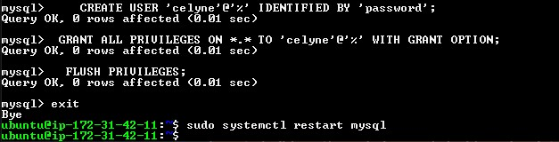
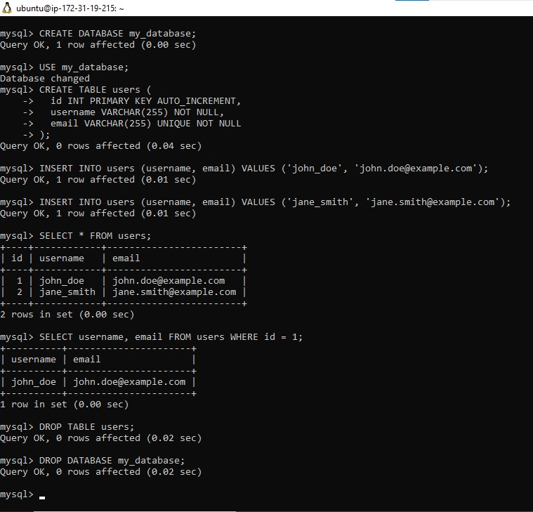

# Implement a Client Server Architecture using MySql Database Management System (DBMS)

To demonstrate a basic client-server using MySQL RDBMS, follow the below instructions:

Create and configure two Linux-based virtual servers (EC2 instances in AWS).

`Server A name - 'mysql server'`  
`Server B name - 'mysql client'`


On `mysql server` install MySQL server software

```powershell
sudo apt install mysql-server
```


On `mysql client` Linux Server install MySQL client software.


On mysql server security add port 3306

Om mysql server, Edit the mysql configuration file to allow remote connections; replace `127.0.0.1` to `0.0.0.0`

```powershell
sudo nano /etc/mysql/mysql.conf.d/mysqld.cnf
```


From `mysql client` Linux Server connect remotely to `mysql server` Database Engine without using `ssh`. You must use the mysql utility to perform this action. We do this by:

1. Create a remote user (on the server hosting the database)

Use the mysql command-line tool on the server to create a new user with appropriate permissions for the client to access the database.
The syntax is

```powershell
CREATE USER 'remote_user'@'client_ip' IDENTIFIED BY 'strong_password';

GRANT <permissions> ON <database>.* TO 'remote_user'@'client_ip' WITH GRANT OPTION;

FLUSH PRIVILEGES;
```




2. Connect from the client machine:

Use the mysql client on your Linux server with the following format:

```powershell
mysql -h <server_ip> -P 3306 -u remote_user -p
```

Replace <server_ip> with the IP address of the server hosting the database.  
Enter the password for the remote_user when prompted.


Check that you have successfully connected to a remote MySQL server and can perforn SQL queries:

```powershell
Show databases;
```


To make sure it works, let's create/drop databases and tables, and insert/select records to and from them using the mysql client:

```powershell
CREATE DATABASE my_database;

USE my_database;  -- Switch to the newly created database

CREATE TABLE users (
  id INT PRIMARY KEY AUTO_INCREMENT,
  username VARCHAR(255) NOT NULL,
  email VARCHAR(255) UNIQUE NOT NULL
);

INSERT INTO users (username, email) VALUES ('john_doe', 'john.doe@example.com');
INSERT INTO users (username, email) VALUES ('jane_smith', 'jane.smith@example.com');

SELECT * FROM users;  -- Select all columns from users table

SELECT username, email FROM users WHERE id = 1;  -- Select specific columns with a filter

DROP TABLE users;  -- Drop the table (be cautious!)

DROP DATABASE my_database;  -- Drop the database
```


