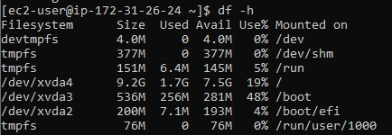
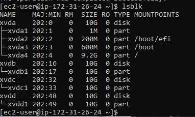
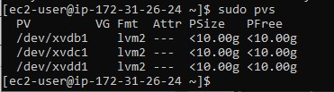
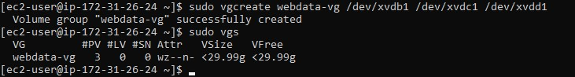
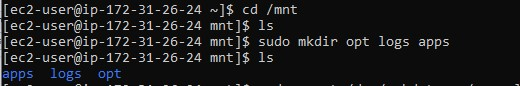
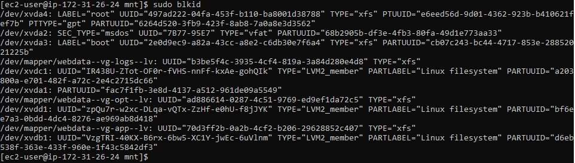
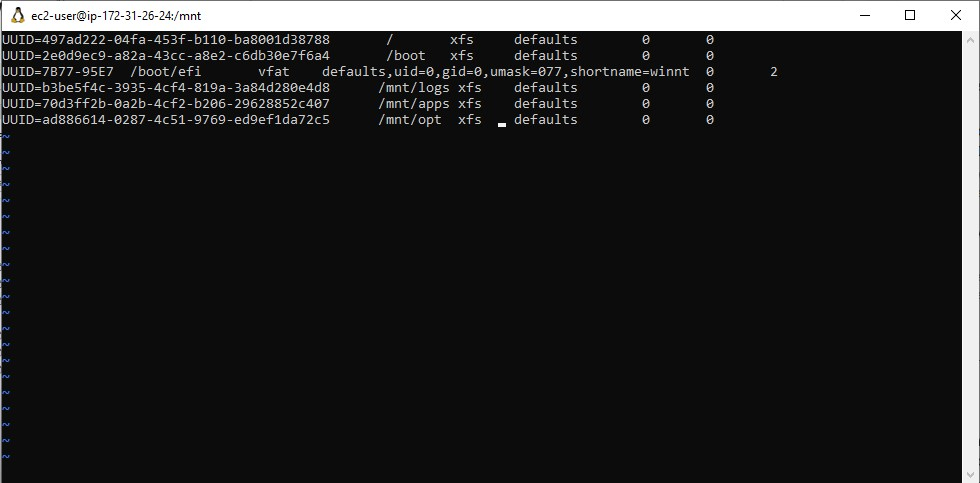
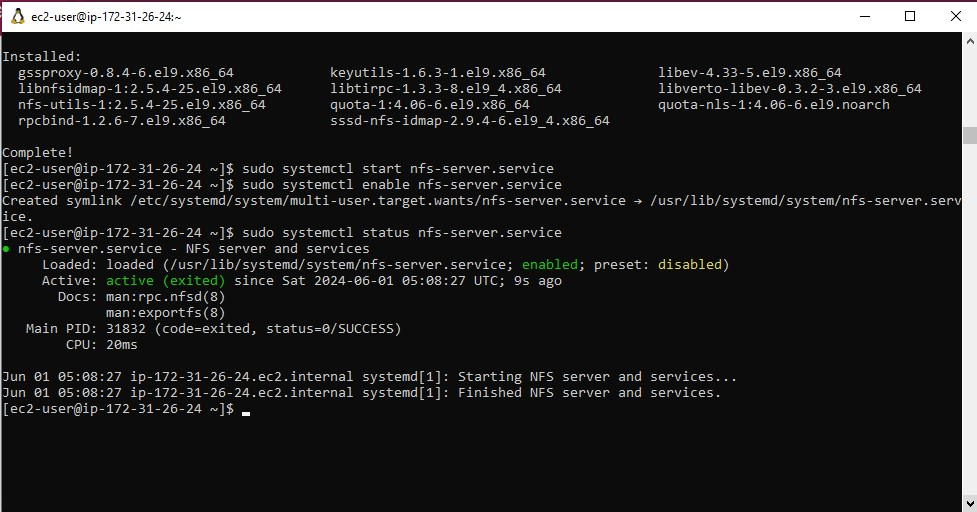
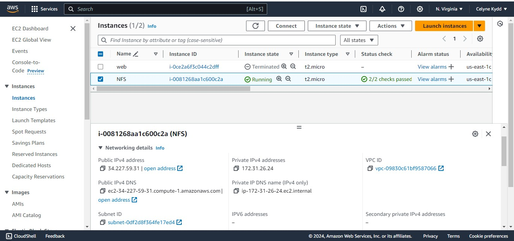
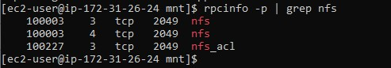

# STEP 1 – PREPARE NFS SERVER

1. Spin up a new EC2 instance with RHEL Linux 8 Operating System.


2. Based on your LVM experience from Project 6, Configure LVM on the Server.

- Instead of formating the disks as ext4 you will have to format them as xfs

- Ensure there are 3 Logical Volumes. lv-opt lv-apps, and lv-logs

- Create mount points on /mnt directory for the logical volumes as follow:

Mount lv-apps on /mnt/apps – To be used by webservers
Mount lv-logs on /mnt/logs – To be used by webserver logs
Mount lv-opt on /mnt/opt – To be used by Jenkins server in Project 8






















4. Install NFS server, configure it to start on reboot and make sure it is u and running

```
sudo yum -y update
sudo yum install nfs-utils -y
sudo systemctl start nfs-server.service
sudo systemctl enable nfs-server.service
sudo systemctl status nfs-server.service
```




5. Export the mounts for webservers’ subnet cidr to connect as clients. For simplicity, you will install your all three Web Servers
   inside the same subnet, but in production set up you would probably want to separate each tier inside its own subnet for higher
   level of security.
   To check your subnet cidr – open your EC2 details in AWS web console and locate ‘Networking’ tab and open a Subnet link:

Make sure we set up permission that will allow our Web servers to read, write and execute files on NFS:

```
sudo chown -R nobody: /mnt/apps
sudo chown -R nobody: /mnt/logs
sudo chown -R nobody: /mnt/opt

sudo chmod -R 777 /mnt/apps
sudo chmod -R 777 /mnt/logs
sudo chmod -R 777 /mnt/opt

sudo systemctl restart nfs-server.service
```


Configure access to NFS for clients within the same subnet (example of Subnet CIDR – 172.31.32.0/20 ):

```
sudo vi /etc/exports

/mnt/apps <Subnet-CIDR>(rw,sync,no_all_squash,no_root_squash)
/mnt/logs <Subnet-CIDR>(rw,sync,no_all_squash,no_root_squash)
/mnt/opt <Subnet-CIDR>(rw,sync,no_all_squash,no_root_squash)

Esc + :wq!

sudo exportfs -arv
```




6. Check which port is used by NFS and open it using Security Groups (add new Inbound Rule)

```
rpcinfo -p | grep nfs
```



Important note: In order for NFS server to be accessible from your client, you must also open following ports: TCP 111, UDP 111,
UDP 2049


