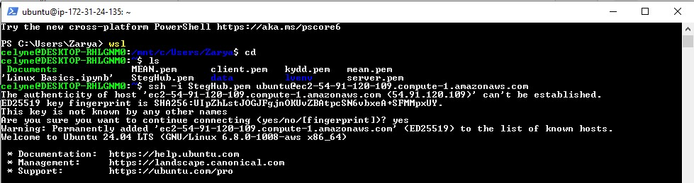
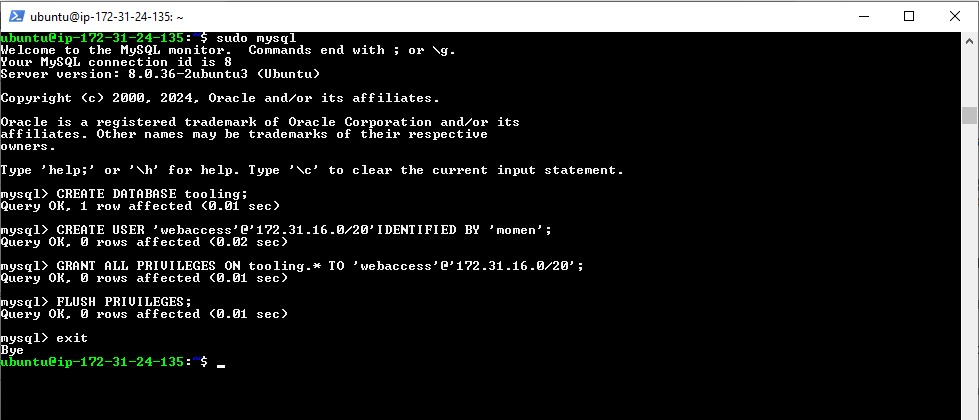

# STEP 2 — CONFIGURE THE DATABASE SERVER

By now you should know how to install and configure a MySQL DBMS to work with remote Web Server

1. Install MySQL server
2. Create a database and name it tooling
3. Create a database user and name it webaccess
4. Grant permission to webaccess user on tooling database to do anything only from the webservers subnet cidr

