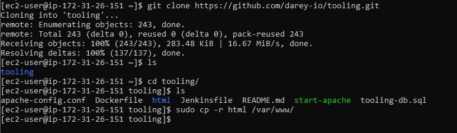
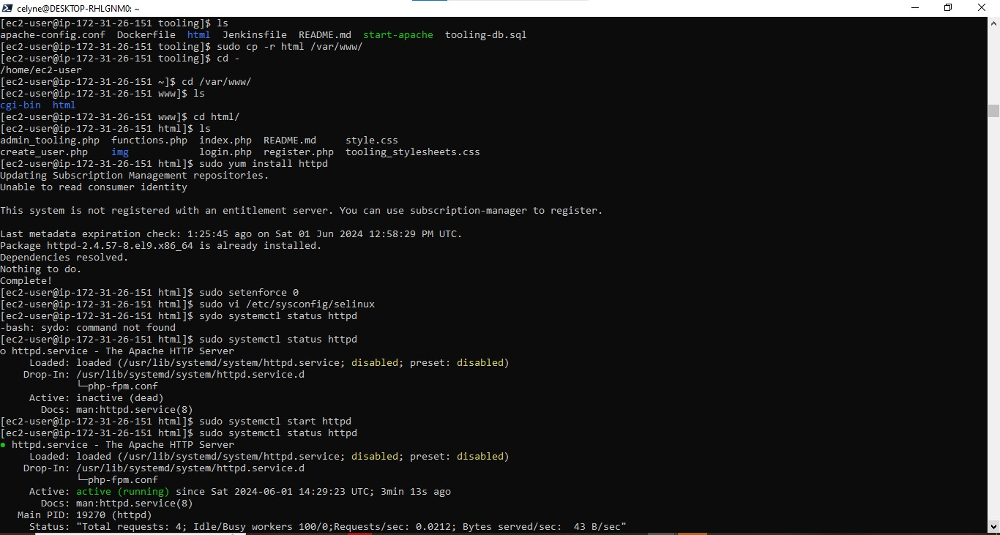
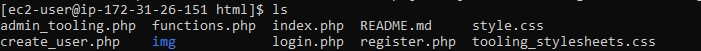
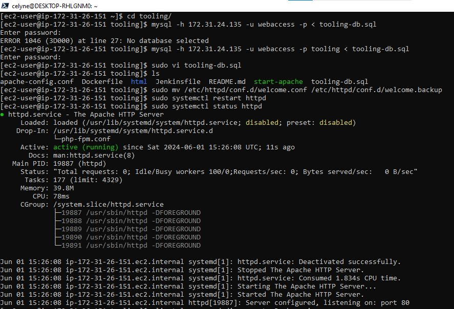
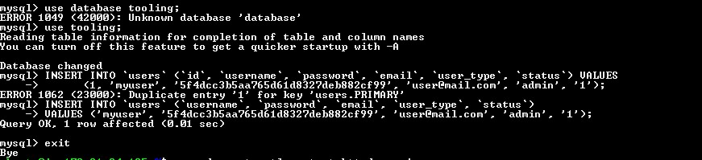
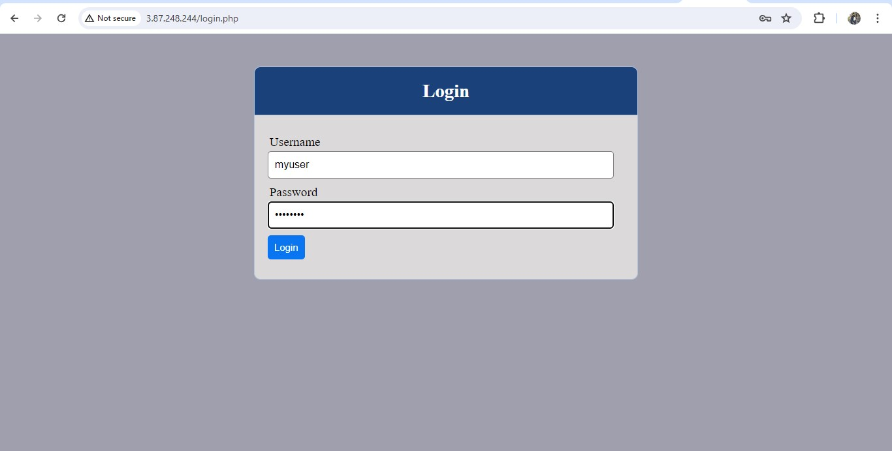
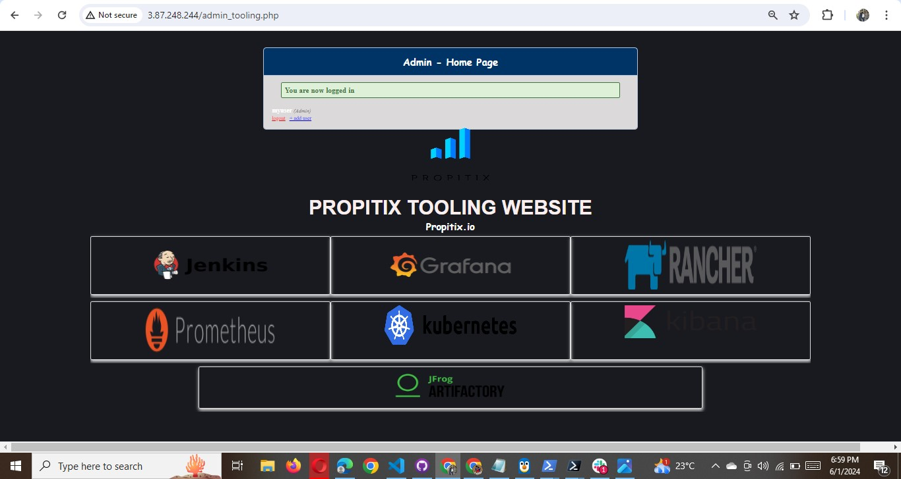

# Repeat steps 1-5 for another 2 Web Servers.

6. Verify that Apache files and directories are available on the Web Server in /var/www and also on the NFS server in /mnt/apps.
   If you see the same files – it means NFS is mounted correctly. You can try to create a new file touch test.txt from one server and
   check if the same file is accessible from other Web Servers.


7. Locate the log folder for Apache on the Web Server and mount it to NFS server’s export for logs. Repeat step №4 to make sure the mount point will persist after reboot.

8. Fork the tooling source code from [Darey.io Github Account](https://github.com/darey-io/tooling) to your Github account. (Learn how to fork a repo [here](https://youtu.be/f5grYMXbAV0))



9. Deploy the tooling website’s code to the Webserver. Ensure that the html folder from the repository is deployed to /var/www/html

Note 1: Do not forget to open TCP port 80 on the Web Server.

Note 2: If you encounter 403 Error – check permissions to your /var/www/html folder and also disable SELinux sudo setenforce 0
To make this change permanent – open following config file sudo vi /etc/sysconfig/selinux and set SELINUX=disabledthen restrt httpd.





10. Update the website’s configuration to connect to the database in `(/var/www/html/functions.php file)`. Apply tooling-db.sql script to your database using this command

```powershell
mysql -h <databse-private-ip> -u <db-username> -p <db-pasword> < tooling-db.sql
```




11. Create in MySQL a new admin user with username: myuser and password: password:

```powershell
INSERT INTO ‘users’ (‘id’, ‘username’, ‘password’, ’email’, ‘user_type’, ‘status’) VALUES
-> (1, ‘myuser’, ‘5f4dcc3b5aa765d61d8327deb882cf99’, ‘user@mail.com’, ‘admin’, ‘1’);
```



12. Open the website in your browser

http://Web-Server-Public-IP-Address-or-Public-DNS-Name/index.php

and make sure you can login into the websute with myuser user.




Congratulations!
You have just implemented a web solution for a DevOps team using LAMP stack with remote Database and NFS servers


