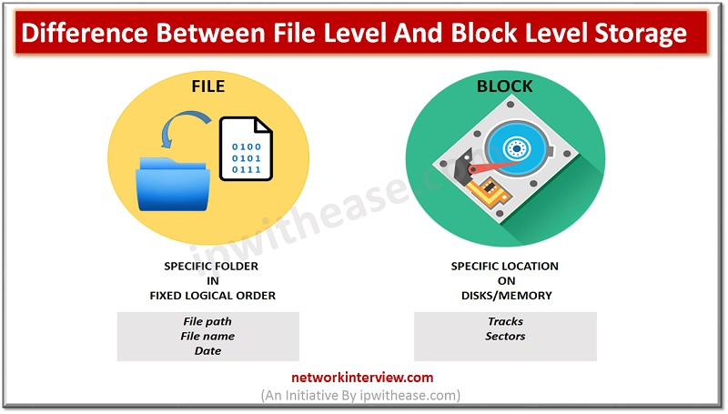

# Block-Level Storage

Block-level storage is a fundamental concept in the world of data storage and management. It refers to a storage architecture where data is organized and accessed at the level of individual blocks, rather than entire files. This approach offers several advantages in terms of efficiency, performance, and flexibility.

## Understanding Block-Level Storage

In block-level storage, data is divided into fixed-size blocks, typically ranging from a few kilobytes to a few megabytes in size. Each block is assigned a unique address, allowing for direct access and manipulation. This is in contrast to file-level storage, where data is organized and accessed at the level of files and directories.

Block-level storage operates at a lower level of abstraction compared to file-level storage. It treats data as a series of blocks with no inherent structure or format. This makes it highly versatile and suitable for a wide range of applications and storage systems.

## Advantages of Block-Level Storage

Block-level storage offers several advantages over file-level storage, making it a popular choice in many storage environments. Here are some key benefits:

### 1. Efficient Storage Utilization

By operating at the block level, block-level storage enables more efficient utilization of storage space. Since data is stored in individual blocks, there is no need to allocate space for entire files. This reduces wasted storage space and allows for more precise allocation of resources.

### 2. Improved Performance

Block-level storage can provide improved performance compared to file-level storage. Since data is accessed at the block level, it allows for more granular and efficient data transfers. This reduces the overhead associated with transferring entire files, resulting in faster read and write operations.

### 3. Flexibility and Versatility

Block-level storage is highly flexible and versatile. It can be used with various storage technologies, including hard disk drives (HDDs), solid-state drives (SSDs), and even network-attached storage (NAS) systems. This makes it suitable for a wide range of applications and storage architectures.

### 4. Simplified Data Management

With block-level storage, data management becomes more streamlined and efficient. Since data is stored in individual blocks, it is easier to perform tasks such as data replication, data migration, and data backup. This simplifies overall data management and improves data availability and reliability.

### 5. Support for Advanced Features

Block-level storage often supports advanced features such as snapshots, thin provisioning, and data deduplication. These features enhance data protection, storage efficiency, and overall system performance. They allow for more efficient use of storage resources and provide additional layers of data protection.

## Use Cases for Block-Level Storage

Block-level storage is widely used in various storage scenarios. Here are some common use cases:

### 1. Virtualization

Block-level storage is commonly used in virtualized environments. Virtual machines (VMs) require direct access to storage at the block level to achieve optimal performance. Block-level storage provides the necessary flexibility and performance for virtualized workloads.

### 2. Database Storage

Databases often require high-performance storage with low latency. Block-level storage meets these requirements by allowing direct access to individual data blocks. This enables efficient database operations, such as random access and transaction processing.

### 3. High-Performance Computing

Block-level storage is crucial in high-performance computing (HPC) environments, where large amounts of data need to be processed quickly. By providing fast and efficient data access, block-level storage supports the demanding requirements of HPC applications.

### 4. Data Replication and Disaster Recovery

Block-level storage is commonly used for data replication and disaster recovery purposes. By replicating individual data blocks, organizations can ensure data consistency and availability in the event of a disaster or system failure.

### 5. Storage Area Networks (SANs)

Storage Area Networks (SANs) often rely on block-level storage for centralized storage management and data sharing. SANs provide high-speed access to shared storage resources, allowing multiple servers to access and share data concurrently.

## Conclusion

Block-level storage is a powerful storage architecture that offers numerous benefits in terms of efficiency, performance, and flexibility. By operating at the block level, it enables efficient storage utilization, improved performance, and simplified data management. Whether used in virtualized environments, database storage, high-performance computing, or data replication scenarios, block-level storage provides the foundation for efficient and scalable storage solutions.
