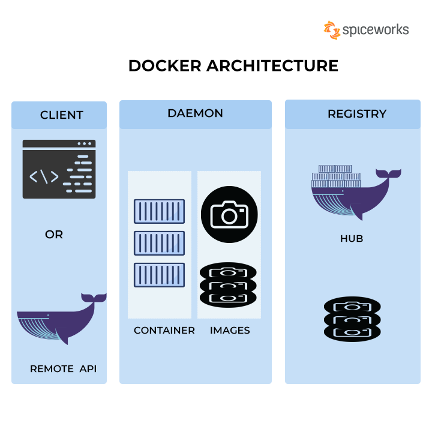

# Docker: Revolutionizing Containerization

Welcome to the world of Docker, a revolutionary technology that has transformed the way we build, ship, and run applications. In this article, we will explore the power of Docker and how it has revolutionized containerization. So, let's dive in and discover the wonders of Docker!

## What is Docker?

Docker is an open-source platform that allows you to automate the deployment, scaling, and management of applications using containerization. Containers are lightweight, isolated environments that package everything needed to run an application, including the code, runtime, system tools, and libraries. Docker provides a standardized way to create, distribute, and run containers, making it easier to build and deploy applications across different environments.

## Key Features of Docker

### 1. Containerization

Docker enables containerization, which allows applications to run in isolated environments without interfering with each other. Each container has its own filesystem, network, and process space, ensuring that applications are isolated and portable.

### 2. Image-based Deployment

Docker uses images to package applications and their dependencies. An image is a lightweight, standalone, and executable software package that includes everything needed to run an application. Images are built from a set of instructions called Dockerfile, which defines the application's environment and configuration.

### 3. Scalability and Portability

Docker makes it easy to scale applications horizontally by running multiple containers across different hosts. Containers can be easily deployed and managed using orchestration tools like Docker Swarm or Kubernetes. Docker also ensures portability, allowing applications to run consistently across different environments, from development to production.

### 4. Resource Efficiency

Containers created with Docker are lightweight and share the host system's kernel, making them highly efficient in terms of resource utilization. This allows you to run more containers on a single host, maximizing resource efficiency and reducing infrastructure costs.

### 5. Version Control and Collaboration

Docker integrates with version control systems like Git, allowing you to track changes to your Dockerfiles and application code. This enables collaboration among team members, making it easier to manage and deploy applications in a consistent and reproducible manner.

## Use Cases of Docker

Docker is widely used in various industries and scenarios. Here are some common use cases:

### 1. Application Deployment and Continuous Integration/Continuous Deployment (CI/CD)

Docker simplifies the deployment process by providing a consistent environment for applications. It allows you to package your application and its dependencies into a container, ensuring that it runs consistently across different environments. Docker also integrates well with CI/CD pipelines, enabling automated testing, building, and deployment of applications.

### 2. Microservices Architecture

Docker is a perfect fit for building and deploying microservices-based architectures. Each microservice can be packaged as a separate container, allowing for independent development, scaling, and deployment. Docker's containerization and orchestration capabilities make it easier to manage and scale a large number of microservices.

### 3. Hybrid and Multi-Cloud Environments

Docker provides a consistent environment for applications, making it easier to deploy and run them across different cloud providers or on-premises infrastructure. With Docker, you can build once and run anywhere, reducing vendor lock-in and increasing flexibility in deploying applications.

### 4. Development and Testing

Docker simplifies the setup of development and testing environments by providing isolated containers. Developers can create containers that mirror the production environment, ensuring consistency and reducing the "works on my machine" problem. Docker also allows for easy sharing of development and testing environments among team members.

## Getting Started with Docker

To get started with Docker, follow these steps:

1. Install Docker on your machine by downloading the Docker Desktop application for your operating system.
2. Familiarize yourself with Docker concepts like images, containers, Dockerfiles, and Docker Compose.
3. Create a Dockerfile for your application, defining its environment and dependencies.
4. Build an image from your Dockerfile using the `docker build` command.
5. Run a container from your image using the `docker run` command.
6. Explore Docker Hub, a public repository of Docker images, to find pre-built images for popular applications and services.
7. Experiment with Docker Compose to define and manage multi-container applications.
8. Learn about Docker orchestration tools like Docker Swarm or Kubernetes for managing containerized applications at scale.

## Conclusion

Docker has revolutionized the way we build, ship, and run applications. Its containerization technology provides a lightweight, scalable, and portable solution for deploying applications across different environments. With Docker, you can streamline your development and deployment processes, improve resource efficiency, and enable collaboration among team members. So, embrace the power of Docker and unlock the full potential of containerization!
