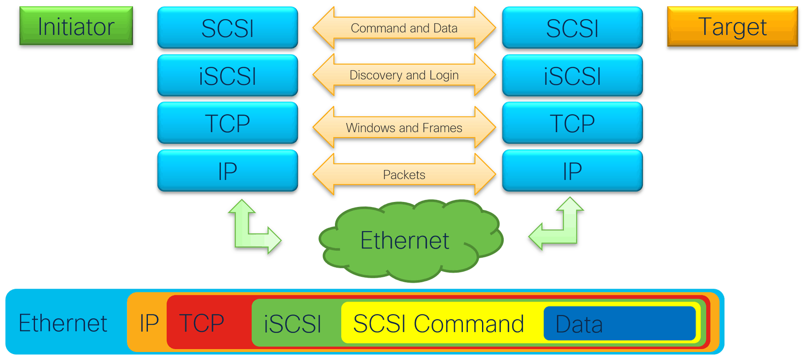
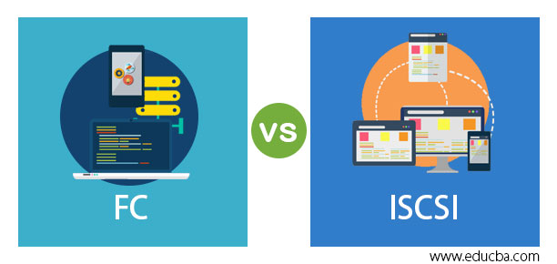

# The Power of iSCSI: Simplifying Storage Networking and Data Management

## Introduction

In the world of data storage and management, efficiency and scalability are key. iSCSI, which stands for Internet Small Computer System Interface, is a powerful storage networking protocol that enables the transport of SCSI commands over IP networks. It provides a cost-effective and flexible solution for connecting servers to storage devices, allowing for centralized storage management and simplified data sharing. Whether you're a system administrator, a storage professional, or simply someone interested in learning about the latest storage technologies, this comprehensive guide will provide you with all the information you need to understand and leverage the power of iSCSI.

## What is iSCSI?

iSCSI is a storage networking protocol that allows for the transmission of SCSI commands over IP networks. It combines the benefits of traditional SCSI, a popular storage interface used in many enterprise environments, with the flexibility and scalability of IP networks. By encapsulating SCSI commands within IP packets, iSCSI enables the seamless integration of storage devices into IP-based networks, eliminating the need for dedicated storage networks and expensive Fibre Channel infrastructure.

### Key Features of iSCSI

- **Block-Level Storage**: iSCSI operates at the block level, allowing for the transfer of individual storage blocks rather than entire files. This enables efficient storage utilization and improves performance by reducing network overhead.
- **IP Network Compatibility**: iSCSI leverages existing IP networks, making it compatible with standard Ethernet infrastructure. This eliminates the need for separate storage networks, reducing costs and simplifying network management.
- **Scalability**: iSCSI supports the use of multiple initiators (servers) and targets (storage devices), allowing for the creation of scalable storage networks. This makes it ideal for environments with growing storage needs.
- **Centralized Storage Management**: iSCSI enables centralized storage management, allowing administrators to easily allocate and manage storage resources from a single interface. This simplifies storage provisioning and improves overall data management efficiency.
- **Data Protection**: iSCSI supports various data protection mechanisms, including CHAP (Challenge-Handshake Authentication Protocol) authentication and encryption, ensuring the security and integrity of data during transmission.

## Setting Up iSCSI

Setting up an iSCSI environment involves configuring both the iSCSI initiator (server) and the iSCSI target (storage device). Here are the general steps to get started:

### 1. iSCSI Target Configuration

1. Install an iSCSI target software on the storage device. There are various iSCSI target software options available, both open-source and commercial.
2. Configure the iSCSI target software to create logical units (LUNs) and assign them to specific initiators. LUNs represent the storage volumes that will be made available to the initiators.
3. Set up access controls and define authentication mechanisms to ensure that only authorized initiators can access the assigned LUNs.
4. Configure any additional features or settings provided by the iSCSI target software, such as encryption or performance optimizations.

### 2. iSCSI Initiator Configuration

1. Install an iSCSI initiator software on the server or client device that will be accessing the iSCSI target. Most operating systems have built-in iSCSI initiator functionality.
2. Configure the iSCSI initiator software to discover and connect to the iSCSI target. This typically involves specifying the IP address or hostname of the iSCSI target.
3. Provide the necessary authentication credentials, such as a username and password, to authenticate with the iSCSI target.
4. Once connected, the iSCSI initiator will detect the available LUNs and make them accessible as local storage devices on the server or client device.

### 3. Storage Management and Data Access

1. Use the storage management interface provided by the iSCSI target software to allocate and manage storage resources. This includes tasks such as creating new LUNs, expanding existing LUNs, and configuring RAID levels if applicable.
2. On the server or client device, use the operating system's disk management tools to initialize and format the iSCSI LUNs. This will make them accessible as regular storage volumes on the server or client device.
3. Once formatted, the iSCSI LUNs can be used for various storage purposes, such as hosting databases, storing virtual machine images, or serving as shared storage for a cluster of servers.

## iSCSI vs. Other Storage Protocols

While iSCSI is a powerful storage networking protocol, it's important to understand how it compares to other storage protocols. Here are some key differences:

- **Fibre Channel**: iSCSI provides a cost-effective alternative to Fibre Channel, a dedicated storage networking protocol. While Fibre Channel offers high performance and low latency, it requires specialized hardware and can be more expensive to implement.
- **NFS**: iSC### Frequently Asked Questions (FAQ)

1. **What are the advantages of using iSCSI for storage networking?**
   iSCSI offers several advantages, including cost-effectiveness, scalability, compatibility with existing IP networks, centralized storage management, and data protection mechanisms. It simplifies storage networking and allows for efficient data sharing and management.

2. **Can iSCSI be used in both small and large-scale environments?**
   Yes, iSCSI is suitable for both small and large-scale environments. It can be easily scaled to accommodate growing storage needs and is compatible with standard Ethernet infrastructure, making it accessible to organizations of all sizes.

3. **Is iSCSI secure for transmitting sensitive data?**
   Yes, iSCSI provides data protection mechanisms such as CHAP authentication and encryption to ensure the security and integrity of data during transmission. These features help safeguard sensitive information and prevent unauthorized access.

4. **Does iSCSI require specialized hardware?**
   Unlike Fibre Channel, iSCSI does not require specialized hardware. It leverages existing IP networks and standard Ethernet infrastructure, making it a cost-effective solution for storage networking.

5. **Can iSCSI be used for both block-level and file-level storage?**
   iSCSI primarily operates at the block level, allowing for the transfer of individual storage blocks. However, it can also be used in conjunction with file-level protocols like NFS (Network File System) to provide a comprehensive storage solution.

### Conclusion

In conclusion, iSCSI is a powerful storage networking protocol that simplifies storage management and data sharing. Its compatibility with existing IP networks, scalability, and cost-effectiveness make it an attractive solution for organizations of all sizes. By leveraging iSCSI, businesses can streamline their storage infrastructure, improve data management efficiency, and ensure the security of their valuable information. So, whether you're a system administrator or a storage professional, consider exploring the power of iSCSI and unlock the potential of efficient storage networking.
