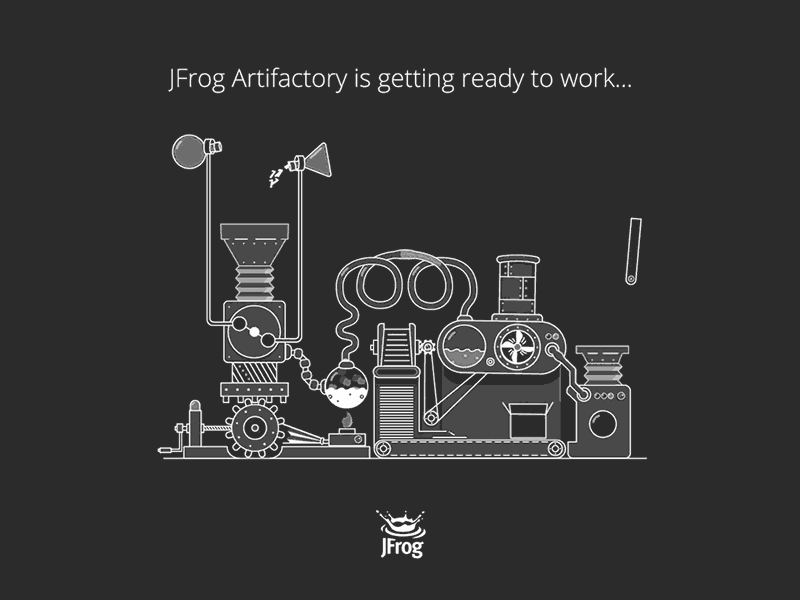

# JFrog Artifactory: Empowering DevOps with Advanced Artifact Management

In the fast-paced world of software development, efficient management of artifacts, such as binaries, container images, and libraries, is crucial for successful DevOps practices.

JFrog Artifactory is a leading universal artifact repository manager that provides a centralized platform for storing, managing, and distributing software artifacts. In this comprehensive guide, we will explore the features and benefits of JFrog Artifactory, as well as provide a step-by-step tutorial on how to set it up and leverage its capabilities to streamline your DevOps workflows.

## Table of Contents

1. [What is JFrog Artifactory?](#what-is-jfrog-artifactory)
2. [Why Use JFrog Artifactory?](#why-use-jfrog-artifactory)
3. [Setting Up JFrog Artifactory](#setting-up-jfrog-artifactory)
4. [Managing Artifacts with JFrog Artifactory](#managing-artifacts-with-jfrog-artifactory)
5. [Integrating JFrog Artifactory with CI/CD Pipelines](#integrating-jfrog-artifactory-with-ci-cd-pipelines)
6. [Securing Artifacts with JFrog Artifactory](#securing-artifacts-with-jfrog-artifactory)
7. [Monitoring and Analytics with JFrog Artifactory](#monitoring-and-analytics-with-jfrog-artifactory)
8. [Conclusion](#conclusion)
9. [FAQ](#faq)

## What is JFrog Artifactory?

JFrog Artifactory is a universal artifact repository manager that serves as a single source of truth for all your software artifacts. It supports various package formats, including Maven, Gradle, npm, Docker, and more, making it compatible with a wide range of programming languages and technologies. Artifactory provides a secure and scalable platform for storing, versioning, and distributing artifacts, enabling teams to collaborate effectively and streamline their software development processes.

## Why Use JFrog Artifactory?

There are several reasons why JFrog Artifactory has become the go-to choice for artifact management in the DevOps community:

1. **Centralized Artifact Management**: Artifactory acts as a central repository for all your software artifacts, eliminating the need for scattered storage solutions. It provides a unified interface to manage and access artifacts, making it easier to track dependencies, enforce version control, and ensure artifact consistency across projects.

2. **Efficient Dependency Management**: Artifactory's powerful dependency management capabilities enable you to resolve and cache dependencies from remote repositories, reducing build times and improving overall development efficiency. It also allows you to define and enforce custom dependency rules to ensure compliance and minimize the risk of using vulnerable or outdated dependencies.

3. **Secure and Reliable Distribution**: Artifactory ensures secure and reliable distribution of artifacts to development, testing, and production environments. It supports fine-grained access control, allowing you to define permissions and roles for different users and teams. Artifactory also provides checksum-based verification and content integrity checks to ensure that artifacts are not tampered with during transit.

4. **Integration with CI/CD Pipelines**: Artifactory seamlessly integrates with popular CI/CD tools like Jenkins, Bamboo, and GitLab, enabling you to automate the deployment and release of artifacts. It supports build promotion and release management workflows, allowing you to promote artifacts through different stages of the software development lifecycle with ease.

5. **Advanced Search and Metadata Management**: Artifactory's advanced search capabilities enable you to quickly find and retrieve artifacts based on various criteria, such as name, version, properties, and more. It also supports custom metadata management, allowing you to add additional information to artifacts for better organization and categorization.

6. **High Availability and Scalability**: Artifactory supports high availability configurations, ensuring that your artifact repository remains accessible even in the event of a failure. It can be deployed in a clustered setup, distributing the load across multiple nodes for improved performance and scalability.

## Setting Up JFrog Artifactory

Setting up JFrog Artifactory involves the following steps:

1. **Choose an Installation Method**: JFrog Artifactory can be installed on-premises or in the cloud. You can choose to download and install the standalone version or use the JFrog Cloud offering for a hassle-free experience.

2. **Configure System Requirements**: Ensure that your system meets the minimum requirements for running Artifactory, including hardware specifications, operating system compatibility, and database requirements.

3. **Install and Configure Artifactory**: Follow the installation guide provided by JFrog to install Artifactory on your chosen platform. Configure the necessary settings, such as database connection, security settings, and repository layouts.

4. **Access Artifactory UI**: Once Artifactory is installed and configured, you can access the Artifactory UI through a web browser. Use the provided credentials to log in.

## Conclusion

In conclusion, JFrog Artifactory is a powerful artifact repository manager that empowers DevOps teams with advanced artifact management capabilities. By centralizing and streamlining the storage, versioning, and distribution of software artifacts, Artifactory enables teams to collaborate more effectively and accelerate their software development processes. With its support for various package formats, integration with CI/CD pipelines, robust security features, and advanced search and metadata management capabilities, Artifactory is a comprehensive solution for managing artifacts in a DevOps environment.

By implementing JFrog Artifactory, organizations can enhance their DevOps workflows, improve software quality and reliability, and achieve faster time-to-market. Whether you are a small startup or a large enterprise, Artifactory provides the scalability, flexibility, and security required to meet the demands of modern software development.

So, if you are looking to optimize your artifact management and take your DevOps practices to the next level, consider adopting JFrog Artifactory as your artifact repository manager. With its extensive features and seamless integration with existing tools and technologies, Artifactory is a game-changer in the world of DevOps.

## FAQ

**Q1: Can JFrog Artifactory be used with different programming languages?**

Yes, JFrog Artifactory supports various package formats, making it compatible with a wide range of programming languages and technologies. Some of the supported formats include Maven, Gradle, npm, Docker, NuGet, PyPI, and more.

**Q2: Can Artifactory be integrated with CI/CD pipelines?**

Absolutely! JFrog Artifactory seamlessly integrates with popular CI/CD tools like Jenkins, Bamboo, and GitLab. It enables you to automate the deployment and release of artifacts, promoting efficient and streamlined software delivery.

**Q3: How does Artifactory ensure the security of artifacts?**

Artifactory provides robust security features to protect your artifacts. It supports fine-grained access control, allowing you to define permissions and roles for different users and teams. It also offers checksum-based verification and content integrity checks to ensure that artifacts are not tampered with during transit.

**Q4: Can Artifactory be deployed in a high availability configuration?**

Yes, JFrog Artifactory supports high availability configurations. It can be deployed in a clustered setup, distributing the load across multiple nodes for improved performance and scalability. This ensures that your artifact repository remains accessible even in the event of a failure.

**Q5: Does Artifactory provide advanced search capabilities?**

Yes, Artifactory offers advanced search capabilities that allow you to quickly find and retrieve artifacts based on various criteria, such as name, version, properties, and more. This makes it easier to manage and organize your artifacts effectively.

For more information and detailed documentation on JFrog Artifactory, please visit the official [JFrog website](https://www.jfrog.com/artifactory/).
