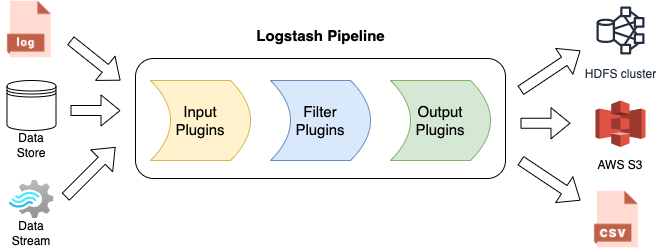

# Logstash: The Data Processing Powerhouse of the Elastic Stack

Logstash is an open-source data processing pipeline that allows organizations to collect, transform, and enrich data from a wide range of sources. It acts as a central hub for ingesting data and preparing it for further analysis and visualization. Logstash is highly flexible and can handle diverse data types, making it a valuable tool for data integration and preprocessing.

## How does Logstash work?

Logstash follows a simple yet powerful "input-process-output" model. It consists of three main stages:

### 1. Input

Logstash supports a wide range of input plugins that allow it to collect data from various sources. These sources can include log files, databases, message queues, web services, and more. Logstash provides pre-built input plugins for popular sources like Apache Kafka, Amazon S3, and MySQL, making it easy to integrate with existing data infrastructure.

### 2. Process

Once the data is collected, Logstash applies a series of filters to process and transform it. Filters can be used to parse structured data, extract relevant fields, convert data formats, and perform various other operations. Logstash offers a rich set of built-in filters, including grok for pattern matching, date for timestamp parsing, and mutate for field manipulation. Additionally, Logstash allows users to create custom filters using Ruby or other programming languages.

### 3. Output

After the data is processed, Logstash sends it to one or more output destinations. These destinations can include Elasticsearch for indexing and storage, other data stores like MongoDB or Apache Cassandra, message queues like Apache Kafka or RabbitMQ, or even external systems through HTTP or TCP/UDP protocols. Logstash provides a wide range of output plugins to support different destinations, ensuring seamless integration with the rest of the data pipeline.

## Key Features of Logstash

Logstash offers several key features that make it a powerful data processing tool:

### 1. Scalability and Performance

Logstash is designed to handle high volumes of data and can scale horizontally to meet the demands of large-scale data processing. It can distribute the processing workload across multiple nodes, ensuring high availability and performance. Logstash also supports parallel processing, allowing it to handle data ingestion and transformation in real-time.

### 2. Data Enrichment

Logstash enables organizations to enrich their data by adding additional information or context. It can perform lookups against external data sources, enrich data with geolocation information, or apply business logic to enhance the data. This data enrichment process helps organizations gain deeper insights and make more informed decisions.

### 3. Extensibility

Logstash's extensible architecture allows users to create custom plugins and filters to meet their specific data processing needs. This flexibility enables organizations to integrate Logstash with their existing systems and extend its functionality as required. The Logstash community also contributes a wide range of plugins, providing additional capabilities and options for data processing.

### 4. Monitoring and Debugging

Logstash provides built-in monitoring capabilities that allow users to track the health and performance of their data processing pipelines. It offers a monitoring API and a web-based monitoring interface that provides real-time insights into the status of Logstash nodes, events processed, and resource utilization. Logstash also generates logs and error messages, making it easier to debug and troubleshoot data processing issues.

## Best Practices for Using Logstash

To make the most out of Logstash, consider the following best practices:

### 1. Plan for Scalability

When designing your Logstash deployment, consider the expected data volume and processing requirements. Ensure that your Logstash cluster is properly sized and can handle the workload. Distribute the processing load across multiple nodes using techniques like load balancing and clustering to achieve scalability and fault tolerance.

### 2. Optimize Data Processing

Efficient data processing is crucial for optimal performance. Use the appropriate filters and techniques to parse and transform your data efficiently. Take advantage of Logstash's built-in filters and plugins to handle common data processing tasks. Avoid unnecessary operations and ensure that your filters are optimized for speed and resource usage.

### 3. Handle Data Errors and Failures

Data ingestion can sometimes encounter errors or failures. Implement error handling mechanisms in your Logstash pipeline to handle such situations gracefully. Use techniques like dead letter queues, retry mechanisms, and error logging to ensure that data is not lost and processing continues smoothly.

### 4. Secure Your Data Pipeline

Ensure the security of your Logstash deployment by following best practices for network security, access control, and data encryption. Use secure protocols like SSL/TLS for data transmission and implement proper authentication and authorization mechanisms. Regularly update Logstash and its plugins to benefit from the# FAQ

## Q1: What is the role of Logstash in the Elastic Stack?

Logstash plays a crucial role in the Elastic Stack by serving as the data processing pipeline. It collects data from various sources, processes and transforms it, and sends it to the desired output destinations. Logstash acts as a bridge between data sources and the rest of the Elastic Stack, enabling organizations to ingest, enrich, and prepare their data for further analysis and visualization.

## Q2: Can Logstash handle high volumes of data?

Yes, Logstash is designed to handle high volumes of data. It is built for scalability and can distribute the processing workload across multiple nodes, ensuring high availability and performance. Logstash can scale horizontally to meet the demands of large-scale data processing and supports parallel processing, allowing it to handle data ingestion and transformation in real-time.

## Q3: Can Logstash enrich data with additional information?

Yes, Logstash provides data enrichment capabilities. It allows organizations to add additional information or context to their data during the processing stage. Logstash can perform lookups against external data sources, enrich data with geolocation information, or apply business logic to enhance the data. This data enrichment process helps organizations gain deeper insights and make more informed decisions.

## Q4: Can I extend Logstash's functionality?

Yes, Logstash is highly extensible. Its architecture allows users to create custom plugins and filters to meet their specific data processing needs. This flexibility enables organizations to integrate Logstash with their existing systems and extend its functionality as required. Additionally, the Logstash community contributes a wide range of plugins, providing additional capabilities and options for data processing.

## Q5: How can I monitor and debug my Logstash pipeline?

Logstash provides built-in monitoring capabilities to track the health and performance of your data processing pipelines. It offers a monitoring API and a web-based monitoring interface that provides real-time insights into the status of Logstash nodes, events processed, and resource utilization. Logstash also generates logs and error messages, making it easier to debug and troubleshoot data processing issues.
