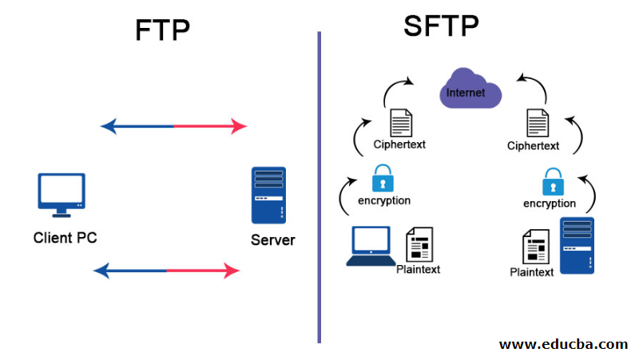
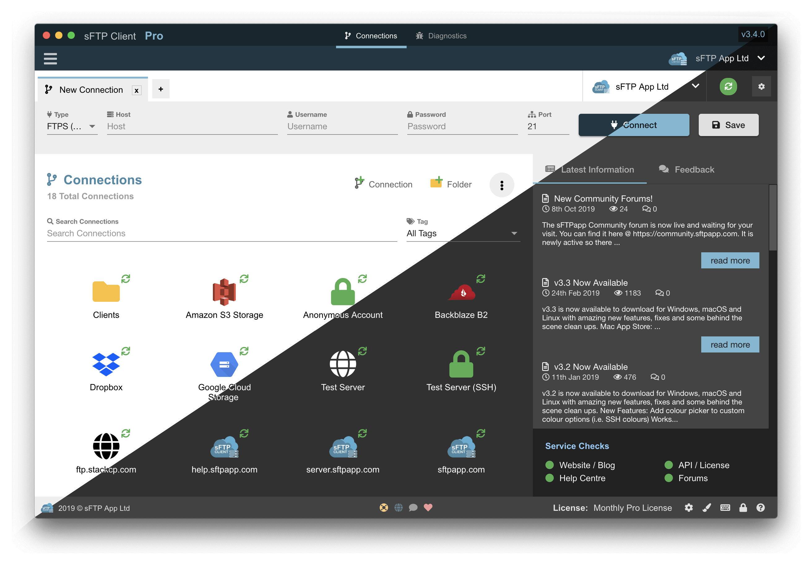

# The Ultimate Guide to (S)FTP: Secure File Transfer Made Easy

(S)FTP, or (Secure) File Transfer Protocol, is a network protocol that allows the transfer of files between a client and a server over a network. It provides a secure and reliable method for transferring files, ensuring that data remains confidential and intact during transit. (S)FTP is commonly used for website maintenance, software distribution, and file sharing among remote teams.

### Key Features of (S)FTP

- **Secure File Transfer**: (S)FTP uses encryption to protect files during transit, ensuring that sensitive data remains confidential and cannot be intercepted by unauthorized parties.
- **Authentication and Access Control**: (S)FTP requires users to provide valid credentials to access files on the server, ensuring that only authorized individuals can transfer or modify files.
- **Directory Listing and Navigation**: (S)FTP allows users to list and navigate through directories on the server, making it easy to locate and transfer specific files.
- **Resume Support**: (S)FTP supports resuming interrupted file transfers, allowing users to pick up where they left off in case of a connection failure or interruption.
- **File and Directory Operations**: (S)FTP supports various file and directory operations, including uploading, downloading, renaming, deleting, and creating directories.

## (S)FTP vs. FTP: What's the Difference?

(S)FTP and FTP (File Transfer Protocol) are often used interchangeably, but there are some key differences between the two:

- **Security**: (S)FTP incorporates encryption to secure file transfers, while FTP does not provide any built-in security measures.
- **Portability**: (S)FTP is supported by most operating systems and platforms, including Windows, macOS, Linux, and Unix-like systems. FTP, on the other hand, may have limited support on certain platforms.
- **Firewall Friendliness**: (S)FTP is more firewall-friendly than FTP. FTP requires multiple ports to be open, which can be challenging in restrictive firewall environments.
- **Authentication**: (S)FTP supports various authentication methods, including username/password, SSH keys, and SSL/TLS certificates. FTP primarily relies on username/password authentication.
- **File Locking**: (S)FTP supports file locking mechanisms to prevent conflicts when multiple users attempt to access or modify the same file simultaneously. FTP does not have built-in file locking capabilities.

## Setting Up (S)FTP

Setting up (S)FTP involves configuring both the server and the client. Here are the general steps to get started:

### 1. Server Configuration

1. Install an (S)FTP server software on the server machine. Popular options include OpenSSH, vsftpd, and ProFTPD.
2. Configure the server software to enable (S)FTP access, specify the root directory for file transfers, and set up authentication methods.
3. Configure any additional security measures, such as firewall rules and SSL/TLS encryption, to enhance the security of the (S)FTP server.

### 2. Client Configuration

1. Install an (S)FTP client software on the client machine. Some popular options include FileZilla, WinSCP, and Cyberduck.
2. Launch the (S)FTP client and enter the server's hostname or IP address, along with the appropriate port number.
3. Provide the necessary authentication credentials, such as a username and password or SSH key, to connect to the (S)FTP server.
4. Once connected, you can navigate through the server's directory structure and transfer files between the client and the server.

### 3. Security Considerations

To ensure the security of your (S)FTP setup, consider implementing the following measures:

- **Encryption**: Enable SSL/TLS encryption for (S)FTP connections to protect data during transit. This prevents unauthorized parties from intercepting sensitive information.
- **Strong Authentication**: Use strong and unique passwords for (S)FTP accounts. Consider implementing two-factor authentication (2FA) or using SSH keys for enhanced security.
- **Regular Updates**: Keep the (S)FTP server software and client software up to date with the latest security patches to protect against known vulnerabilities.
- **Firewall Configuration**: Configure your firewall to allow (S)FTP traffic on the appropriate ports. Restrict access to the (S)FTP server to trusted IP addresses if possible.
- \***\*FAQ: Frequently Asked Questions**

1. **What is the difference between FTP and (S)FTP?**
   FTP stands for File Transfer Protocol, while (S)FTP stands for (Secure) File Transfer Protocol. The main difference is that (S)FTP incorporates encryption to secure file transfers, while FTP does not provide any built-in security measures.

2. **Is (S)FTP secure?**
   Yes, (S)FTP is secure. It uses encryption to protect files during transit, ensuring that sensitive data remains confidential and cannot be intercepted by unauthorized parties.

3. **Can I use (S)FTP on any operating system?**
   Yes, (S)FTP is supported by most operating systems and platforms, including Windows, macOS, Linux, and Unix-like systems.

4. **What authentication methods are supported by (S)FTP?**
   (S)FTP supports various authentication methods, including username/password, SSH keys, and SSL/TLS certificates.

5. **Can multiple users access the same file simultaneously with (S)FTP?**
   Yes, (S)FTP supports file locking mechanisms to prevent conflicts when multiple users attempt to access or modify the same file simultaneously.

**Conclusion**

(S)FTP is a powerful and secure protocol for transferring files over a network. Whether you're a business owner, a web developer, or an individual who needs to send files securely, understanding and utilizing (S)FTP can greatly enhance your file transfer capabilities. By following the steps outlined in this guide and implementing the recommended security measures, you can ensure that your (S)FTP setup is optimized for efficiency and security. So, start exploring the world of (S)FTP and enjoy the benefits of secure file transfers!
