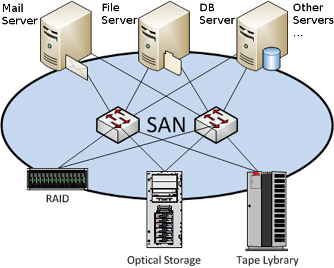

# The Comprehensive Guide to Storage Area Network (SAN)

A Storage Area Network (SAN) is a specialized network architecture that enables the connection of multiple storage devices to servers. It provides a dedicated, high-speed network infrastructure solely for the purpose of storage, allowing servers to access and share data with exceptional speed and efficiency. SANs are typically used in enterprise-level environments where large amounts of data need to be accessed and managed simultaneously.

### Key Features of SAN

- **High-Speed Connectivity**: SANs utilize high-speed Fibre Channel or Ethernet connections to provide fast and reliable data transfer between servers and storage devices.
- **Scalability**: SANs can be easily scaled to accommodate growing storage needs by adding additional storage devices or expanding the existing infrastructure.
- **Centralized Storage Management**: SANs centralize storage management, allowing administrators to efficiently allocate, monitor, and manage storage resources.
- **Data Redundancy**: SANs often incorporate data redundancy techniques such as RAID (Redundant Array of Independent Disks) to ensure data integrity and protection against disk failures.
- **Storage Virtualization**: SANs enable storage virtualization, allowing administrators to pool and allocate storage resources as needed, simplifying management and improving efficiency.

## Benefits of Using SAN

Implementing a Storage Area Network (SAN) offers numerous benefits for organizations:

- **High Performance**: SANs provide exceptional performance, enabling fast and efficient data access and transfer. This is particularly beneficial for applications that require real-time data processing or high-speed data transfers.
- **Scalability**: SANs are highly scalable, allowing organizations to easily expand their storage capacity as their needs grow. Additional storage devices can be seamlessly added to the SAN infrastructure without disrupting operations.
- **Centralized Management**: SANs centralize storage management, simplifying administration tasks and reducing the complexity of managing multiple storage devices.
- **Data Protection**: SANs incorporate data redundancy techniques such as RAID, ensuring data integrity and protection against disk failures. This helps minimize the risk of data loss and downtime.
- **Improved Resource Utilization**: SANs enable efficient allocation and utilization of storage resources, eliminating the need for dedicated storage on individual servers. This leads to better resource utilization and cost savings.

## Setting Up a SAN

Setting up a Storage Area Network (SAN) involves several key steps:

### 1. Planning and Design

Before implementing a SAN, it's essential to carefully plan and design the network architecture. Consider factors such as storage requirements, performance needs, scalability, and budget. Determine the number and type of storage devices, the network topology, and the connectivity options.

### 2. Hardware Acquisition

Acquire the necessary hardware components for your SAN, including storage devices, switches, host bus adapters (HBAs), and cables. Ensure compatibility between the components and choose reputable vendors that offer reliable and high-performance equipment.

### 3. SAN Fabric Configuration

Configure the SAN fabric, which consists of switches and interconnecting cables. Design the fabric to provide redundancy and fault tolerance to ensure uninterrupted data access. Configure zoning, which controls access to specific storage devices based on the servers' requirements.

### 4. Storage Device Configuration

Configure the storage devices within the SAN. This involves initializing the devices, creating logical unit numbers (LUNs), and configuring RAID levels and other storage settings. Optimize the storage configuration based on your specific requirements.

### 5. Server Configuration

Configure the servers to connect to the SAN. Install and configure the necessary host bus adapters (HBAs) or network interface cards (NICs) to establish connectivity with the SAN fabric. Install any required drivers or software provided by the SAN vendor.

### 6. Testing and Validation

Thoroughly test the SAN setup to ensure proper functionality and performance. Verify connectivity between servers and storage devices, test data transfer speeds, and validate the configuration against your initial requirements. Make any necessary adjustments or optimizations.

### 7. Monitoring and Maintenance

Implement a monitoring system to continuously monitor the SAN for performance, availability, and potential issues. Regularly perform maintenance tasks such as firmware updates, disk health checks, and performance optimizations to keep the SAN running smoothly.

## Optimizing SAN Performance

To optimize the performance of your Storage Area Network (SAN), consider the following factors:

### 1. Network Infrastructure

Ensure that your network infrastructure, including switches and cables, supports high-speed data transfer and has sufficient bandwidth to handle the expected workload. Use high-quality components and considerimplementing technologies like Fibre Channel over Ethernet (FCoE) for improved performance.

### 2. Storage Device Configuration

Optimize the configuration of your storage devices within the SAN. This includes configuring RAID levels, cache settings, and optimizing the placement of data across different disks. Consider using solid-state drives (SSDs) for high-performance workloads.

### 3. Network Topology

Design your SAN network topology to minimize latency and maximize throughput. Consider using redundant paths and load balancing techniques to distribute traffic evenly across the network. Implementing technologies like Multipath I/O (MPIO) can also improve performance and provide failover capabilities.

### 4. Monitoring and Performance Tuning

Regularly monitor the performance of your SAN using tools provided by the SAN vendor or third-party software. Identify any bottlenecks or performance issues and make necessary adjustments. This may include adjusting queue depths, tuning cache settings, or optimizing data placement.

### 5. Data Management and Tiering

Implement data management techniques such as tiering to optimize performance and cost-efficiency. Classify your data based on its importance and access frequency, and store it on appropriate storage tiers. Frequently accessed data can be stored on high-performance storage, while less frequently accessed data can be moved to lower-cost storage.

## Frequently Asked Questions (FAQ)

### Q1: What is the difference between SAN and NAS?

A1: While both SAN and NAS (Network Attached Storage) are storage technologies, they differ in their architecture and use cases. SAN is a dedicated network solely for storage, providing high-performance block-level access to storage devices. NAS, on the other hand, uses file-level access and is typically used for file sharing and centralized file storage.

### Q2: Can I use SAN for small businesses?

A2: Yes, SAN can be used for small businesses, especially if they have high-performance storage requirements or need centralized storage management. However, it's important to consider the cost and complexity of implementing and maintaining a SAN infrastructure, as it may not be suitable for all small businesses.

### Q3: Is SAN secure?

A3: SAN can be made secure by implementing appropriate security measures. This includes using zoning and access controls to restrict access to specific storage devices, encrypting data in transit, and implementing secure management practices. It's important to follow best practices and consult with security experts to ensure the security of your SAN.

### Q4: Can I connect multiple servers to a SAN?

A4: Yes, SAN allows multiple servers to connect to the same storage devices simultaneously. This enables shared access to data and facilitates collaboration among servers. However, it's important to properly configure zoning and access controls to ensure that each server can access the appropriate storage resources.

### Q5: Can SAN be used for disaster recovery?

A5: Yes, SAN can be used as part of a disaster recovery strategy. By replicating data between geographically dispersed SANs, organizations can ensure data availability in the event of a disaster. SAN-based replication technologies, such as synchronous or asynchronous replication, can be used to replicate data between primary and secondary SANs.

## Conclusion

Storage Area Network (SAN) is a powerful technology that provides high-performance storage capabilities for organizations. With its high-speed connectivity, scalability, and centralized management, SAN offers numerous benefits for businesses of all sizes. By following the steps outlined in this guide and optimizing SAN performance, organizations can leverage this technology to enhance data storage, access, and management. Implementing a SAN requires careful planning and configuration, but the rewards in terms of performance, scalability, and data protection are well worth the effort.
