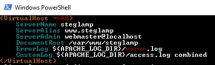
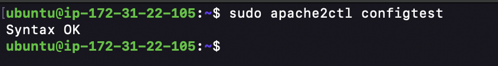

# Step 4 - Create a virtual host for the website using Apache

The default directory serving the apache default page is /var/www/html. Create your document directory next to the default one.\_\_

We create our directory for projectlamp using "mkdir" command

```powershell
$ sudo mkdir /var/www/projectlamp
```

Assign the directory ownership with $USER environment variable which references the current system user.

```
sudo chown -R $USER:$USER /var/www/projectlamp
```


Install vim and create and open a new configuration file in apache’s “sites-available” directory using vim.

```powershell
$ sudo vim /etc/apache2/sites-available/projectlamp.conf
```

Pass in the bare-bones configuration below:

```powershell
<VirtualHost *:80>
  ServerName projectlamp
  ServerAlias www.projectlamp
  ServerAdmin webmaster@localhost
  DocumentRoot /var/www/projectlamp
  ErrorLog ${APACHE_LOG_DIR}/error.log
  CustomLog ${APACHE_LOG_DIR}/access.log combined
</VirtualHost>
```



Show the new file in sites-available

```powershell
$ sudo ls /etc/apache2/sites-available
```

```powershell
Output:
000-default.conf default-ssl.conf projectlamp.conf
```

With the VirtualHost configuration, Apache will serve projectlamp using /var/www/projectlamp as its web root directory.

**Enable the new virtual host**

```powershell
$ sudo a2ensite projectlamp
```

**Disable apache’s default website.**

This is because Apache’s default configuration will overwrite the virtual host if not disabled. This is required if a custom domain is not being used.

```powershell
$ sudo a2dissite 000-default
```

**Ensure the configuration does not contain syntax error**

The command below was used:

```powershell
$ sudo apache2ctl configtest
```



**Reload apache for changes to take effect.**

```powershell
$ sudo systemctl reload apache2
```

**The new website is now active but the web root /var/www/projectlamp is still empty. Create an index.html file in this location so to test the virtual host work as expected.**

```powershell
$ sudo echo 'Hello LAMP from hostname' $(curl -s http://169.254.169.254/latest/meta-data/public-hostname) 'with public IP' $(curl -s http://169.254.169.254/latest/meta-data/public-ipv4) > /var/www/projectlamp/index.html
```

**Open the website on a browser using the public IP address.**

```powershell
http://184.72.210.143:80
```


This file can be left in place as a temporary landing page for the application until an index.php file is set up to replace it. Once this is done, the index.html file should be renamed or removed from the document root as it will take precedence over index.php file by default.

# Step 5 - Enable PHP on the website

With the default DirectoryIndex setting on Apache, index.html file will always take precedence over index.php file. This is useful for setting up maintenance page in PHP applications, by creating a temporary index.html file containing an informative message for visitors. The index.html then becomes the landing page for the application. Once maintenance is over, the index.html is renamed or removed from the document root bringing back the regular application page.
If the behaviour needs to be changed, /etc/apache2/mods-enabled/dir.conf file should be edited and the order in which the index.php file is listed within the DirectoryIndex directive should be changed.

Open the dir.conf file with vim to change the behaviour

```powershell
$ sudo vim /etc/apache2/mods-enabled/dir.conf
```

```powershell
<IfModule mod_dir.c>
  # Change this:
  # DirectoryIndex index.html index.cgi index.pl index.php index.xhtml index.htm
  # To this:
  DirectoryIndex index.php index.html index.cgi index.pl index.xhtml index.htm
</IfModule>
```


**Reload Apache**

Apache is reloaded so the changes takes effect.

```powershell
$ sudo systemctl reload apache2
```

**Create a php test script to confirm that Apache is able to handle and process requests for PHP files.**

A new index.php file was created inside the custom web root folder.

```powershell
vim /var/www/projectlamp/index.php
```

**Add the text below in the index.php file**

```powershell
<?php
phpinfo();
```

**Now refresh the page**

.png>)

This page provides information about the server from the perspective of PHP. It is useful for debugging and to ensure the settings are being applied correctly.

After checking the relevant information about the server through this page, It’s best to remove the file created as it contains sensitive information about the PHP environment and the ubuntu server. It can always be recreated if the information is needed later.

```powershell
sudo rm /var/www/projectlamp/index.php
```
