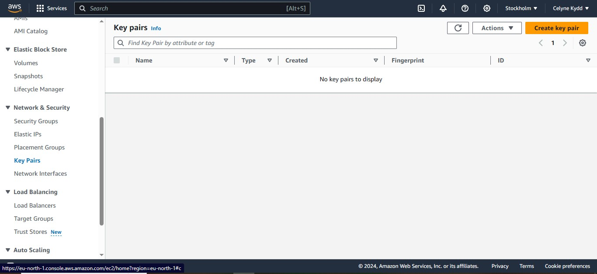
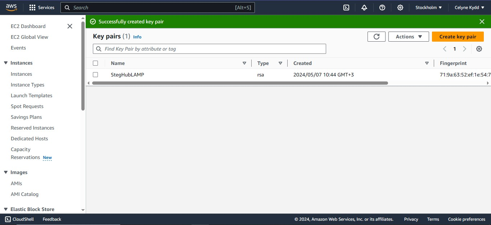
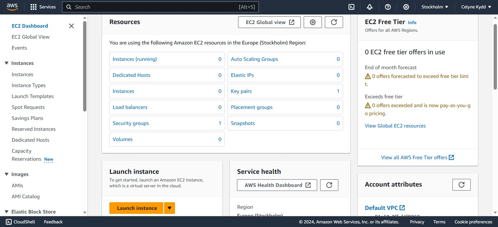
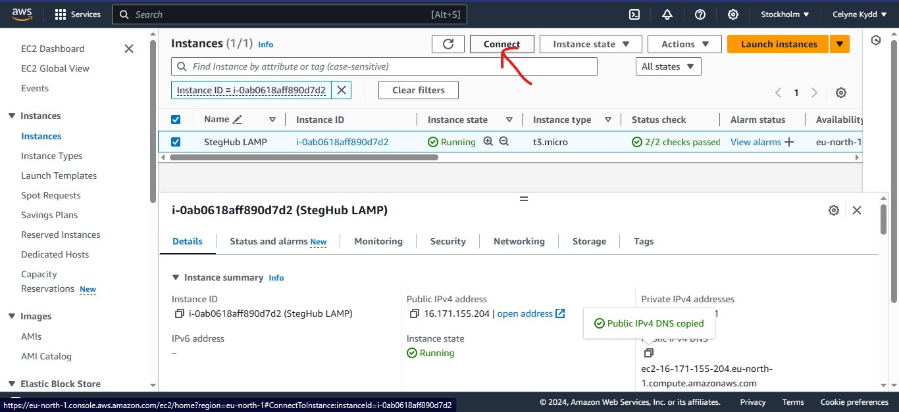
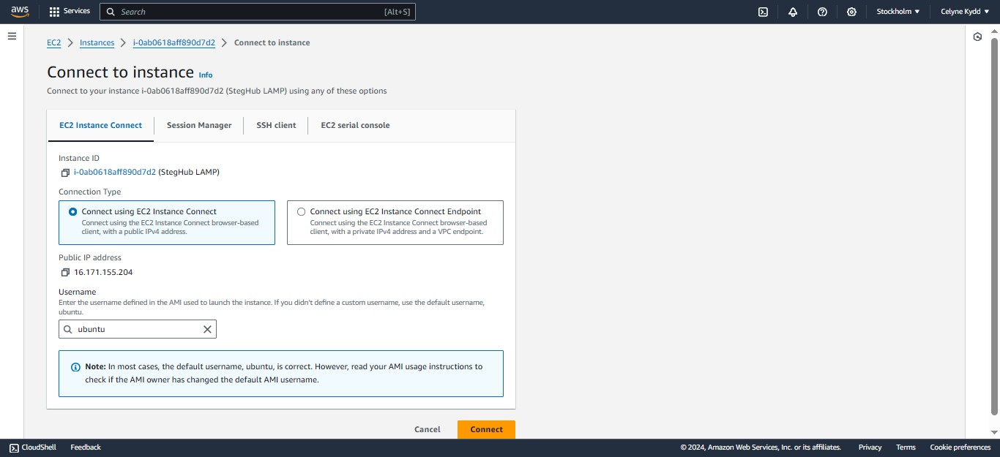
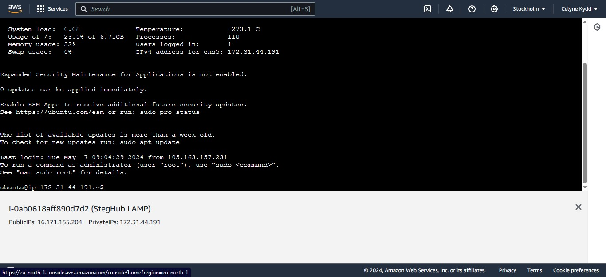

# WEB STACK IMPLEMENTATION (LAMP STACK) IN AWS

LAMP is a popular open-source software stack commonly used for building dynamic websites and web applications. It stands for:

Linux: This is the foundation of the LAMP stack. It's a free and open-source operating system that provides the platform on which the other components run. Linux is known for its stability, security, and flexibility.

Apache: This is the web server software that sits on top of the Linux operating system. Apache is responsible for processing incoming web requests, managing traffic, and serving content to users' browsers.

MySQL: This is a relational database management system (RDBMS) used for storing and managing the dynamic content of websites and applications. MySQL allows you to create databases, store data in tables, and retrieve information based on user interaction or application needs.

PHP (or Perl/Python): This is the programming language used to develop the dynamic functionality of web applications. This language processes user input, interact with the MySQL database, and generate tailored web pages for users.

## STEP 0 - Preparing Prerequisites.

To complete the project, we need an AWS account and Ubuntu OS.
Because I am using widows, I decided to install Ubuntu virtual server using Windows Powershell.  
You have to ensure you have admin rights before installing Linux. To check if you have the ubuntu virtual server installed in your machine you enter this command in powershell

          wsl -v

It should return this:

If you don't have it installed use this command

         wsl --install -d Ubuntu-20.04

Next, we need the AWS free virtual server called EC2(Elastic Compute Cloud). You need to open a free tier account and get it verrified. After, you can access EC2 by clicking the services then compute buttons.

Now for the fun part!

First, start by creating a key pair

Then we need to create our first AWS EC2 Instance using Ubuntu 20.  
We first start with going back to our EC2 dashboard and clicking the Launch instance button at the bottom.

Then we launch the instance, copy the public address or DNS in order to connect the instance.  
And we make sure we downloaded our key pair(.pem file).

Open windows PowerShell, and enter this command

If you keep getting a permission denied error, you can debug it by typing

      sudo chmod 400 Downloads/StegHubLAMP.pem (This is for Windows)

      chmod g-r,o-r -/Downloads/StegHubLAMP.pem  (This if for Mac)

or ensuring that inbound SSH traffic is allowed from your IP address and updating the security group rules to allow SSH access on AWS through these steps:

1. Open the AWS Management Console and navigate to the EC2 service.

2. Select the appropriate region from the top-right corner if it's not already selected.

3. Click on "Security Groups" in the left-hand navigation pane.

4. Locate the security group associated with your EC2 instance and select it.

5. In the "Inbound" tab of the security group details, click on "Edit inbound rules" or "Add rule" button.

6. Add a new rule for SSH access by selecting "SSH" from the "Type" dropdown menu. This will automatically set the port to 22, which is the default SSH port.

7. Specify the source IP address range from which you want to allow SSH access. You can choose "My IP" to automatically populate your current public IP address, or you can specify a custom IP range.

8. Click on "Save" or "Add rule" to apply the changes and update the security group rules.

Then go back on your instance and click connect

If you are experiencing difficulties authorizing the EC2 Instance Connect service when IP addresses and port 22 is already authorized in your security group, you can try the following steps to debug the issue:

- Verify Security Group Rules: Double-check the security group rules associated with your EC2 instance. Ensure that there is a rule allowing inbound access on port 22 (SSH) from the EC2 Instance Connect service IP addresses for your region.

- Confirm Region Compatibility: Make sure that the region of your EC2 instance and the EC2 Instance Connect service IP addresses match. Each region has its own set of IP addresses for the EC2 Instance Connect service, so it's important to verify that you are using the correct IP addresses for your specific region.

- Check VPC and Subnet Configuration: Ensure that your EC2 instance is associated with a VPC (Virtual Private Cloud) and a subnet that allows inbound and outbound traffic. Check the network ACLs (Access Control Lists) and route tables associated with the subnet to ensure they are not blocking SSH traffic.

- Verify EC2 Instance Connectivity: Ensure that your EC2 instance is running and accessible. You can try connecting to the instance using other methods such as the EC2 console or SSH with a different SSH client.

- Review EC2 Instance Connect Service Documentation: Consult the AWS documentation on EC2 Instance Connect to understand the requirements and troubleshooting steps specific to the service. The documentation provides detailed information on how to authorize the EC2 Instance Connect service IP addresses for your region.

Yay! We have just created our very first linux server in the cloud and our setup looks like this now

