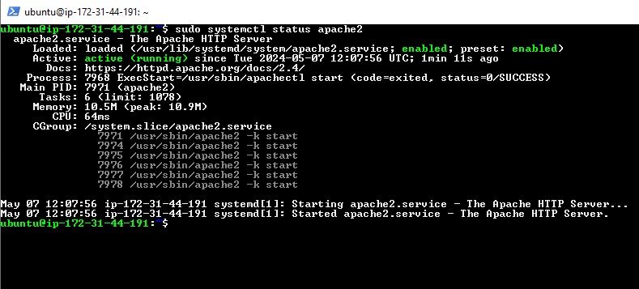
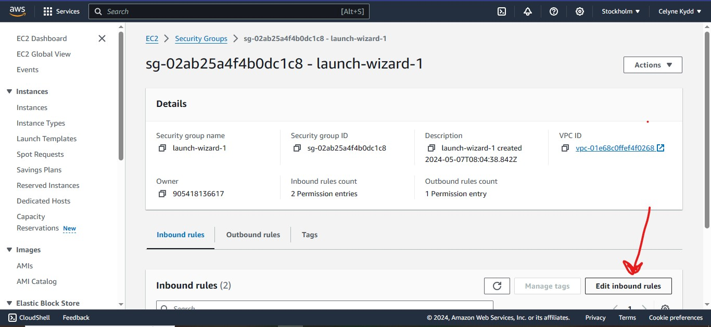
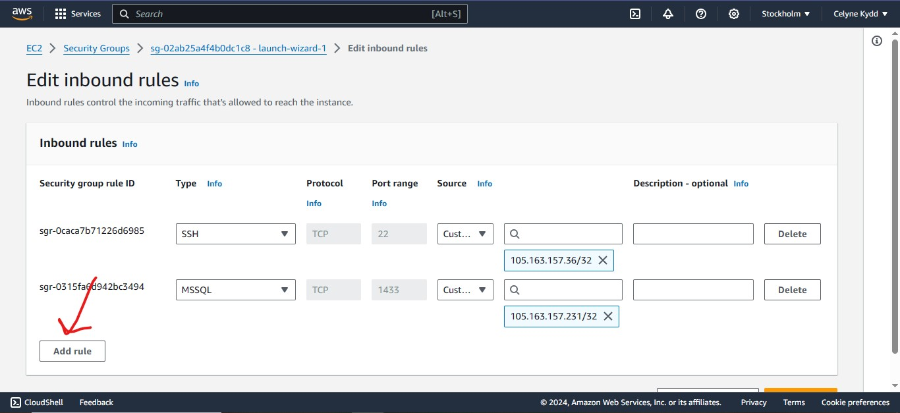
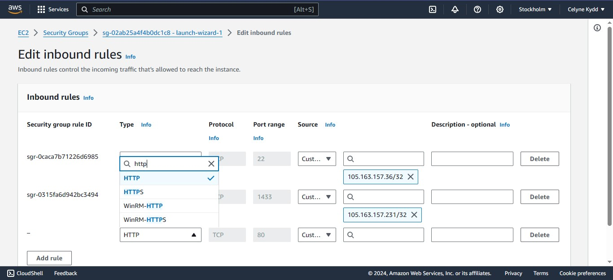
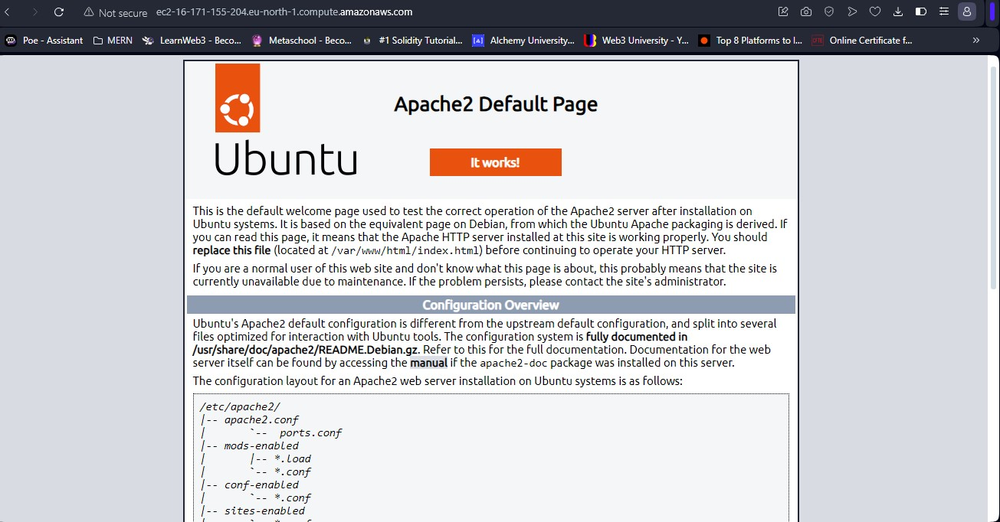

# STEP 1 - Installing Apache & Updating the Firewall.

Apache refers to the Apache HTTP Server, a free and open-source web server software. It's one of the most popular web servers globally, powering a significant portion of the websites you visit.  
Apache acts as a middleman between a web browser and the web server that stores a website's files. It's responsible for several key tasks:

- Receiving Requests: Apache listens for incoming requests from web browsers. These requests typically specify a web page (like https://bloomfire.com/resources/what-is-a-wiki/), an image, or other resources on the website.

- Processing Requests: Apache interprets the request and identifies the specific resource being requested.

- Serving Content: Apache retrieves the requested resource (web page, image, etc.) from the web server's storage.

- Sending Responses: Once retrieved, Apache sends the requested content back to the user's web browser.

- Managing Traffic: Apache can handle multiple requests simultaneously, ensuring efficient handling of website traffic.

- Security: Apache can implement basic security measures like access control and authentication to protect website resources.

Benefits of Apache:

- Free and Open Source: Anyone can use and modify Apache freely, making it a cost-effective solution for web hosting.

- Stable and Reliable: Apache has been around for decades and is known for its stability and reliability, offering a solid foundation for web applications.

- Scalable: Apache can be configured to handle high traffic volumes, making it suitable for small and large websites alike.

- Platform Independent: Apache runs on various operating systems, including Linux, Windows, and macOS, offering flexibility in deployment.

- Extensive Community: Apache has a large and active community of developers who provide support and contribute to its ongoing development.

Common use cases:

- Hosting static websites (HTML, CSS, JavaScript)
- Hosting dynamic websites built with server-side - scripting languages (PHP, Python, etc.)
- Running web applications
- Content Management Systems (CMS) like WordPress and Drupal

## Installation

To install apache use these commands:

```powershell
# Update a list of packages in package manager
$ sudo apt update

# run apache2 package installation with either of the two commands:
$ sudo apt install apache2
$ sudo apt-get install apache2 libapache2-mod-php

# You can start, stop, and check the status of the Apache2 server with one of these commands:
$ sudo systemctl stop apache2
$ sudo systemctl start apache2
$ sudo systemctl status apache2

```



Next we check if our localhost is online using any of the three commands:

```powershell
$ telnet localhost 80
$ curl http://localhost:80
```


Then we update Security Group to access Apache Web Application.  
We do this by going to our security groups then clicking edit inbound rules, click add rule, choose http.  
Then we go back to our terminal and confirm if our server is working through the telnet command.





Our web is now working

