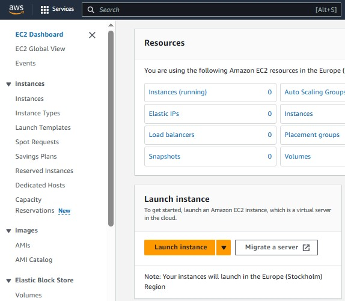
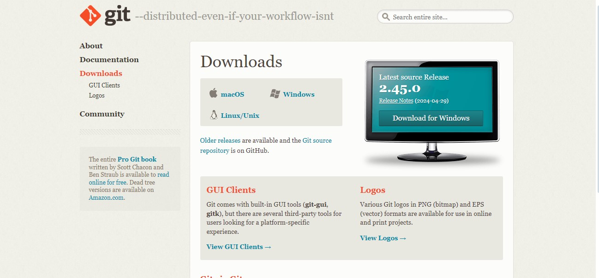

# WEB STACK IMPLEMENTATION (LEMP STACK)

## Introduction

Developed by Igor Sissel in October 2004 NGINX was created specifically to resolve the issues Apache was facing with connection concurrency. Similar to Apache, Nginx was developed as an open source project.

This helped accelerate its adoption and experienced the level of recognition it now has. Nginx can be deployed as a standalone server or it can be used as a front end proxy for Apache and other popular Web servers. It comes bundled in LEMP stack(Linux, Nginx, MySql, PHP).

Here are just some of the benefits of Nginx:

- It can be used to absorb significant spikes in traffic on vulnerable Apache servers.

- It is very lightweight customizable and easy to configure and also has a proven track record of stability.

- It's used by some of the largest web applications on the internet. Organizations using Nginx include Microsoft, IBM, Google, Adobe, Linked-In and Facebook among many others.

- The technology that facilitates simultaneous connections also mitigate security risks and DDOS attacks.

- Nginx is extremely scalable and it's strict coding style requires developers to avoid inefficient code blocks unlike Apache.

- it also offers zero downtime and supports multiple back end applications.

## STEP 0 - Preparing Prerequisites.

To complete this project we need an AWS account and a virtual server with Ubuntu Server OS, refer to LAMP STEP_0.  
Next, we need to create a new key pair.


Then a new instance through launch instance.



And make sure our instance is up and running.

Next, we download and install Git Bash



We then launch bash and go to the directory where our `.pem` file is.

```bash
$ cd downloads
```


You can use the `ls` command to check if your file is in the chosen directory.

Next, we inject these commands to make sure our server is up and running

```bash
chmod 400 lemp.pem
ssh -i lemp.pem ubuntu@13.51.168.11
```


