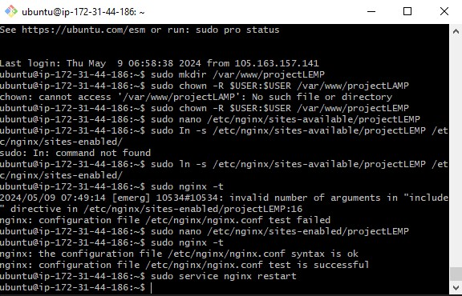
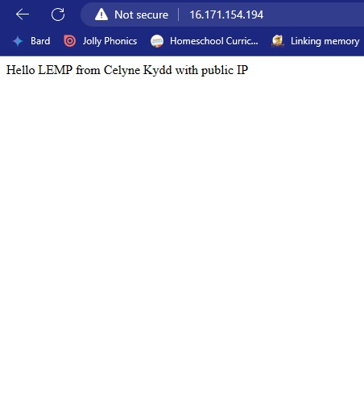

# Configuring Nginx to use PHP Processor

We will use projectLEMP as our domain name.  
First, we create the root web directory for our domain:

```bash
sudo mkdir /var/www/projectLEMP
```

Next, we assign ownership of the directory with the $USER environment variable, which will reference our current system user:

```bash
sudo chown -R $USER:USER /var/www/projectLEMP
```

Then, we open a new configuration file in nginx's `sites-available` using nano

```bash
sudo nano /etc/nginx/sites-available/projectLEMP
```


This will create a new blank file where we will paste our bare-bones configuration:

```bash
#/etc/nginx/sites-available/projectLEMP

server {
   listen 80;
   server_name projectLEMP www.projectLEMP;
   root /var/www/projectLEMP;

   index index.html index.htm index.php;

   location / {
       try_files $uri $uri/ =404;
   }

   location ~ \.php$ {
       include snippets/fastcgi-php.conf:
       fastcgi_pass unix:/var/run/php/php8.1-fpm.sock;
   }

   location ~ /\.ht {
       deny all;
   }

}
```

then we save and close the file.  
Next, we activate our configuration by linking the config file from nginx's `sites-enabled` directory.

```bash
sudo ln -s /etc/nginx/sites-available/projectLEMP /etc/nginx/sites-enabled/
```

This will tell nginx to use the configuration next time it is reloaded.  
We test our configuration for syntax eroors by:

```bash
sudo nginx -t
```

It should return:

```bash
nginx: the configuration file /etc/nginx/nginx.conf syntax is okay
nginx: configuration file /etc/nginx/nginx.conf test is successful
```

If you get any errors:

1. Open the configuration file for editing: Execute the following command to open the file:

```bash
sudo nano /etc/nginx/sites-enabled/projectLEMP
```

2. Locate the directive that is causing the issue and check the syntax and arguments of the directive.

3. Save the changes and exit the text editor: If you made any modifications, save the file and exit the text editor. In Nano, you can do this by pressing Ctrl + X, followed by Y and Enter.

4. Test the Nginx configuration again: Run the following command to check if the configuration file syntax is correct:

```bash
sudo nginx -t
```

If you've fixed the issue with the directive, you should see a message indicating that the configuration file test was successful. 5. Restart Nginx: If the configuration test passes without errors, restart the Nginx service to apply the changes:

```bash
sudo service nginx restart
```



We also need to disable default nginx host that is currently configured to listen to port 80

```bash
sudo unlink /etc/nginx/sites-enabled/default
```

When ready, we reload nginx and apply changes made.

```bash
sudo systemctl reload nginx
```

Our website is now active! We then create an index.html file in the location so that we can test that our new server block works as expected:

```bash
sudo echo 'Hello LEMP from Celyne Kydd' $(curl -s http://169.254.169.254/latest/meta-data/public-hostname) 'with public IP' $(curl -s http://169.254.169.254/latest/meta-data/public-ipv4) > /var/www/projectLEMP/index.html
```


