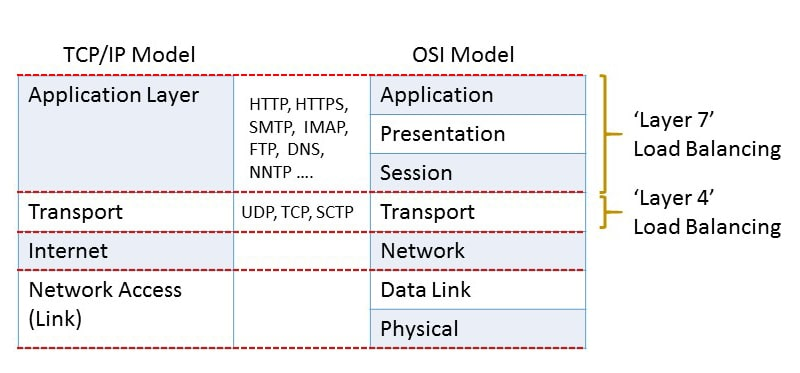
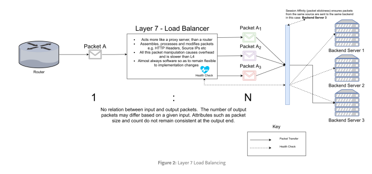

# Difference Between L4 Network LB and L7 Application LB

The difference between L4 Network Load Balancing (LB) and L7 Application Load Balancing (LB) lies in the layer at which they operate within the networking stack. Let's dive into each type to understand their distinctions and use cases.

## L4 Network Load Balancing

L4 Network Load Balancing operates at the transport layer (Layer 4) of the OSI model. It focuses on distributing network traffic based on information such as source IP address, destination IP address, source port, and destination port. This type of load balancing is commonly used for TCP and UDP-based applications.

### How L4 Network Load Balancing Works

When a client sends a request to a server, the L4 load balancer intercepts the request and determines the appropriate server to handle it. The load balancer uses algorithms like round-robin, least connections, or weighted round-robin to distribute the traffic evenly across multiple backend servers.

### Benefits of L4 Network Load Balancing

1. **Efficient Traffic Distribution**: L4 load balancers distribute traffic based on network-level information, ensuring that requests are evenly distributed across backend servers.
2. **High Scalability**: By distributing traffic, L4 load balancers allow for horizontal scaling, enabling the addition or removal of servers without impacting the overall system performance.
3. **Improved Performance**: L4 load balancers can optimize performance by reducing response times and preventing server overloads.
4. **High Availability**: In the event of a server failure, L4 load balancers can redirect traffic to healthy servers, ensuring continuous availability of services.

### Use Cases for L4 Network Load Balancing

L4 load balancing is suitable for scenarios where the application layer protocols are not a critical factor. It is commonly used for load balancing traffic for protocols such as HTTP, HTTPS, SMTP, FTP, and DNS. L4 load balancers are ideal for scenarios where the focus is on distributing traffic based on network-level information rather than application-specific requirements.

## L7 Application Load Balancing

L7 Application Load Balancing operates at the application layer (Layer 7) of the OSI model. It goes beyond network-level information and takes into account application-specific details such as HTTP headers, cookies, and URL paths. L7 load balancers have a deeper understanding of the application protocols and can make more intelligent routing decisions.

### How L7 Application Load Balancing Works

L7 load balancers can inspect the content of the requests and responses, allowing them to make routing decisions based on application-specific criteria. For example, an L7 load balancer can route requests based on the URL path or perform content-based routing based on specific headers or cookies.

### Benefits of L7 Application Load Balancing

1. **Advanced Routing Capabilities**: L7 load balancers have a deeper understanding of application protocols, enabling them to make routing decisions based on application-specific criteria.
2. **Enhanced Security**: L7 load balancers can perform SSL/TLS termination, which offloads the decryption process from backend servers, improving performance and simplifying server management.
3. **Session Persistence**: L7 load balancers can maintain session persistence by directing requests from the same client to the same backend server, ensuring a consistent user experience.
4. **Content-Based Routing**: L7 load balancers can route requests based on specific content within the request or response, allowing for more granular traffic management.

### Use Cases for L7 Application Load Balancing

L7 load balancing is suitable for scenarios where the application layer protocols and application-specific requirements are crucial. It is commonly used for web applications, APIs, and other HTTP/HTTPS-based services. L7 load balancers are ideal for scenarios where advanced routing capabilities, session persistence, and content-based routing are necessary.

## Conclusion

In summary, the main difference between L4 Network Load Balancing and L7 Application Load Balancing lies in the layer at which they operate within the networking stack. L4 load balancing focuses on distributing traffic based on network-level information, while L7 load balancing goes beyond that and considers application-specific details. Understanding the distinctions between these two types of load balancing is crucial for designing a robust and efficient load balancing strategy that meets your specific requirements.
