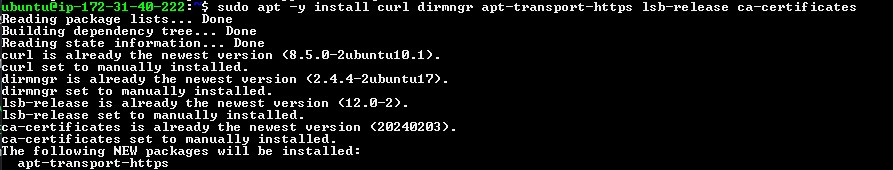

# Install NodeJs

Sign in to your aws account and create an ec2 instance, then ssh into your terminal.

Update & Upgrade Ubuntu

`sudo apt update && sudo apt upgrade`

Install certifications

```powershell
sudo apt -y install curl dirmngr apt-transport-https lsb-release ca-certificates

curl -sL https://deb.nodesource.com/setup_18.x | sudo -E bash -
```




Install NodeJs

```powershell
sudo apt install -y nodejs
```


