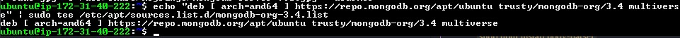

# Install MongoDB

MongoDB stores data in flexible, _JSON-LIKE_ documents. Fields in a database can vary from document to document and data structure can be changed over time. For our example application, we are adding book records to MongoDB that contain book name, ISBN number, author and number of pages.

```powershell
sudo apt install gnupg curl

curl -fsSL https://www.mongodb.org/static/pgp/server-7.0.asc | sudo gpg -o /usr/share/keyrings/mongodb-server-7.0.gpg --dearmor
```


```powershell
echo "deb [ arch=amd64 ] https://repo.mongodb.org/apt/ubuntu trusty/mongodb-org/3.4 multiverse" | sudo tee /etc/apt/sources.list.d/mongodb-org-3.4.list


echo "deb [ arch=amd64,arm64 signed-by=/usr/share/keyrings/mongodb-server-7.0.gpg ] https://repo.mongodb.org/apt/ubuntu jammy/mongodb-org/7.0 multiverse" | sudo tee
/etc/apt/sources.list.d/mongodb-org-7.0.list
```



Update


Install MongoDB  
`sudo apt -y install mongodb-org`


Start the server  
`sudo service mongodb start`

Verify the server is up and running  
`sudo systemctl status mongodb`


Install _[npm](https://www,npmjs.com)_ - Node package manager  
`sudo apt install -y npm`

Install _body-parser_ package  
`sudo npm install body-parser`


Create a folder named 'Books'  
`mkdir Books && cd Books`

In the Books directory, Initialize npm projects  
`npm init`


Add a file to it named server.js  
`sudo nano server.js`

Add this code

```powershell
var express = require('express');
var bodyParser = require('body-parser');
var app = express();
app.use(express.static(__dirname + '/public'));
app.use(bodyParser.json());
require('./apps/routes')(app);
app.set('port', 3300);
app.listen(app.get('port'), function() {
    console.log('Server up: http;//localhost:' + app.get('port'))
});
```


