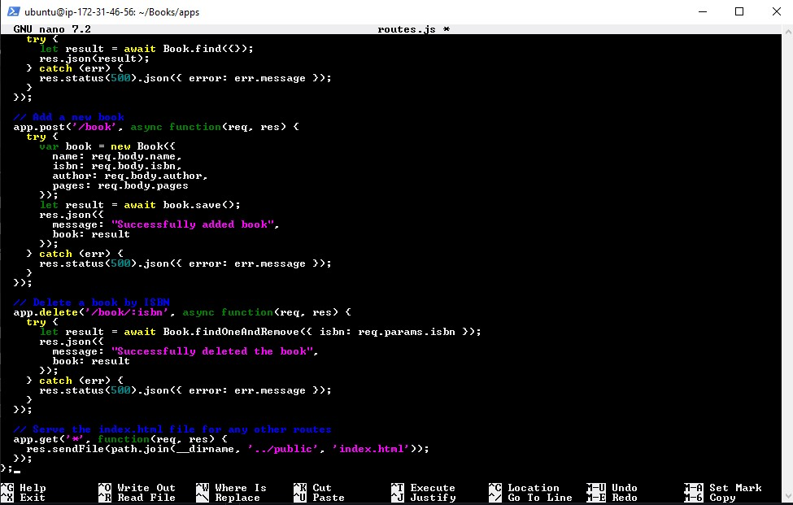

# Install Express and set up routes to the server

Install mongoose  
`sudo npm install express mongoose`


In Books folder we create a folder named apps  
`mkdir apps && cd apps`

Create a file named routes.js  
`sudo nano routes.js`

Paste code

```powershell
    var Book = require('./models/book');
var path = require('path');

module.exports = function(app) {

  // Get all books
  app.get('/book', async function(req, res) {
    try {
      let result = await Book.find({});
      res.json(result);
    } catch (err) {
      res.status(500).json({ error: err.message });
    }
  });

  // Add a new book
  app.post('/book', async function(req, res) {
    try {
      var book = new Book({
        name: req.body.name,
        isbn: req.body.isbn,
        author: req.body.author,
        pages: req.body.pages
      });
      let result = await book.save();
      res.json({
        message: "Successfully added book",
        book: result
      });
    } catch (err) {
      res.status(500).json({ error: err.message });
    }
  });

  // Delete a book by ISBN
  app.delete('/book/:isbn', async function(req, res) {
    try {
      let result = await Book.findOneAndRemove({ isbn: req.params.isbn });
      res.json({
        message: "Successfully deleted the book",
        book: result
      });
    } catch (err) {
      res.status(500).json({ error: err.message });
    }
  });

  // Serve the index.html file for any other routes
  app.get('*', function(req, res) {
    res.sendFile(path.join(__dirname, '../public', 'index.html'));
  });
};
```



In the apps folder, create a folder named models  
`mkdir models && cd models`

Create a file named book.js  
`sudo nano book.js`

paste

```powershell
      var mongoose = require('mongoose');

     var bookSchema = new mongoose.Schema({
       name: String,
       isbn: { type: String, index: true },
       author: String,
       pages: Number
     });

     module.exports = mongoose.model('Book', bookSchema);
```


