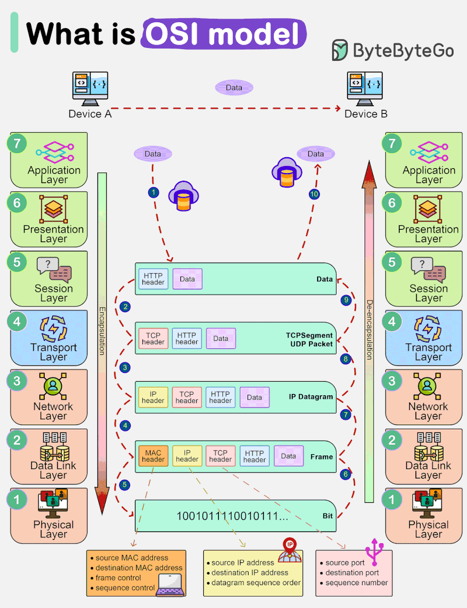
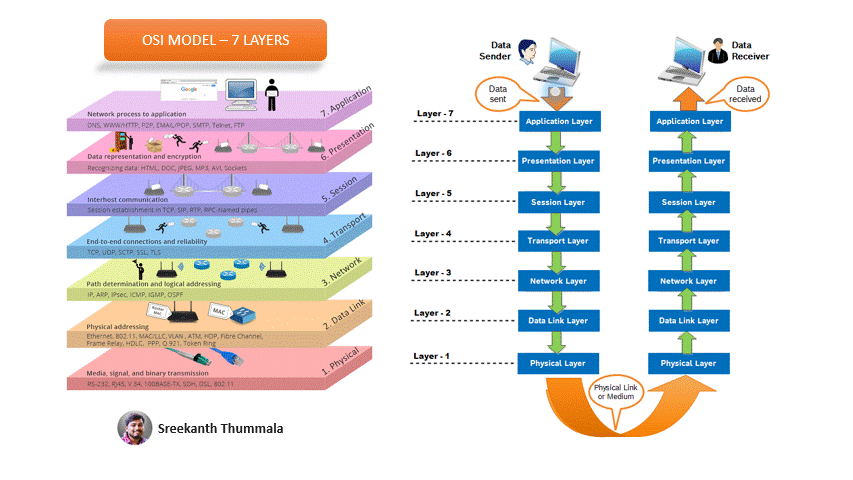

# Understanding the OSI Model

## Introduction

The OSI (Open Systems Interconnection) model is a conceptual framework that standardizes the functions of a communication system into seven distinct layers. It was developed by the International Organization for Standardization (ISO) to facilitate interoperability between different computer systems and ensure seamless communication. Each layer of the OSI model has a specific set of responsibilities and interacts with the layers above and below it.

We will now delve into the details of the OSI model, exploring each layer and its functions, and understanding how they work together to enable effective communication.

### Table of Contents

1. [What is the OSI Model?](#what-is-the-osi-model)
2. [The Seven Layers of the OSI Model](#the-seven-layers-of-the-osi-model)
   1. [Physical Layer](#physical-layer)
   2. [Data Link Layer](#data-link-layer)
   3. [Network Layer](#network-layer)
   4. [Transport Layer](#transport-layer)
   5. [Session Layer](#session-layer)
   6. [Presentation Layer](#presentation-layer)
   7. [Application Layer](#application-layer)
3. [Understanding Layer Interaction](#understanding-layer-interaction)
4. [FAQ](#faq)
   1. [What is the purpose of the OSI model?](#what-is-the-purpose-of-the-osi-model)
   2. [Why are there seven layers in the OSI model?](#why-are-there-seven-layers-in-the-osi-model)
   3. [What is the role of the physical layer in the OSI model?](#what-is-the-role-of-the-physical-layer-in-the-osi-model)
   4. [How does the transport layer ensure reliable data delivery?](#how-does-the-transport-layer-ensure-reliable-data-delivery)
   5. [What is the significance of the application layer in the OSI model?](#what-is-the-significance-of-the-application-layer-in-the-osi-model)

### What is the OSI Model? 

The OSI model is a conceptual framework that defines the functions of a communication system. It provides a standardized way of understanding and implementing network protocols, ensuring compatibility and interoperability between different systems. The model is divided into seven layers, each responsible for specific tasks related to data transmission and communication. By separating the communication process into distinct layers, the OSI model simplifies the design, implementation, and troubleshooting of network systems.

### The Seven Layers of the OSI Model 

#### 1. Physical Layer 

The physical layer is the lowest layer of the OSI model and deals with the physical transmission of data. It defines the electrical, mechanical, and procedural aspects of communication, including the physical medium (cables, fibers, etc.) and the signaling methods used. The physical layer's primary function is to transmit raw bits over the network without any regard for the meaning or structure of the data.

#### 2. Data Link Layer 

The data link layer is responsible for the reliable transmission of data between adjacent network nodes. It provides error detection and correction mechanisms to ensure data integrity and handles the flow control between the sender and receiver. The data link layer is divided into two sublayers: the Logical Link Control (LLC) sublayer, which deals with error control and flow control, and the Media Access Control (MAC) sublayer, which manages access to the physical medium.

#### 3. Network Layer 

The network layer is responsible for the logical addressing and routing of data packets across multiple networks. It determines the optimal path for data transmission, considering factors such as network congestion, network topology, and the availability of routes. The network layer also performs packet fragmentation and reassembly, allowing data to be transmitted in smaller, manageable units.

#### 4. Transport Layer 

The transport layer ensures reliable and efficient data delivery between end systems. It breaks down large data streams into smaller segments and reassembles them at the receiving end. The transport layer also provides error detection and correction, flow control, and congestion control mechanisms. It establishes end-to-end connections, manages data sequencing, and guarantees the reliable delivery of data.

#### 5. Session Layer 

The session layer establishes, manages, and terminates communication sessions between applications. It provides mechanisms for session establishment, synchronization, and checkpointing. The session layer also handles session recovery in case of failures and manages the security and authentication of sessions.

#### 6. Presentation Layer 

The presentation layer is responsible for the formatting, encryption, and compression of data. It ensures that the data is in a format that can be understood by the receiving system. The presentation layer also handles data encryption and decryption to provide secure communication. It is responsible for data compression to optimize bandwidth usage and improve transmission efficiency.

#### 7. Application Layer 

The application layer is the topmost layer of the OSI model and is responsible for providing services to end-user applications. It includes protocols and services that enable communication between applications and facilitate tasks such as file transfer, email, web browsing, and remote access. The application layer interacts directly with the end-user and provides a user-friendly interface for accessing network resources.

### Understanding Layer Interaction 

The layers of the OSI model interact with each other to ensure effective communication. Each layer performs specific functions and relies on the services provided by the layers below it. When data is transmitted from the sender to the receiver, it passes through each layer, with each layer adding its own header and removing it at the receiving end.

The process of data transmission starts at the application layer, where the data is generated. The application layer passes the data to the presentation layer, which formats and encrypts it if required. The presentation layer then passes the data to the session layer, which establishes a session with the receiving application.

The session layer passes the data to the transport layer, which breaks it down into smaller segments and adds a transport layer header. The transport layer then passes the segments to the network layer, which adds a network layer header containing the logical addresses of the sender and receiver.

The network layer determines the optimal path for data transmission and adds a network layer header. The data is then passed to the data link layer, which adds a data link layer header and performs error detection and correction. Finally, the physical layer transmits the data over the physical medium.

At the receiving end, the process is reversed. The physical layer receives the data and passes it to the data link layer, which performs error detection and correction. The data link layer then passes the data to the network layer, which removes the network layer header and determines the destination address.

The network layer passes the data to the transport layer, which removes the transport layer header and reassembles the segments into the original data stream. The transport layer then passes the data to the session layer, which removes the session layer header and passes the data to the presentation layer.

The presentation layer removes the presentation layer header and decrypts the data if required. Finally, the application layer receives the data and presents it to the end-user application.

### FAQ 

#### 1. What is the purpose of the OSI model? 

The OSI model serves as a framework for understanding and implementing network protocols. It ensures compatibility and interoperability between different systems by defining the functions of each layer and the interactions between them.

#### 2. Why are there seven layers in the OSI model? 

The seven layers of the OSI model provide a structured approach to network communication. Each layer has specific responsibilities, allowing for modular design, ease of troubleshooting, and the ability to replace or upgrade individual layers without affecting the entire system.

#### 3. What is the role of the physical layer in the OSI model? 

The physical layer is responsible for the physical transmission of data. It defines the physical medium, signaling methods, and electrical and mechanical aspects of communication. The physical layer ensures that raw bits are transmitted over the network without any regard for the meaning or structure of the data.

#### 4. How does the transport layer ensure reliable data delivery? 

The transport layer ensures reliable data delivery by breaking down large data streams into smaller segments and reassembling them at the receiving end. It provides error detection and correction mechanisms, flow control, and congestion control to guarantee the reliable and efficient delivery of data.

#### 5. What is the significance of the application layer in the OSI model? 

The application layer is the interface between the network and the end-user. It includes protocols and services that enable communication between applications and facilitate tasks such as file transfer, email, web browsing, and remote access. The application layer provides a user-friendly interface for accessing network resources and is responsible for delivering data to the end-user.

### Conclusion

The OSI model is a fundamental concept in computer networking, providing a standardized framework for understanding and implementing network protocols. By dividing the communication process into seven distinct layers, the OSI model simplifies the design, implementation, and troubleshooting of
