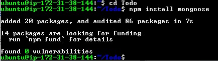
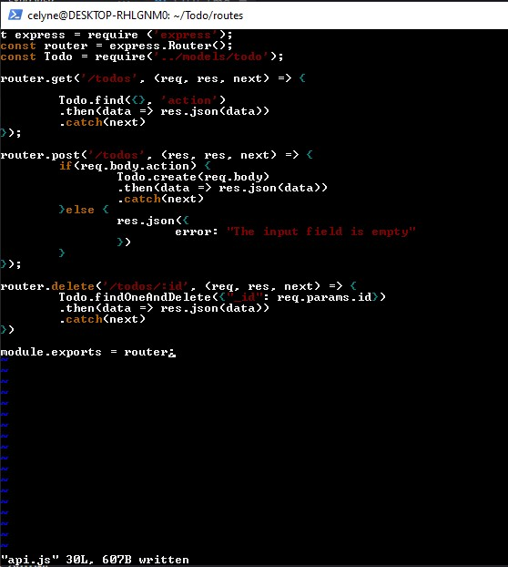

# Models

Install mongodb

```powershell
npm install mongoose
```



create a new `todo.js` file

```powershell
mkdir models && cd models && touch todo.js
```


Then we paste in this code after typing `vim index.js`

```powershell
const mongoose = require('mongoose');
const Schema = mongoose.Schema;

const TodoSchema = new Schema({
action: {
type: String,
required: [true, 'The todo text field is required']
}
})

const Todo = mongoose.model('todo', TodoSchema);

module.exports = Todo;
```


Next, we need to update our routes file by opening our `vim api.js` , delete the code inside with `:%d` and paste in the code below:

```powershell
const express = require ('express');
const router = express.Router();
const Todo = require('../models/todo');

router.get('/todos', (req, res, next) => {

Todo.find({}, 'action')
.then(data => res.json(data))
.catch(next)
});

router.post('/todos', (res, res, next) => {
if(req.body.action) {
Todo.create(req.body)
.then(data => res.json(data))
.catch(next)
}else {
res.json({
error: "The input field is empty"
})
}
});

router.delete('/todos/:id', (req, res, next) => {
Todo.findOneAndDelete({"_id": req.params.id})
.then(data => res.json(data))
.catch(next)
})

module.exports = router;
```


