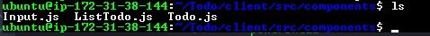
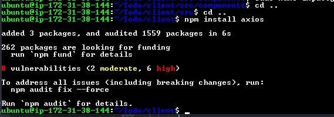
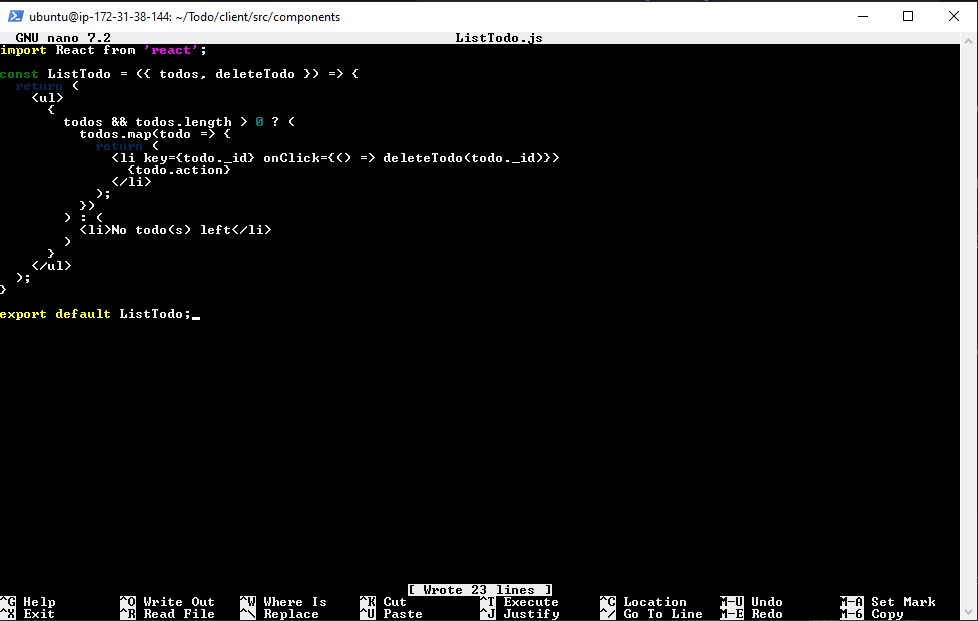
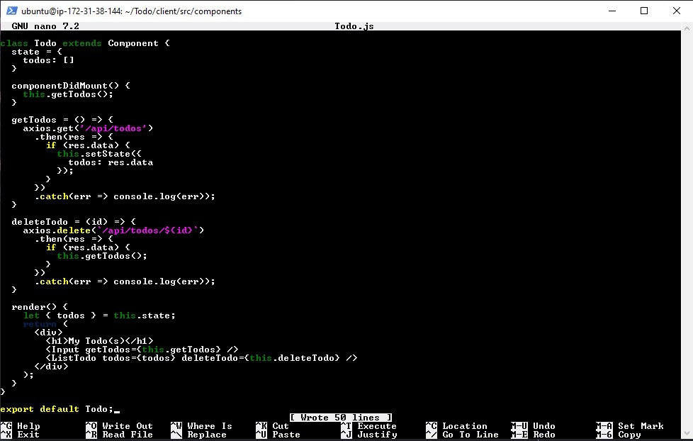
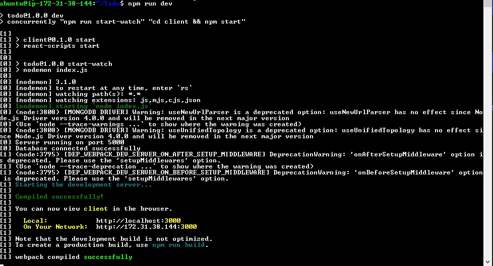
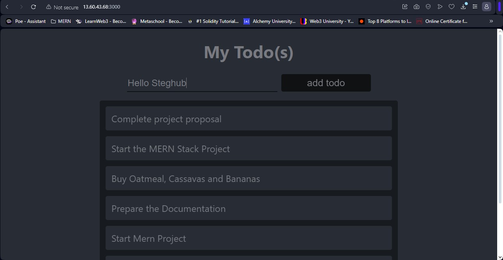

# Creating Your React Components

One of the advantages of react is that it makes use of components, which are reusable and also makes code modular.  
For the Todo app, there are two stateful components and one stateless component. From Todo directory, run:

`cd client`

Move to the “src” directory

`cd src`

Inside your src folder, create another folder called “components”

`mkdir components`

Move into the components directory

`cd components`


Inside the ‘components’ directory create three files “Input.js”, “ListTodo.js” and “Todo.js”.

`touch Input.js ListTodo.js Todo.js`



Open Input.js file

`sudo nano Input.js`

Paste in the following:

```powershell
import React, { Component } from 'react';
import axios from 'axios';

class Input extends Component {
  state = {
    action: ""
  }

  handleChange = (event) => {
    this.setState({ action: event.target.value });
  }

  addTodo = () => {
    const task = { action: this.state.action };

    if (task.action && task.action.length > 0) {
      axios.post('/api/todos', task)
        .then(res => {
          if (res.data) {
            this.props.getTodos();
            this.setState({ action: "" });
          }
        })
        .catch(err => console.log(err));
    } else {
      console.log('Input field required');
    }
  }

  render() {
    let { action } = this.state;
    return (
      <div>
        <input type="text" onChange={this.handleChange} value={action} />
        <button onClick={this.addTodo}>add todo</button>
      </div>
    );
  }
}

export default Input;
```


In oder to make use of Axios, which is a Promise based HTTP client for the browser and node.js, you need to cd into your client from your terminal and run npm install axios.

move to the src folder `cd ..`  
move to the client folder `cd ..`  
Install Axios `npm install axios`



Go to components directory `cd src/components`

After that open the ListTodo.js `sudo nano ListTodo.js`

Copy and paste the following code:

```powershell
import React from 'react';

const ListTodo = ({ todos, deleteTodo }) => {
  return (
    <ul>
      {
        todos && todos.length > 0 ? (
          todos.map(todo => {
            return (
              <li key={todo._id} onClick={() => deleteTodo(todo._id)}>
                {todo.action}
              </li>
            );
          })
        ) : (
          <li>No todo(s) left</li>
        )
      }
    </ul>
  );
}

export default ListTodo;
```



Then in the Todo.js file, write the following code

`sudo nano Todo.js`

```powershell
import React, { Component } from 'react';
import axios from 'axios';

import Input from './Input';
import ListTodo from './ListTodo';

class Todo extends Component {
  state = {
    todos: []
  }

  componentDidMount() {
    this.getTodos();
  }

  getTodos = () => {
    axios.get('/api/todos')
      .then(res => {
        if (res.data) {
          this.setState({
            todos: res.data
          });
        }
      })
      .catch(err => console.log(err));
  }

  deleteTodo = (id) => {
    axios.delete(`/api/todos/${id}`)
      .then(res => {
        if (res.data) {
          this.getTodos();
        }
      })
      .catch(err => console.log(err));
  }

  render() {
    let { todos } = this.state;
    return (
      <div>
        <h1>My Todo(s)</h1>
        <Input getTodos={this.getTodos} />
        <ListTodo todos={todos} deleteTodo={this.deleteTodo} />
      </div>
    );
  }
}

export default Todo;
```



We need to make a little adjustment to our react code.  
Delete the logo and adjust our App.js

Move to src folder

`cd ..`

Ensure to be in the src folder and run:

`sudo nano App.js`

Copy and paste the following code

```powershell
import React from 'react';
import Todo from './components/Todo';
import './App.css';

const App = () => {
  return (
    <div className="App">
      <Todo />
    </div>
  );
}

export default App;
```


In the src directory, open the App.css
`sudo nano App.css`

Paste the following code into it

```powershell
.App {
  text-align: center;
  font-size: calc(10px + 2vmin);
  width: 60%;
  margin-left: auto;
  margin-right: auto;
}

input {
  height: 40px;
  width: 50%;
  border: none;
  border-bottom: 2px #101113 solid;
  background: none;
  font-size: 1.5rem;
  color: #787a80;
}

input:focus {
  outline: none;
}

button {
  width: 25%;
  height: 45px;
  border: none;
  margin-left: 10px;
  font-size: 25px;
  background: #101113;
  border-radius: 5px;
  color: #787a80;
  cursor: pointer;
}

button:focus {
  outline: none;
}

ul {
  list-style: none;
  text-align: left;
  padding: 15px;
  background: #171a1f;
  border-radius: 5px;
}

li {
  padding: 15px;
  font-size: 1.5rem;
  margin-bottom: 15px;
  background: #282c34;
  border-radius: 5px;
  overflow-wrap: break-word;
  cursor: pointer;
}

@media only screen and (min-width: 300px) {
  .App {
    width: 80%;
  }

  input {
    width: 100%;
  }

  button {
    width: 100%;
    margin-top: 15px;
    margin-left: 0;
  }
}

@media only screen and (min-width: 640px) {
  .App {
    width: 60%;
  }

  input {
    width: 50%;
  }

  button {
    width: 30%;
    margin-left: 10px;
    margin-top: 0;
  }
}
```


In the src directory, open the index.css
`sudo nano index.css`

Copy and paste the code below:

```powershell
body {
  margin: 0;
  padding: 0;
  font-family: -apple-system, BlinkMacSystemFont, "Segoe UI", "Roboto", "Oxygen", "Ubuntu", "Cantarell", "Fira Sans", "Droid Sans", "Helvetica Neue", sans-serif;
  -webkit-font-smoothing: antialiased;
  -moz-osx-font-smoothing: grayscale;
  box-sizing: border-box;
  background-color: #282c34;
  color: #787a80;
}

code {
  font-family: source-code-pro, Menlo, Monaco, Consolas, "Courier New", monospace;
}
```


Go to the Todo directory `cd ../..`

Run:

`npm run dev`



React build would compile sucessfully and both backend and front end will run concurrently through the ports we earlier opened


To make sure it is working, let us type a word on the insert then press add todo, it should reflect on the list




