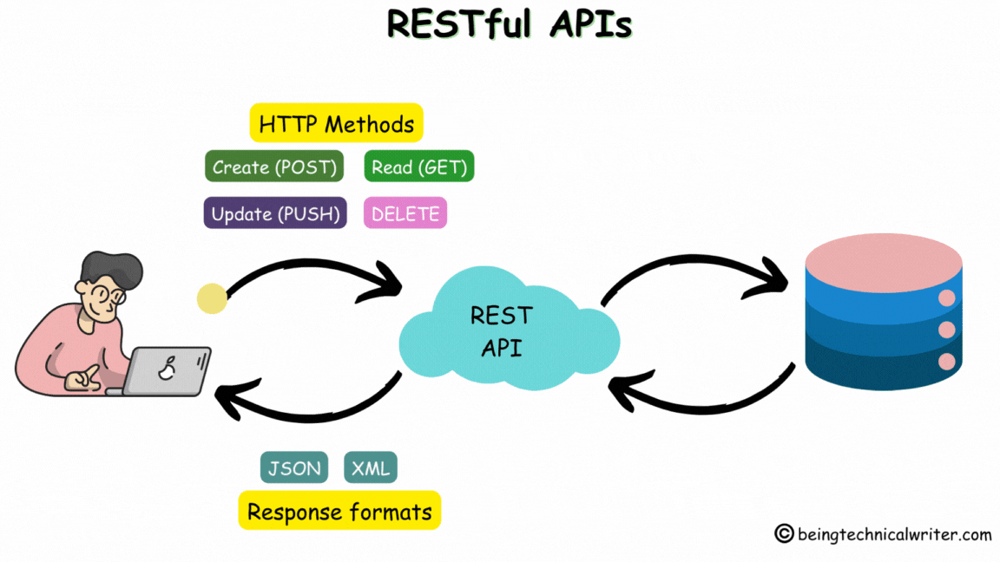

# Restful API

Restful API stands for Representational State Transfer Application Programming Interface. It is an architectural style for designing networked applications. Restful API is used in web development to create a flexible and scalable architecture that can be easily integrated with other systems.

In a Restful API, resources are identified by URIs, and resources can be manipulated using a fixed set of operations. The most common operations are GET, POST, PUT, and DELETE.

GET: Retrieve a resource
POST: Create a new resource
PUT: Update an existing resource
DELETE: Delete a resource

Restful API uses HTTP protocol to communicate between the client and server. The client can be a web browser, a mobile app, or another server.  
The server is responsible for managing the resources and responding to the client's requests.

Restful API has several advantages in web development, including:

- Platform independence: Restful API can be built using any programming language or framework, making it platform-independent.

- Interoperability: Restful API can be easily integrated with other systems, making it a popular choice for building web services.

- Scalability: Restful API is designed to scale horizontally, making it suitable for high-traffic applications.

- Flexibility: Restful API allows for a wide range of data formats, such as JSON, XML, and HTML, making it flexible and adaptable to different client needs.

- Security: Restful API uses HTTPS protocol, which provides secure communication between the client and server.

They is widely used in web development for building:

1. Web services: Restful API is used to build web services that can be easily integrated with other systems.

2. APIs: Restful API is used to build APIs that can be used by developers to build applications.
   Microservices: Restful API is used to build microservices that can be used to build distributed systems.

3. Cloud services: Restful API is used to build cloud services that can be easily integrated with other systems.

4. Mobile applications: Restful API is used to build mobile applications that can communicate with the server using HTTP protocol.
