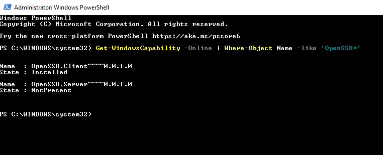

# Preparing Prerequisites

# Introduction

The MERN (MongoDB, Express, React, Node.js) web stack is a popular tech stack for building web applications. Here's a brief overview of each component and how they work together:


1. MongoDB: MongoDB is a NoSQL database that stores data in JSON-like documents. It's a flexible, scalable, and high-performance database that allows for easy data modeling and supports a wide range of use cases.

2. Express: Express is a Node.js web application framework that provides a robust set of features for building web applications, including routing, middleware, and template engines. It's lightweight, fast, and flexible, making it a popular choice for building web applications.

3. React: React is a front-end JavaScript library for building user interfaces. It's designed to be fast, efficient, and easy to use, and it allows developers to create reusable UI components that can be used to build complex, interactive user interfaces.

4. Node.js: Node.js is a server-side JavaScript runtime that allows developers to run JavaScript on the server. It's event-driven, non-blocking I/O model makes it lightweight and efficient, and it's a popular choice for building real-time web applications.

The MERN stack is often used together to build web applications because it allows developers to use the same language (JavaScript) for both the front-end and back-end, which can streamline development and make it easier to maintain and update the application.

## Install OpenSSH for Windows

To complete this project we need an AWS account and a virtual server with Ubuntu Server OS, refer to LAMP STEP_0.

To install OpenSSH using PowerShell, we run our PowerShell as an Administrator. To make sure that OpenSSH is available, run the following cmdlet:

```powershell
Get-WindowsCapability -Online | Where-Object Name -like 'OpenSSH*'
```



The command should return the following output if neither are already installed:

```powershell
Name  : OpenSSH.Client~~~~0.0.1.0
State : NotPresent

Name  : OpenSSH.Server~~~~0.0.1.0
State : NotPresent
```

Then, install the server or client components as needed:

```PowerShell
# Install the OpenSSH Client
Add-WindowsCapability -Online -Name OpenSSH.Client~~~~0.0.1.0

# Install the OpenSSH Server
Add-WindowsCapability -Online -Name OpenSSH.Server~~~~0.0.1.0
```

Both commands should return the following output:

```powershell
Path          :
Online        : True
RestartNeeded : False
```


Next, we start and configure OpenSSH Server for initial use, run the following commands to start the sshd service:

```PowerShell
# Start the sshd service
Start-Service sshd

# OPTIONAL but recommended:
Set-Service -Name sshd -StartupType 'Automatic'

# Confirm the Firewall rule is configured. It should be created automatically by setup. Run the following to verify
if (!(Get-NetFirewallRule -Name "OpenSSH-Server-In-TCP" -ErrorAction SilentlyContinue | Select-Object Name, Enabled)) {
    Write-Output "Firewall Rule 'OpenSSH-Server-In-TCP' does not exist, creating it..."
    New-NetFirewallRule -Name 'OpenSSH-Server-In-TCP' -DisplayName 'OpenSSH Server (sshd)' -Enabled True -Direction Inbound -Protocol TCP -Action Allow -LocalPort 22
} else {
    Write-Output "Firewall rule 'OpenSSH-Server-In-TCP' has been created and exists."
}
```


Close terminal.
