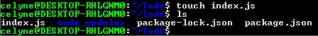
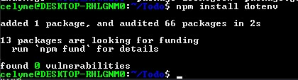

# Install ExpressJs

We start by installation

```powershell
npm install express
```


create index.js file by typing `touch index.js`



install `dotenv` module


open index.js `vim index.js` then paste in this code

```javascript
const express = require("express");
require("dotenv").config();

const app = express();

const port = process.env.PORT || 5000;

app.use((req, res, next) => {
  res.header("Access-Control-Allow-Origin", "*");
  res.header(
    "Access-Control-Allow-Headers",
    "Origin, X-Requested-With, Content-Type, Accept"
  );
  next();
});

app.use((req, res, next) => {
  res.send("Welcome to Express");
});

app.listen(port, () => {
  console.log(`Server running on port ${port}`);
});
```


then save by pressing the Esc key to ensure you are in the normal mode (command mode) of Vim.
Type :w or :write and press Enter. This command saves the file.
You should see the message "File saved", or "written" or a similar confirmation message at the bottom of the Vim screen.

Next type `node index.js` and if everything works it should look like this


Next, we open our browser and access our server
`http://13.60.49.255:5000`


