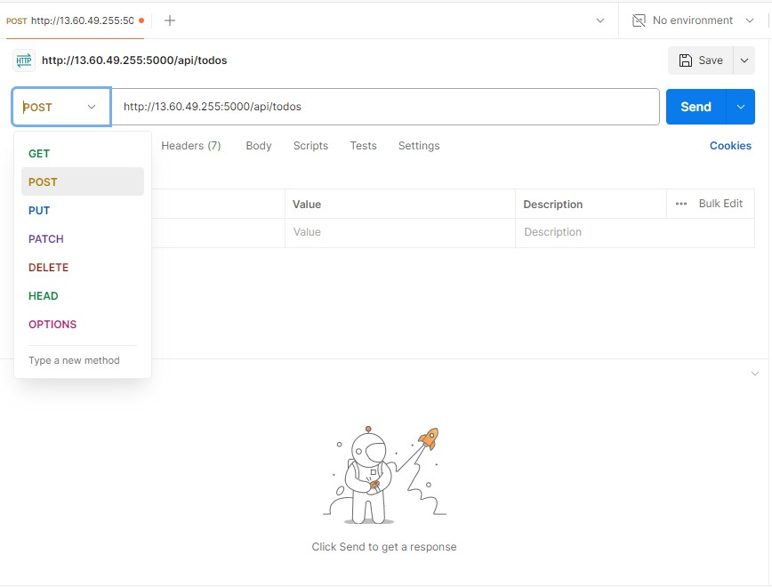

# Testing Backend without Frontend using RESTful API

First, we need to download and install postman on our machine: https://www.postman.com/downloads/

Next, we open send an API request, and create a POST request to our API(make sure your server is running on your terminal)

                http://localhost:5000/api/Todos

In the Header below, Set the key as content-type, Value as application/json.  
Press send

Now create a GET request by Clicking on http, choose GET, add the previous address from the post request, press send

