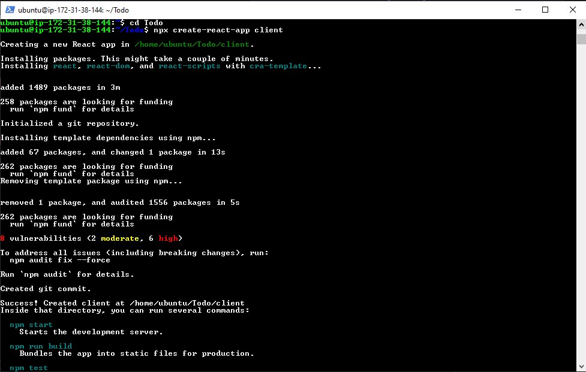
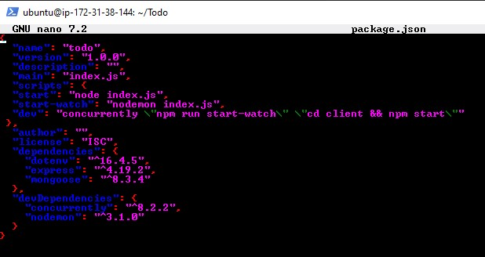
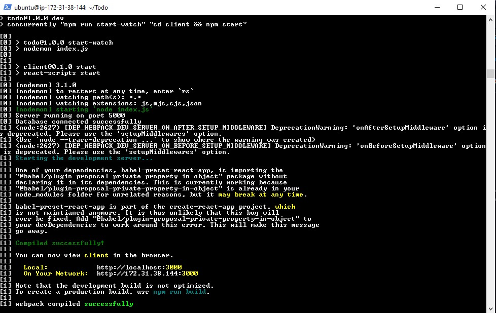

# Frontend Creation

In the Todo directory, run

```powershell
npx create-react-app client
```



Install concurrently

```powershell
npm install concurrently --save-dev
```


install nodemon

```powershell
npm install nodemon --save-dev
```


Open package.json file

```powershell
sudo nano package.json
```

paste

```powershell
{
  "name": "todo",
  "version": "1.0.0",
  "description": "",
  "main": "index.js",
  "scripts": {
  "start": "node index.js",
  "start-watch": "nodemon index.js",
  "dev": "concurrently \"npm run start-watch\" \"cd client && npm start\""
 },
  "author": "",
  "license": "ISC",
  "dependencies": {
    "dotenv": "^16.4.5",
    "express": "^4.19.2",
    "mongoose": "^8.3.4"
  },
  "devDependencies": {
    "concurrently": "^8.2.2",
    "nodemon": "^3.1.0"
  }
}
```



change directory to client, open package.json and add `“proxy”: “http://localhost:5000”`


then back to Todo `npm run dev`



The app is open and running on localhost:3000

Note: In order to access the application from the internet, TCP port 3000 had been opened on EC2.
