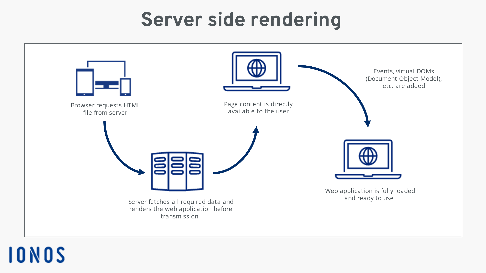

# Web Application Frameworks

Web application frameworks are software frameworks that provide a structured approach to building web applications. They help developers create web applications more efficiently and with fewer errors by providing pre-built components, tools, and guidelines.

There are two main types of web application frameworks: server-side (backend) frameworks and client-side (frontend) frameworks.

## Server-side (backend) frameworks

These are responsible for handling requests and responses, managing data storage, and providing APIs for client-side frameworks to consume.

Some popular server-side frameworks include:

1. Ruby on Rails (RoR): A popular framework for building web applications using the Ruby programming language. It follows the Model-View-Controller (MVC) pattern and provides a rich set of tools and libraries for building scalable web applications.

2. Django: A Python-based framework that provides a high-level framework for building web applications. It follows the MTV (Model-Template-View) pattern and provides a robust set of tools for building web applications, including an ORM, a template engine, and support for user authentication and authorization.

3. Laravel: A PHP-based framework that provides a flexible and modular approach to building web applications. It follows the MVC pattern and provides a rich set of tools and libraries for building scalable web applications, including support for routing, middleware, and database management.

4. Node.js: A JavaScript runtime environment that allows developers to build scalable and high-performance web applications. It provides a non-blocking I/O model, which makes it lightweight and efficient for building real-time web applications.

## Client-side (frontend) frameworks

These, on the other hand, are responsible for rendering the user interface and user experience of web applications. They are typically built using JavaScript and HTML/CSS.

Some popular client-side frameworks include:

- React: A JavaScript library for building user interfaces. It uses a virtual DOM (Document Object Model) to efficiently update the UI, making it fast and efficient for building complex web applications.

- Angular: A JavaScript framework for building single-page applications. It provides a rich set of tools and libraries for building complex web applications, including support for dependency injection, unit testing, and routing.

- Vue.js: A progressive and flexible JavaScript framework for building web applications. It provides a reactive component model, a robust ecosystem, and a strong focus on developer experience.

- Ember.js: A JavaScript framework for building web applications. It provides a robust set of tools and libraries for building scalable web applications, including support for routing, models, and templates.
