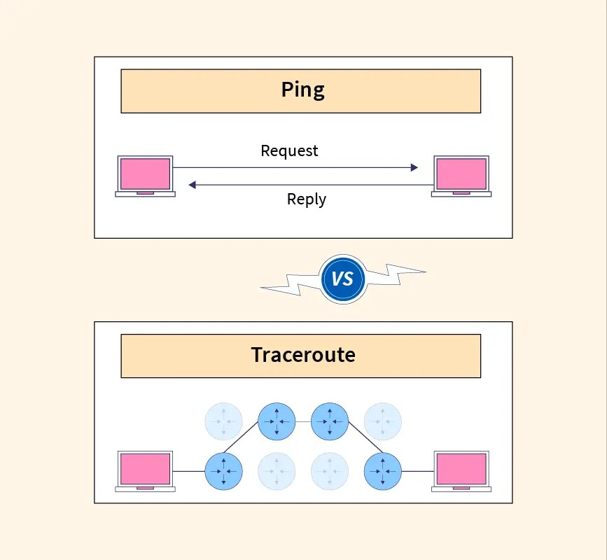

# Ping and Traceroute: Essential Network Diagnostic Utilities

## Introduction

In the world of networking, troubleshooting and diagnosing network issues are crucial tasks. Two commonly used utilities for network diagnostics are Ping and Traceroute. These tools provide valuable information about network connectivity, latency, and routing.

In this md, we will explore the functionalities of Ping and Traceroute, understand how they work, and discuss their importance in network troubleshooting.

### Table of Contents

1. [What is Ping?](#what-is-ping)
2. [How Does Ping Work?](#how-does-ping-work)
3. [What is Traceroute?](#what-is-traceroute)
4. [How Does Traceroute Work?](#how-does-traceroute-work)
5. [Ping vs. Traceroute](#ping-vs-traceroute)
6. [FAQ](#faq)
   1. [What is the purpose of Ping?](#what-is-the-purpose-of-ping)
   2. [What is the purpose of Traceroute?](#what-is-the-purpose-of-traceroute)
   3. [How can Ping help in network troubleshooting?](#how-can-ping-help-in-network-troubleshooting)
   4. [How can Traceroute help in network troubleshooting?](#how-can-traceroute-help-in-network-troubleshooting)
   5. [Are there any alternatives to Ping and Traceroute?](#are-there-any-alternatives-to-ping-and-traceroute)

### What is Ping? 

Ping is a network utility used to test the reachability of a host on an Internet Protocol (IP) network. It sends Internet Control Message Protocol (ICMP) Echo Request messages to the target host and waits for ICMP Echo Reply messages in response. Ping measures the round-trip time (RTT) between the source and destination hosts, providing valuable information about network latency and connectivity.

### How Does Ping Work? 

When you initiate a Ping command, your computer sends ICMP Echo Request packets to the target host. The target host, if reachable, responds with ICMP Echo Reply packets. Ping measures the time it takes for the packets to travel from the source to the destination and back, known as the round-trip time (RTT). It also provides statistics such as packet loss percentage and average RTT, helping to identify network issues.

### What is Traceroute? 

Traceroute is a network diagnostic tool used to trace the route that packets take from the source host to the destination host. It provides information about the intermediate routers or hops that the packets traverse. Traceroute helps in identifying network bottlenecks, latency issues, and routing problems by showing the time taken for each hop and the IP addresses of the routers along the path.

### How Does Traceroute Work? 

When you initiate a Traceroute command, your computer sends packets with increasing Time-to-Live (TTL) values. The TTL value determines the maximum number of hops a packet can traverse before being discarded. Each router along the path decrements the TTL value, and when it reaches zero, the router sends an ICMP Time Exceeded message back to the source. By incrementing the TTL value, Traceroute can identify the routers along the path and measure the time taken for each hop.

### Ping vs. Traceroute 

Ping and Traceroute serve different purposes in network diagnostics. Ping focuses on testing the reachability and measuring the round-trip time between the source and destination hosts. It helps in identifying network connectivity issues and latency problems. On the other hand, Traceroute provides a detailed view of the network path between the source and destination hosts. It helps in identifying routing issues, network congestion, and bottlenecks.

### FAQ 

#### What is the purpose of Ping? 

The purpose of Ping is to test the reachability of a host on an IP network and measure the round-trip time (RTT) between the source and destination hosts. It helps in diagnosing network connectivity issues and latency problems. [Learn more about Ping](<https://en.wikipedia.org/wiki/Ping_(networking_utility)>)

#### What is the purpose of Traceroute? 

The purpose of Traceroute is to trace the route that packets take from the source host to the destination host. It provides information about the intermediate routers or hops along the path. Traceroute helps in identifying network bottlenecks, latency issues, and routing problems. [Learn more about Traceroute](https://en.wikipedia.org/wiki/Traceroute)

#### How can Ping help in network troubleshooting? 

Ping can help in network troubleshooting by testing the reachability of a host and measuring the round-trip time (RTT). If a host is unreachable, Ping can indicate network connectivity issues. If the RTT is high or there is packet loss, it can point to latency or congestion problems. Ping can also be used to check the response time of a server or website. [Learn more about network troubleshooting with Ping](https://www.lifewire.com/how-to-ping-computer-or-website-818405)

#### How can Traceroute help in network troubleshooting? 

Traceroute can help in network troubleshooting by providing a detailed view of the network path between the source and destination hosts. It helps in identifying routing issues, network congestion, and bottlenecks. By analyzing the time taken for each hop and the IP addresses of the routers along the path, network administrators can pinpoint the location of network issues and take appropriate actions. [Learn more about network troubleshooting with Traceroute](https://www.cloudflare.com/learning/network-layer/what-is-traceroute/)

#### Are there any alternatives to Ping and Traceroute? 

Yes, there are alternative network diagnostic utilities to Ping and Traceroute. Some popular alternatives include:

1. **MTR (My Traceroute)**: MTR combines the functionality of Ping and Traceroute, providing real-time monitoring and continuous testing of network paths. It displays the statistics of each hop in a continuous manner, making it easier to identify network issues.

2. **PathPing**: PathPing is a Windows utility that combines Ping and Traceroute. It provides information about network latency and packet loss at each hop, along with round-trip time statistics. PathPing is useful for diagnosing network problems that occur intermittently.

3. **Nmap**: Nmap is a versatile network scanning tool that can be used for network diagnostics. It can perform Ping sweeps to discover live hosts on a network and also has the ability to trace the route to a target host. Nmap provides detailed information about open ports, services, and operating systems.

While Ping and Traceroute are widely used and offer valuable insights, these alternative tools can provide additional functionalities and flexibility in network diagnostics. [Learn more about network diagnostic tools](https://www.lifewire.com/network-diagnostic-tools-818239)

### Conclusion

Ping and Traceroute are essential network diagnostic utilities that provide valuable information about network connectivity, latency, and routing. Ping helps in testing the reachability of a host and measuring the round-trip time, while Traceroute traces the route that packets take from the source to the destination host. By utilizing these tools and understanding their functionalities, network administrators can effectively troubleshoot and resolve network issues. Remember to use them wisely and in conjunction with other diagnostic tools to get a comprehensive view of the network.
