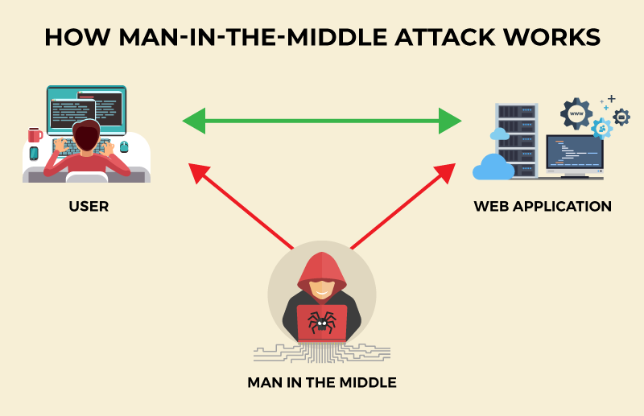
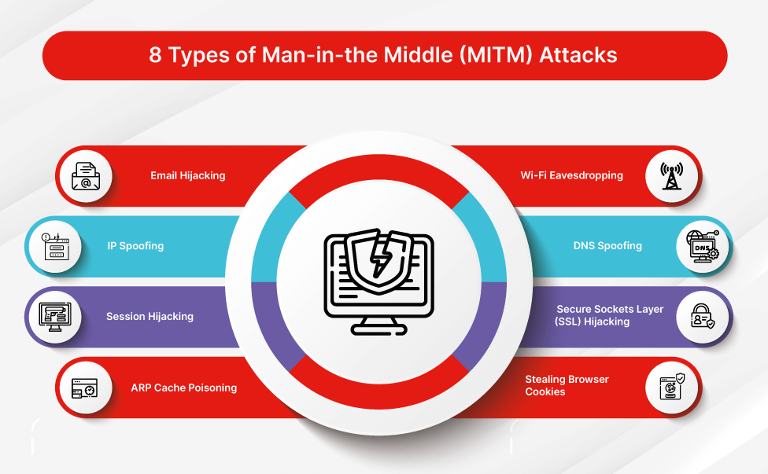
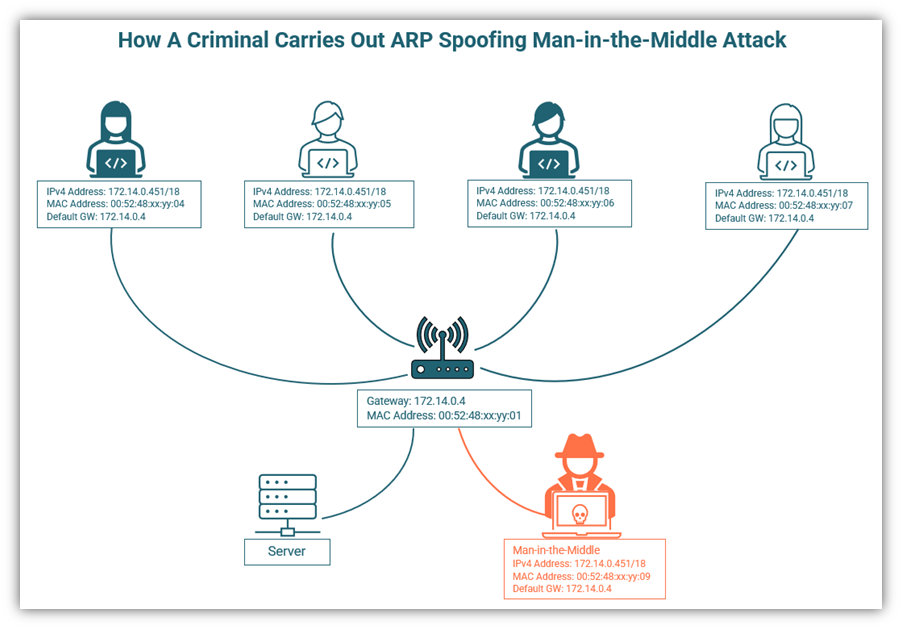
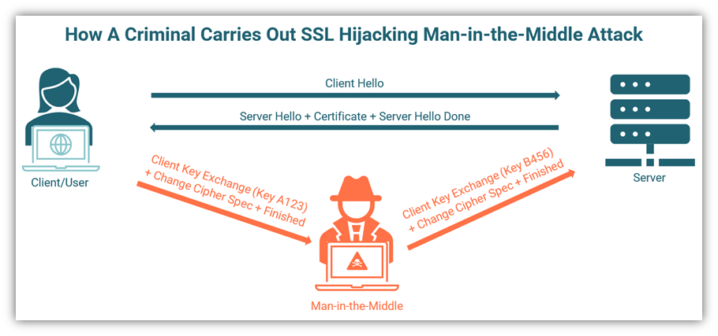
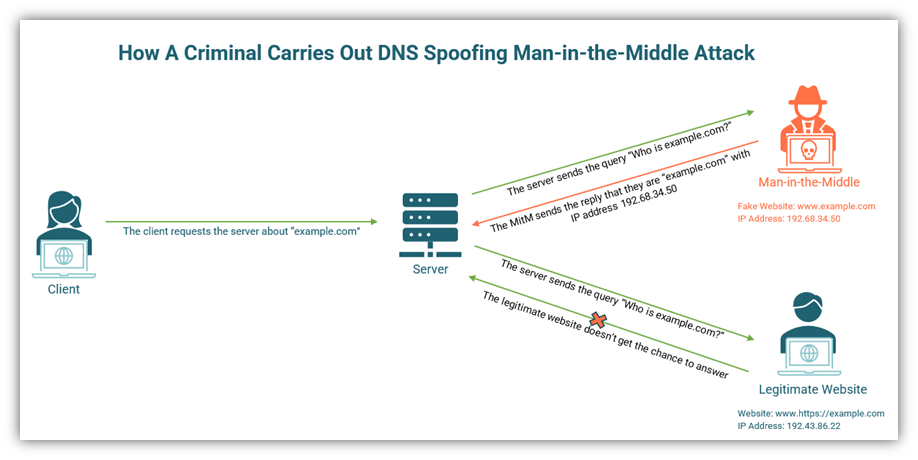
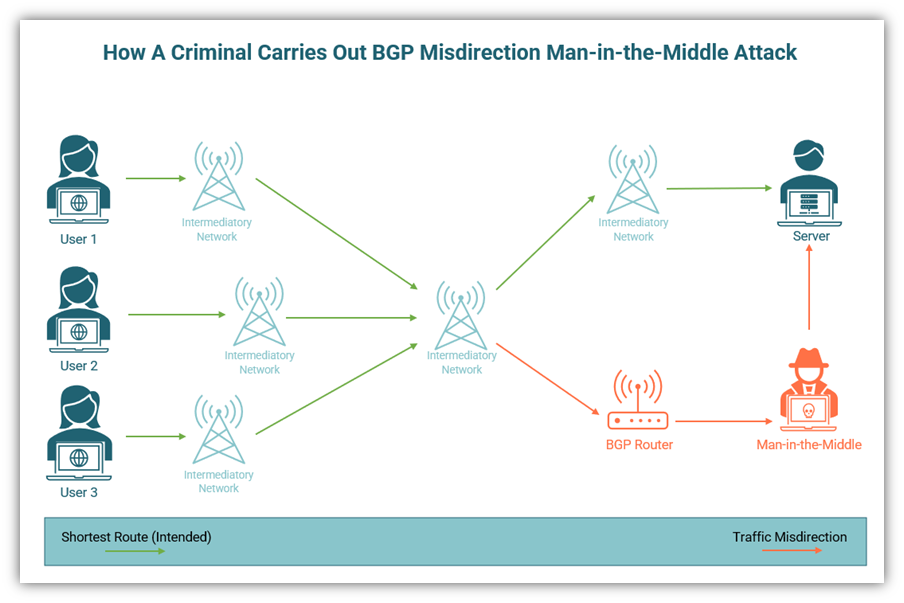
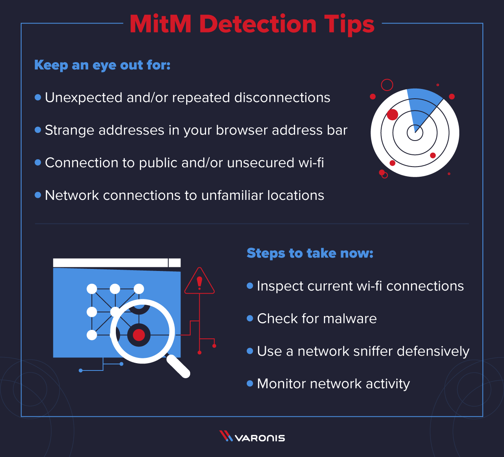
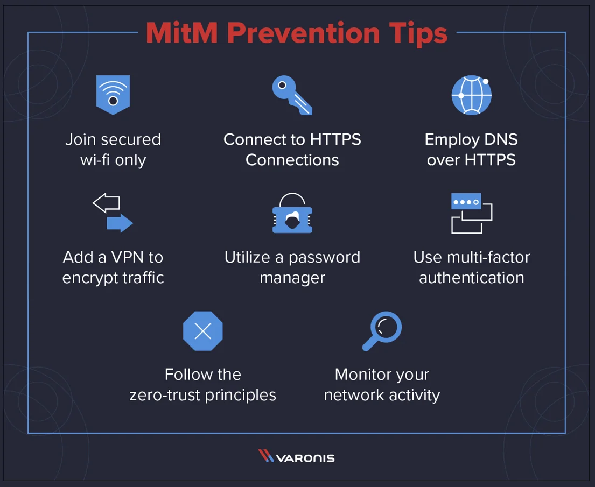

# Man-In-The-Middle (MITM) attack

A Man-in-the-Middle (MITM) attack is a cyberattack where the attacker secretly intercepts and relays communications between two parties who believe they are directly communicating with each other. The attacker is able to monitor and manipulate the traffic in real-time.

## How does a MITM attack work?

In a MITM attack, the attacker inserts themselves between the communication channel of two parties without their knowledge. Here are the typical steps:

1. The attacker scans the network for wireless devices or gains access to the LAN.

2. A rogue wireless access point or switch is set up impersonating the legitimate network.

3. When the target connects to the rogue network, their traffic is redirected to the attacker.

4. The attacker decrypts, reads, and optionally modifies the traffic before re-encrypting and forwarding it.

5. To the targets, it appears they are communicating directly over a secure connection.

## Types of MITM attacks

- ARP spoofing - Manipulating ARP protocol to intercept LAN traffic.

- SSL/TLS interception - Breaking secure connections by posing as trusted certificate authorities.

- Rogue access points - Deploying fake public Wi-Fi hotspots to intercept wireless traffic.

- DNS spoofing - Redirecting DNS queries to malicious servers under attacker's control.

- BGP hijacking - Hijacking internet traffic through manipulation of routing protocols.

## Impact of MITM attacks

- Stealing sensitive data like passwords, cookies, session tokens, credit cards etc.

- Injecting malware or modifying legitimate traffic for phishing and fraud.

- Eavesdropping private communications and transactions.

- Impersonating users, services and websites to gain unauthorized access.

- Undermining security of HTTPS websites by breaking end-to-end encryption.

## Prevention techniques

- Use VPN and firewalls to establish secure network tunnels.

- Enable SSL certificate pinning and HSTS to prevent SSL stripping attacks.

- Educate users on secure browsing practices like avoiding public Wi-Fi networks.

- Implement network access control and authentication on enterprise networks.

- Monitor network traffic for anomalies through intrusion detection systems.

- Use encrypted protocols like SSH, SFTP for administrative access.

## Conclusion

MITM attacks pose a serious threat to network security by intercepting supposedly private communications. Proper security controls and user awareness are necessary to prevent sensitive data theft and impersonation through these stealthy attacks.
