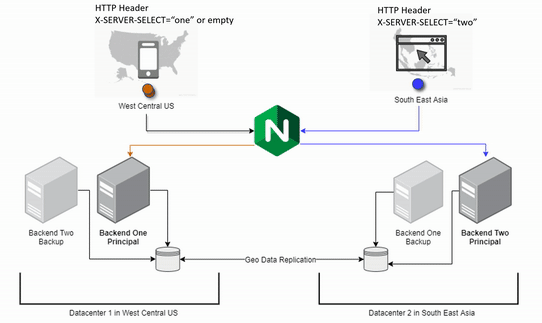

# LOAD BALANCER SOLUTION WITH NGINX AND SSL/TLS

By now you have learned what Load Balancing is used for and have configured an LB solution using Apache, but a DevOps engineer must
be a versatile professional and know different alternative solutions for the same problem. That is why, in this project we will
configure a Nginx Load Balancer solution.

It is also extremely important to ensure that connections to your Web solutions are secure and information is encrypted in transit – we
will also cover connection over secured HTTP (HTTPS protocol), its purpose and what is required to implement it.

When data is moving between a client (browser) and a Web Server over the Internet – it passes through multiple network devices and,
if the data is not encrypted, it can be relatively easy intercepted by someone who has access to the intermediate equipment. This kind
of information security threat is called Man-In-The-Middle (MIMT) attack.

This threat is real – users that share sensitive information (bank details, social media access credentials, etc.) via non-secured
channels, risk their data to be compromised and used by cybercriminals.

SSL and its newer version, TSL – is a security technology that protects connection from MITM attacks by creating an encrypted session
between browser and Web server. Here we will refer this family of cryptographic protocols as SSL/TLS – even though SSL was replaced
by TLS, the term is still being widely used.

SSL/TLS uses digital certificates to identify and validate a Website. A browser reads the certificate issued by a Certificate
Authority (CA) to make sure that the website is registered in the CA so it can be trusted to establish a secured connection.

In this project you will register your website with LetsEnrcypt Certificate Authority, to automate certificate issuance you will use
a shell client recommended by LetsEncrypt – cetrbot.

## Task

This project consists of two parts:

1. Configure Nginx as a Load Balancer
2. Register a new domain name and configure secured connection using SSL/TLS certificates
   Your target architecture will look like this:

Let us get started!
