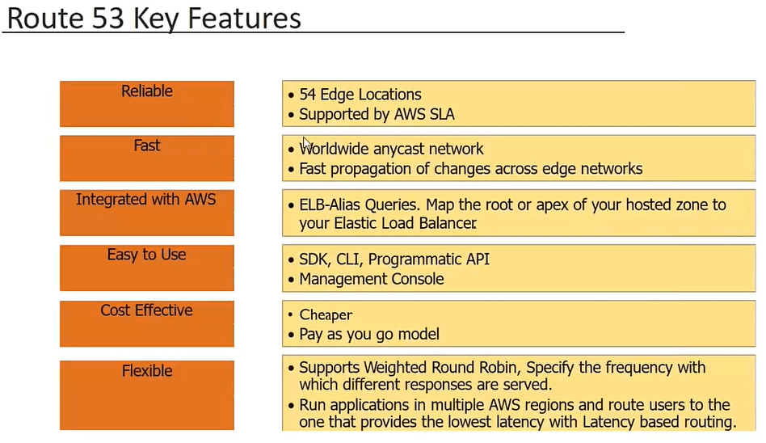

# AWS Route 53

AWS Route 53 is a highly available and scalable cloud Domain Name System (DNS) web service provided by Amazon Web Services. It is designed to give developers and organizations an extremely reliable and cost-effective way to route end users to internet applications by translating domain names like www.example.com to IP addresses like 192.0.2.1.

## Key Features

- **Domain Registration** - Register new domains or transfer existing domains to Route 53.

- **Health Checks** - Monitor the health and performance of backend applications and resources.

- **Routing Policies** - Route traffic intelligently based on health, latency, geolocation and other criteria.

- **DNS Failover** - Automatically route traffic to healthy endpoints in the event of failures.

- **Traffic Flow** - Control routing of traffic according to business, security and performance needs.

- **Low Latency Querying** - Serve DNS queries with ultra-low latency using a global network of DNS resolvers.

- **Security & Compliance** - Meet organizational requirements through features like DNSSEC.

## Working of Route 53

Route 53 allows mapping domain names to their corresponding web servers, apps or other internet resources. It does this by hosting DNS records that associate domains to IP addresses. When users request a domain, Route 53 routes them to the intended destination using the fastest available path. It also monitors endpoints and routes traffic around failures.

## Benefits

- High performance, scalability and availability due to AWS global infrastructure.

- Built-in health checks and traffic routing rules for reliability.

- Seamless integration with other AWS services for server registrations.

- Automated failovers maintain application accessibility.

- Low latency and fast response times for end users worldwide.

- Flexible control over routing and configuration changes.

- Robust security, compliance, auditing and access management.

## Conclusion

Route 53 is a powerful managed DNS service that helps developers and businesses direct traffic to their websites, applications and other online resources with ease. Its global infrastructure, reliability features and integration capabilities make it a preferred choice for mission-critical production workloads and services hosted on AWS.
