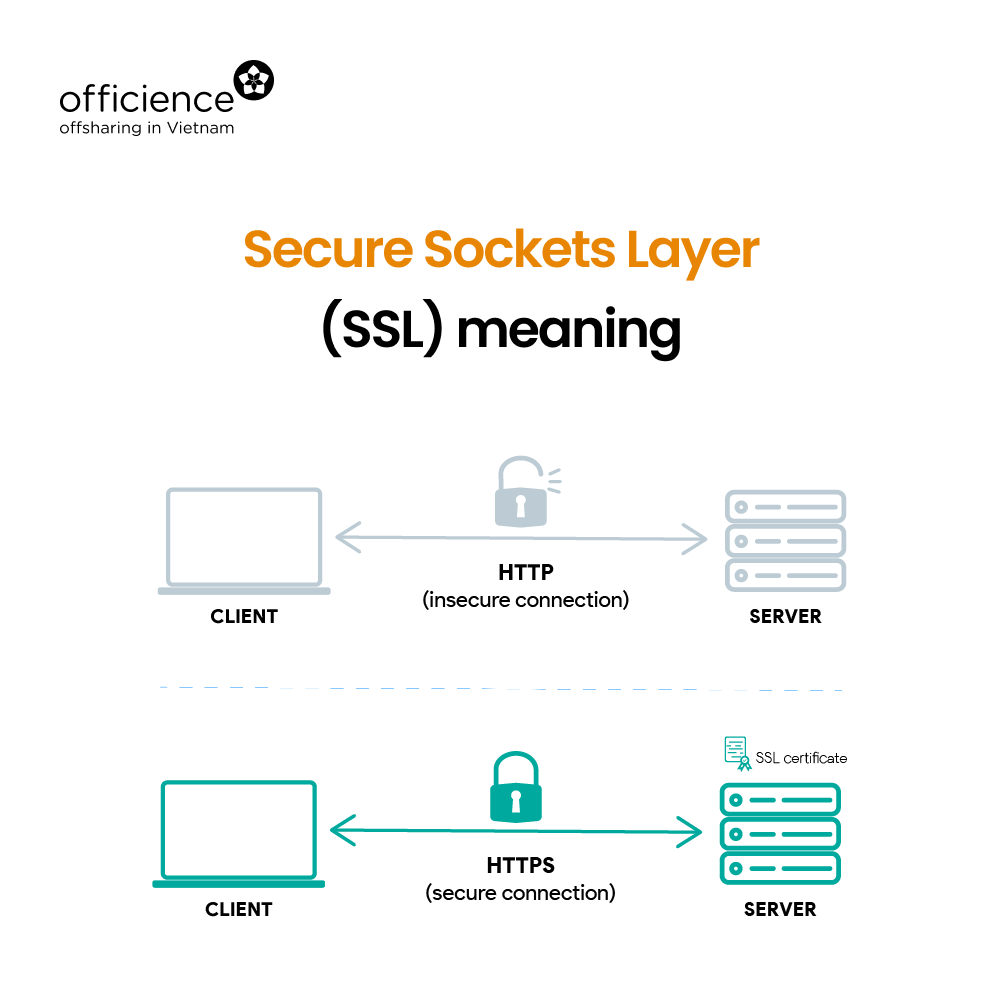
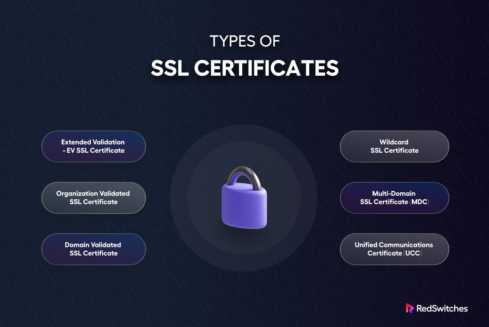
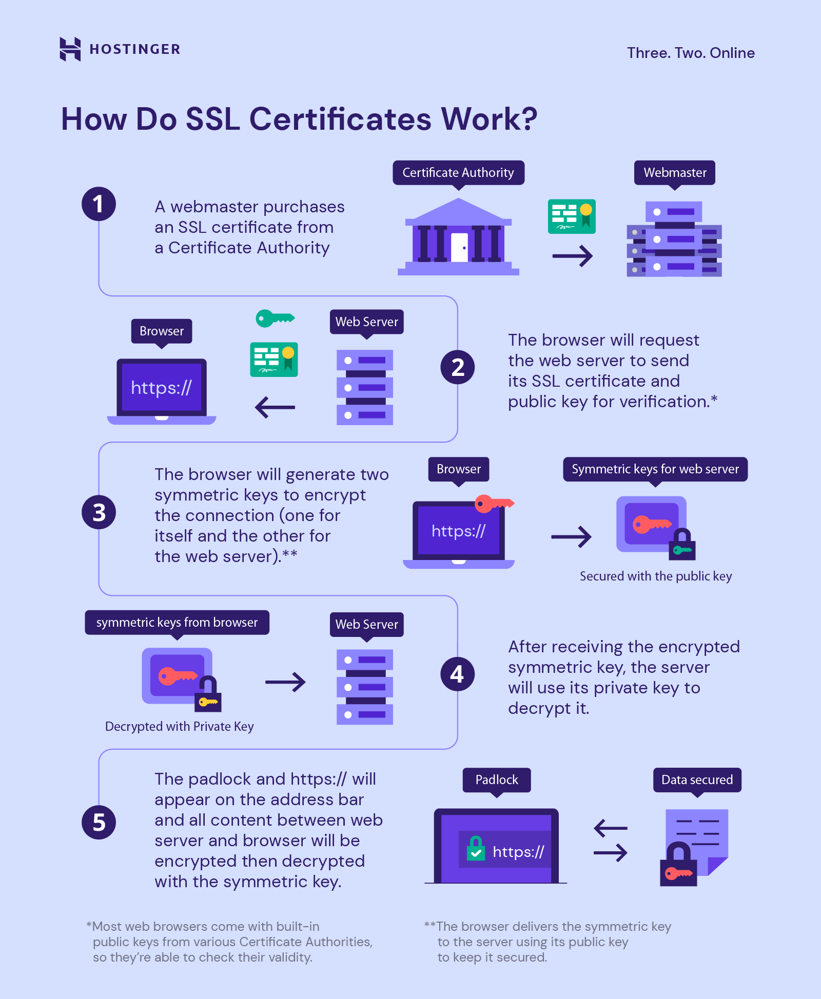

# SSL

SSL (Secure Sockets Layer) is a standard security technology for establishing an encrypted link between a server and a client. This link ensures that all data passed between the web server and browsers remain private and integral. SSL uses a private key to encrypt data that can only be decrypted by a public key known to both the server and client.

## How does SSL work?

When an SSL connection is established, the following takes place:

1. The client sends a "Client Hello" message to the server indicating its SSL capabilities.

2. The server responds with a "Server Hello" message along with its SSL certificate.

3. The certificate contains the server's public key and identity details signed by a Certificate Authority (CA).

4. The client validates the certificate against the known CAs and establishes an encrypted connection using a randomly generated symmetric session key.

5. All further communications between the server and client are encrypted using this session key for privacy and integrity.

## SSL Certificate Types

There are several types of SSL certificates used for different purposes:

- Domain Validated (DV) - Validates domain ownership only. Cheapest option.

- Organization Validated (OV) - Validates domain and business identity. More trusted than DV.

- Extended Validation (EV) - Highest level of validation for domain, business, and physical address. Green address bar in browsers.

- Wildcard - Secures multiple subdomains with a single certificate.

- Unified Communications (UC) - For encrypted communication platforms.

- Code Signing - Validates the publisher of software files and downloads.

## Benefits of SSL

- Encrypts data in transit ensuring complete privacy.

- Prevents tampering, modification or forgery of data through digital signatures.

- Allows secure transmission of sensitive data like payment details.

- Builds user trust through the padlock icon and "https" in the browser address bar.

- Provides authentication of websites and online services.

- Helps increase conversion rates and sales for e-commerce websites.

- Enhances SEO and ranks websites higher in search engine results.

## SSL Configuration

To enable SSL on a website, you need an SSL certificate issued by a trusted CA and the following configuration:

- Purchase and install the SSL certificate on the web server.

- Configure the web server (e.g. Apache, Nginx) to listen on port 443 for HTTPS requests.

- Redirect all HTTP traffic to HTTPS using 301 redirects or HSTS headers.

- Enforce SSL on the whole website by removing unencrypted content references.

- Renew SSL certificates before expiration to avoid browser certificate warnings.

- Use SSL offloading if SSL processing impacts server performance.

## Conclusion

SSL encryption is essential for secure online communication and sensitive data transmission in today's world. It establishes trust, privacy and security for websites and applications on the internet. By obtaining and properly configuring SSL certificates, organizations can protect their online presence and ensure user confidentiality.
