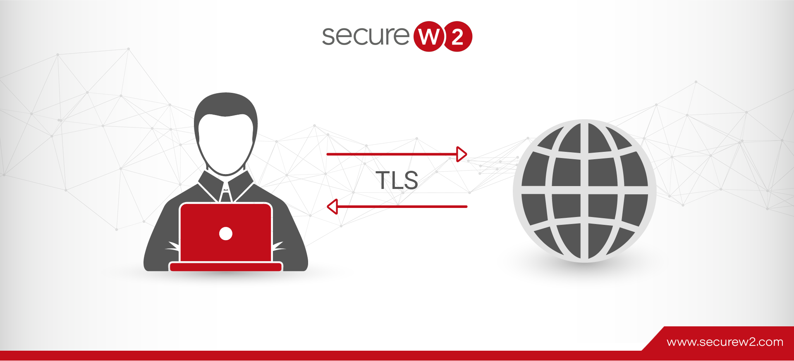
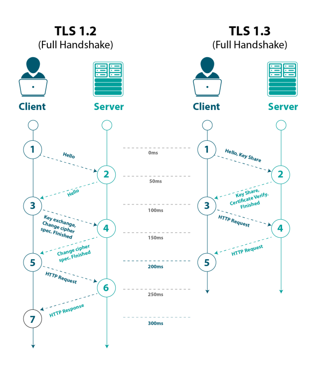
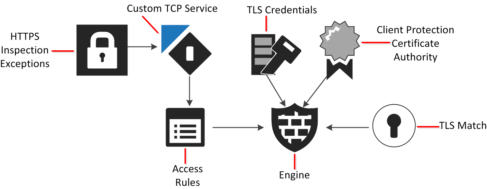

# TLS

TLS (Transport Layer Security) is the successor to the SSL (Secure Sockets Layer) protocol. It is a cryptographic protocol that provides communications security over the internet. TLS ensures secure data transmission between two applications through encryption, authentication and integrity checks. It prevents eavesdropping, tampering and message forgery.

## TLS Protocol Versions

The major TLS protocol versions are:

- **TLS 1.0:** Successor to SSL 3.0, added minor fixes.

- **TLS 1.1:** Added additional security by addressing vulnerabilities in TLS 1.0.

- **TLS 1.2:** Current standard version, more resistant to known attacks.

- **TLS 1.3:** Newest version focused on performance and security improvements.

Most modern browsers support TLS 1.2 and some also support TLS 1.3. Older TLS versions are considered insecure.

## TLS Handshake

The TLS handshake establishes a secure connection between a client and server in the following steps:

1. Client sends "Client Hello" with supported ciphers, compression methods etc.

2. Server responds with "Server Hello" selecting parameters and its certificate.

3. Client verifies server certificate and sends "Client Key Exchange".

4. Server sends "Server Hello Done".

5. Client sends "Change Cipher Spec" and "Finished".

6. Server sends "Change Cipher Spec" and "Finished" to complete handshake.

7. Secure communication begins over encrypted and authenticated TLS channel.

## Benefits of TLS

- Encrypts data-in-transit using strong ciphers to prevent snooping and tampering.

- Authenticates server and optionally client through X.509 certificates.

- Prevents man-in-the-middle attacks, message tampering and eavesdropping.

- Protects sensitive communications like banking, e-commerce and other applications.

- Provides better security than traditional transport protocols like TCP.

- Supported natively by all major browsers and operating systems.

- Successor to widely adopted SSL protocol for secure internet connections.

## TLS Configuration

To enable TLS, a server needs a valid SSL/TLS certificate from a trusted CA and TLS protocol support configured in the server software (Apache, Nginx etc). The server then handles encrypted communications using the TLS handshake process. Clients like browsers also support TLS out of the box.

## Conclusion

TLS is the standard security protocol to establish encrypted connections and secure data transmission on the internet. It ensures privacy, integrity and authentication which are critical for sensitive online applications. With widespread adoption across systems and browsers, TLS protocol provides robust security for network communications.
