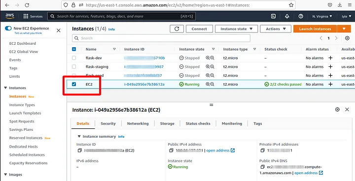
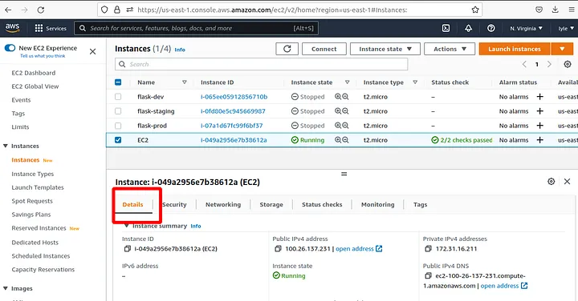
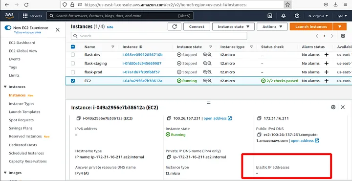
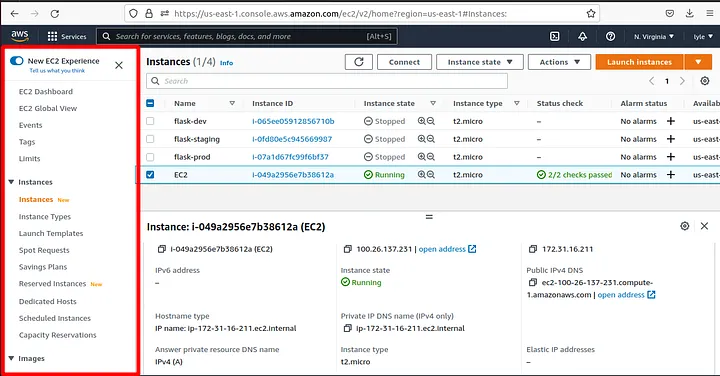
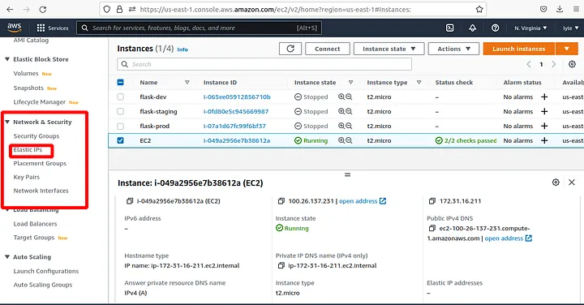
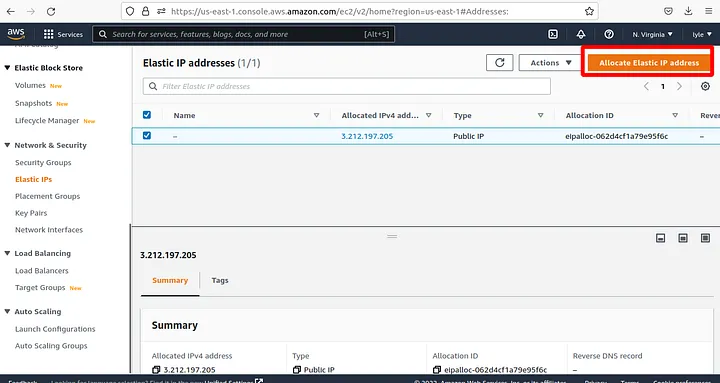
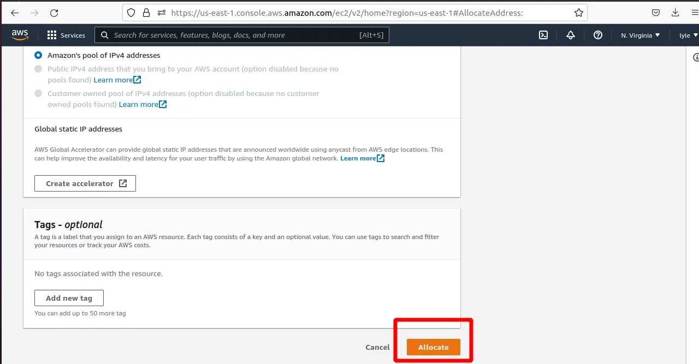
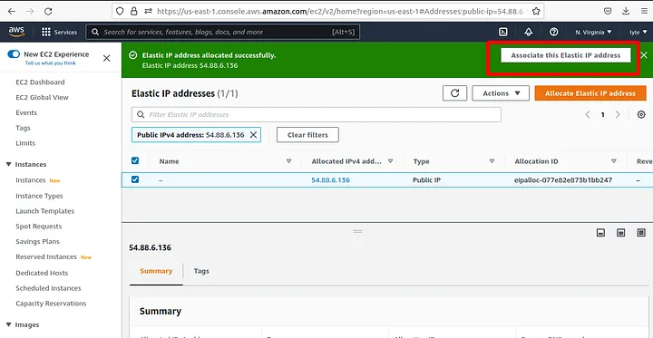
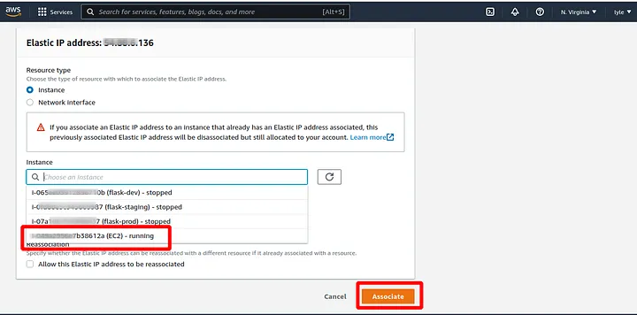
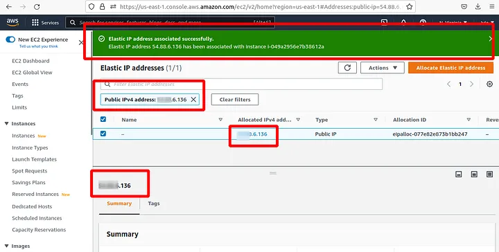

# Adding Elastic IP to your AWS EC2 instance

Why you may need a static IP address for EC2 instance¶
This article explains how to add an Elastic IP to your AWS EC2 instance and why this is so important.

## What is elastic ip in AWS

In AWS (Amazon Web Services), an Elastic IP (EIP) is a static public IPv4 address that you can allocate to your AWS resources, such as Amazon EC2 instances, NAT gateways, and some load balancers. The term "elastic" refers to the fact that you can easily associate and disassociate the IP address with your instances and other resources, making it flexible and portable.

When you launch a new EC2 instance in AWS, it is assigned a dynamic public IP address by default. However, this dynamic IP address can change whenever you stop and start the instance, or if there's any interruption in the underlying infrastructure.

On the other hand, an Elastic IP address remains associated with your AWS account until you explicitly release it. This makes it useful for scenarios where you need a consistent, public IP address for your resources, such as hosting a website, setting up a VPN, or accessing resources from the internet.

### By using an Elastic IP, you can:

Associate a persistent public IP address with your instance or other resources, ensuring that the address remains the same even after instance stop/start cycles.
Reserve an IP address in your AWS account, which can be useful for scenarios where you want to ensure that the IP address remains unchanged even if the instance is terminated and later relaunched.

Easily remap the Elastic IP to different instances or resources within the same AWS account, providing a level of flexibility for your architecture.
Also you might want server's IP address static if it calls 3rd party APIs and you need to whitelist its IP address. Elastic IP address will be used when server is making outgoing connections.

## Create an elastic IP Address on AWS using AWS Elastic IP

Log into your AWS account. First, let us confirm that the instance that you created has no elastic IP address associated with it.On the instances dashboard, select the checkbox next to the EC2 instance that you want to create the elastic IP address for. In this case, our instance is called EC2:

Select the Details tab:

Then Under the Instance summary, scroll down to the Elastic IP addresses section; it should be empty:

In the same tab in the navigation panel to the left:

Scroll down to the **Network and Security** section; within the drop-down, select **Elastic IPs**:

Click on the Allocate Elastic IP address button:

Leave the defaults and click on Allocate:

Then select the Associate this Elastic IP address prompt:

Select the instance to associate it with in the Instance drop-down, then in the Private IP address drop-down, select the instance’s private IP address. then click the Associate button:

And with that, we have successfully allocated an Elastic IP address to our EC2 server:

