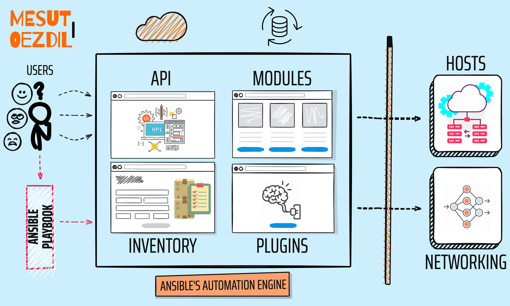

# Ansible

Ansible is an open-source automation engine that automates software provisioning, configuration management, and application deployment. It uses YAML files to define descriptions of desired system configurations and then executes these descriptions on remote systems using SSH. Ansible is agentless, which means it does not require any additional software to be installed on managed nodes.

## Key Concepts

- Inventory: Ansible inventory is a list of managed nodes that Ansible can connect to and execute tasks on. It defines the hosts, groups, and variables.

- Modules: Modules are individual tasks that can be used in playbooks to perform specific configuration functions like installing packages, editing files, etc. Ansible ships with hundreds of core modules.

- Playbooks: Playbooks are YAML files that define the automation workflow using a list of tasks called plays. They allow declaring entire procedures in a standardized, readable format.

- Templates: Templates allow generating configuration files dynamically using variables. This avoids repetitive tasks and makes configurations flexible and portable.

- Roles: Roles help with the reusability, organization and sharing of playbooks. They encapsulate tasks related to specific functions.

## How Ansible Works

Ansible uses SSH to connect to remote nodes and execute tasks. Playbooks define the steps to automate configurations on these nodes. Ansible runs these playbooks and executes the tasks in the defined order. It uses YAML files to define inventories, modules and playbooks. Being agentless, it does not require any additional software on remote machines.

## Benefits of Ansible

- Agentless architecture: Ansible does not require any software installation on managed nodes, simplifying deployment.

- Declarative language: Playbooks define the desired state in a declarative way rather than procedural scripts.

- Idempotent tasks: Ansible tasks are idempotent and ensure nodes are always in the desired state.

- Simple to use: Ansible has a very low learning curve and is easy to pick up for system administrators and developers.

- Scalability: It can manage thousands of servers simultaneously with good performance.

- Multi-platform: Ansible works across Linux, Windows, networking devices, cloud infra and more.

## Common Uses

- Configuration management
- Application deployment
- Infrastructure provisioning
- Orchestration
- Continuous integration/delivery
- Patch management
- Security auditing

## Conclusion

Ansible provides a simple yet powerful way to automate IT infrastructure and application deployments. Its agentless nature, idempotent operations, and YAML syntax make it easy to learn and use for both simple and complex automation tasks across heterogeneous environments at any scale.
