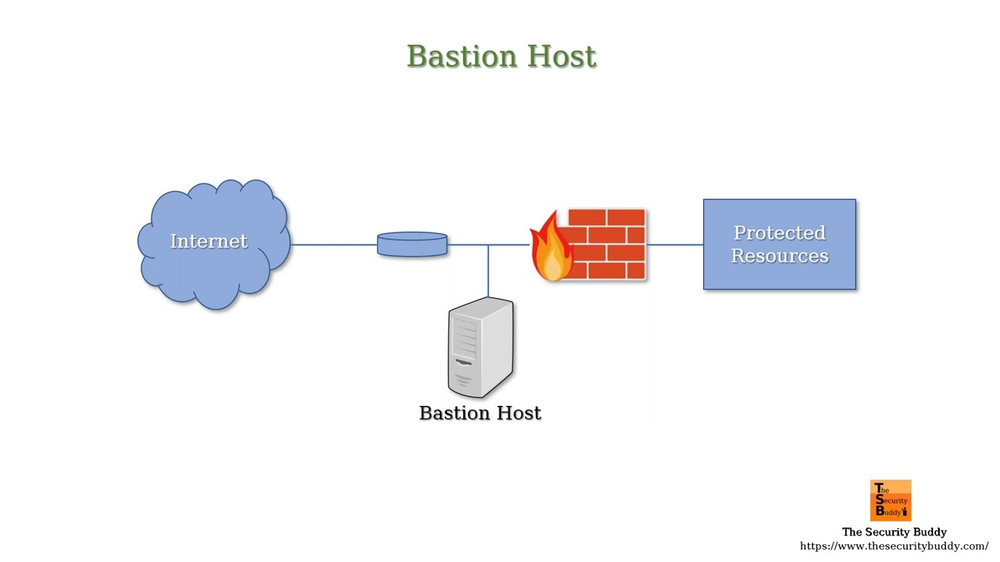

# Bastion Host

A bastion host is a special purpose computer on a network specifically designed and configured to withstand attacks. It is hosted in a specially protected demilitarized zone (DMZ) and only accepts connections from a trusted internal network and the untrusted external network, but does not allow direct connections between the two.

## Purpose of a Bastion Host

The main purpose of a bastion host is to restrict and control access between internal and external networks for security reasons. It allows system administrators to securely and safely administer systems located in the internal network from the external network.

## Working of a Bastion Host

- It has two network interfaces - one connected to the internal network and the other to the external network.

- Users from the external network can only access services running on the bastion host like SSH.

- The bastion host then proxies or tunnels connections to systems located in the internal network.

- This prevents exposing the internal network systems directly to the external network.

- Strong access controls are applied on the bastion host to restrict unauthorized access.

## Benefits of Using a Bastion Host

- Acts as a barrier and security choke point between networks.

- Reduces the attack surface by restricting direct external access.

- Allows secure remote administration of internal systems.

- Simplifies security management and access controls.

- Can perform network address translation for internal systems.

- Provides logging and auditing of network access activities.

- Helps achieve security compliance and hardening standards.

## Common Uses

- Remote access to internal systems via SSH/RDP forwarding.

- VPN gateway or jump server for virtual private networks.

- Administration of cloud infrastructure and servers.

- Access to database servers or other Internet-facing systems.

- Disaster recovery and business continuity operations.

## Conclusion

A bastion host is a vital security tool that balances the need for remote access with protection of critical internal systems. It centralizes network access controls and allows safe administration of infrastructure located behind firewalls. With careful configuration and monitoring, it can significantly harden the perimeter defenses of an organization.
