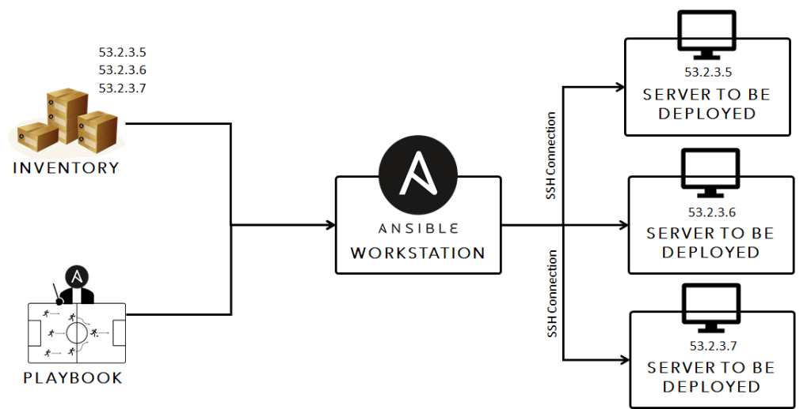

# Playbooks

Playbooks are files that define automation workflows in Ansible. They are used to execute a series of tasks on remote managed nodes to configure systems, deploy applications, orchestrate services etc. Playbooks use YAML syntax and allow defining reusable and modular automation workflows.

## Key Elements of Playbooks

- **Plays** - Logical grouping of tasks that define a unit of work.

- **Tasks** - Individual automation steps like copying files, running commands etc.

- **Roles** - Reusable modules containing tasks, handlers and variables.

- **Handlers** - Tasks run when notified by other tasks for events.

- **Variables** - Dynamic values used in tasks, roles and playbooks.

- **Includes** - Break playbooks into multiple files for modularity.

- **Tags** - Filter tasks to run selectively based on tags.

## Playbook Structure

A basic playbook structure consists of:

- Playbook name and metadata

- Plays defining hosts and tasks

- Tasks listing step-by-step automation work

- Roles, handlers, variables as needed

- YAML syntax for readability

## Benefits of Playbooks

- Define entire workflows and orchestration in a single file.

- Reusable, modular and maintainable automation definitions.

- Idempotent tasks ensure consistent and reliable automation.

- Easy to understand sequential flows for auditing and collaboration.

- Leverage roles for code reuse and DRY principles.

- Integrate with other DevOps tools via APIs and workflows.

## Common Uses

- Server provisioning
- Application deployment
- Configuration management
- Orchestration
- Patch management
- Security audits
- Continuous delivery

## Conclusion

Playbooks are the backbone of Ansible automation. They provide a simple yet powerful way to define entire infrastructure and application workflows through reusable YAML files. This makes automation scalable, modular, and repeatable for diverse environments and use cases.
