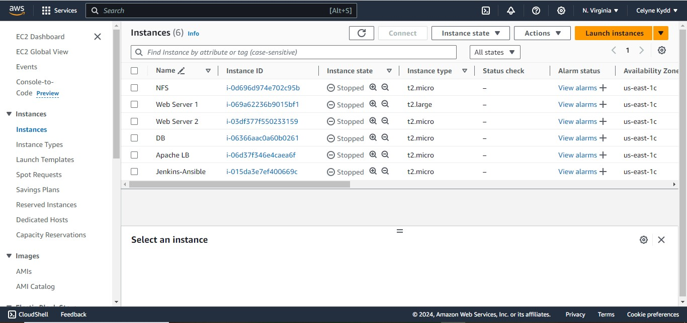
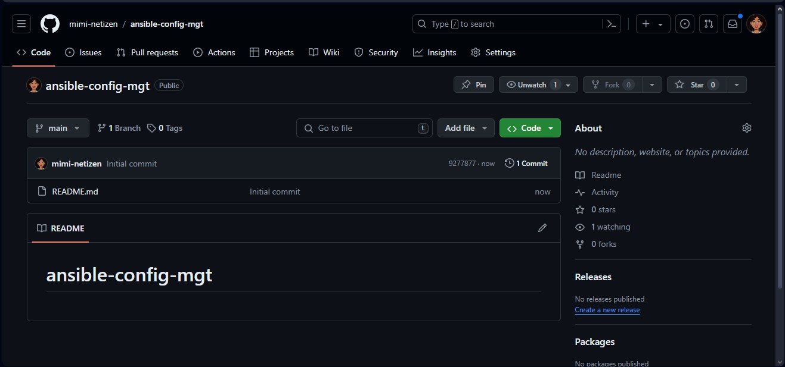
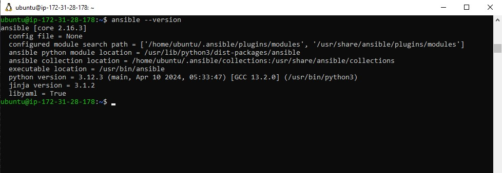
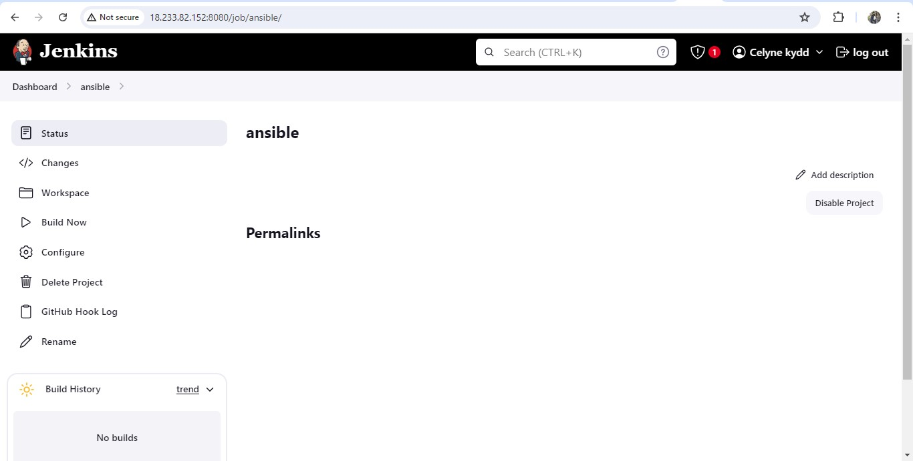
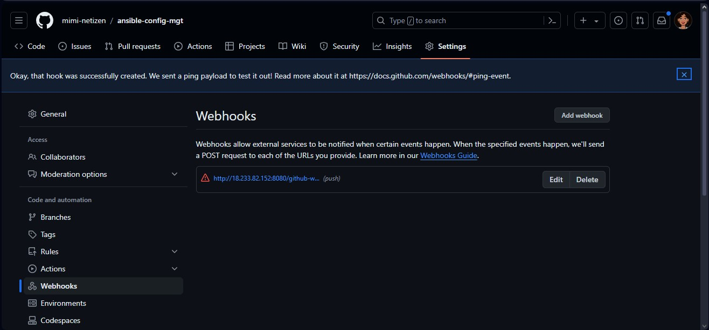
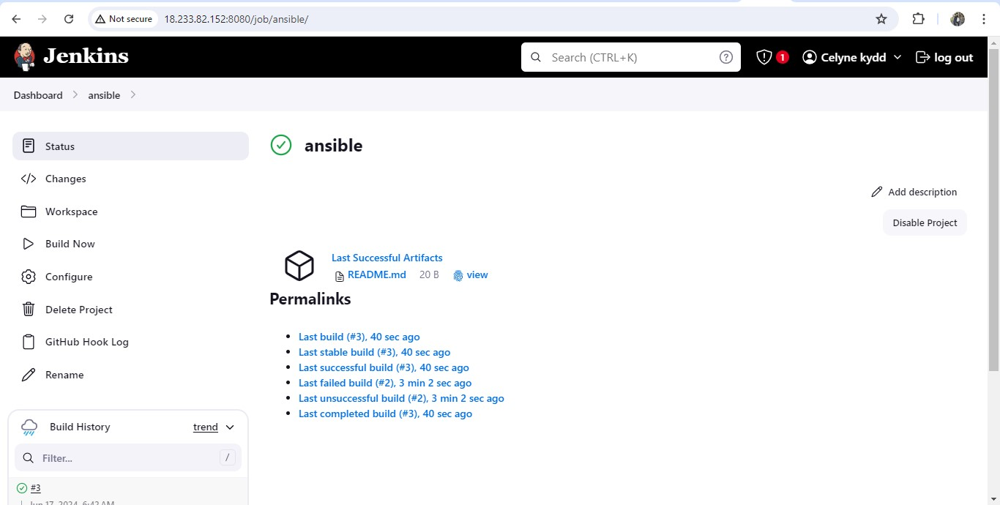
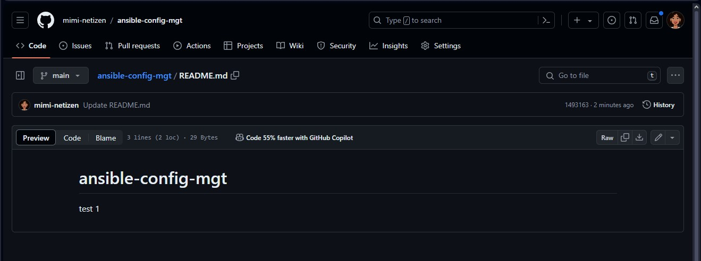
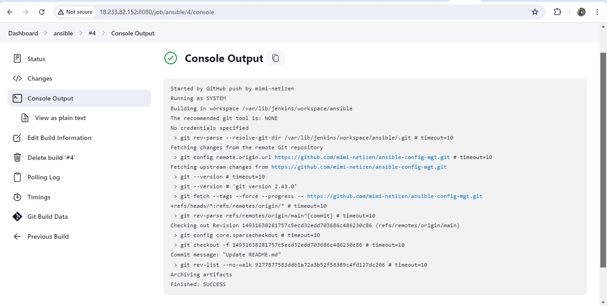
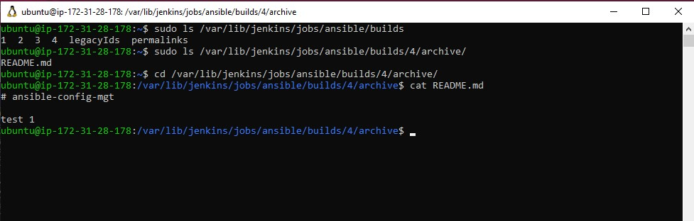

# INSTALL AND CONFIGURE ANSIBLE ON EC2 INSTANCE

1. Update Name tag on your Jenkins EC2 Instance to Jenkins-Ansible. We will use this server to run playbooks.



2. In your GitHub account create a new repository and name it ansible-config-mgt.



3. Install Ansible

```
sudo apt update

sudo apt install ansible
```

Check your Ansible version by running ansible --version



4. Configure Jenkins build job to save your repository content every time you change it – this will solidify your Jenkins configuration skills acquired in Project 9.

- Create a new Freestyle project ansible in Jenkins and point it to your ‘ansible-config-mgt’ repository.



- Configure Webhook in GitHub and set webhook to trigger ansible build.
- Configure a Post-build job to save all (\*\*) files, like you did it in Project 9.



5. Test your setup by making some change in README.MD file in master branch and make sure that builds starts automatically and Jenkins saves the files (build artifacts) in following folder

```
ls /var/lib/jenkins/jobs/ansible/builds/<build_number>/archive/
```






Note: Trigger Jenkins project execution only for /main (master) branch.

Now your setup will look like this:


Tip Every time you stop/start your Jenkins-Ansible server – you have to reconfigure GitHub webhook to a new IP address, in order to avoid it, it makes sense to allocate an Elastic IP to your Jenkins-Ansible server. Note that Elastic IP is free only when it is being allocated to an EC2 Instance, so do not forget to release Elastic
IP once you terminate your EC2 Instance.
