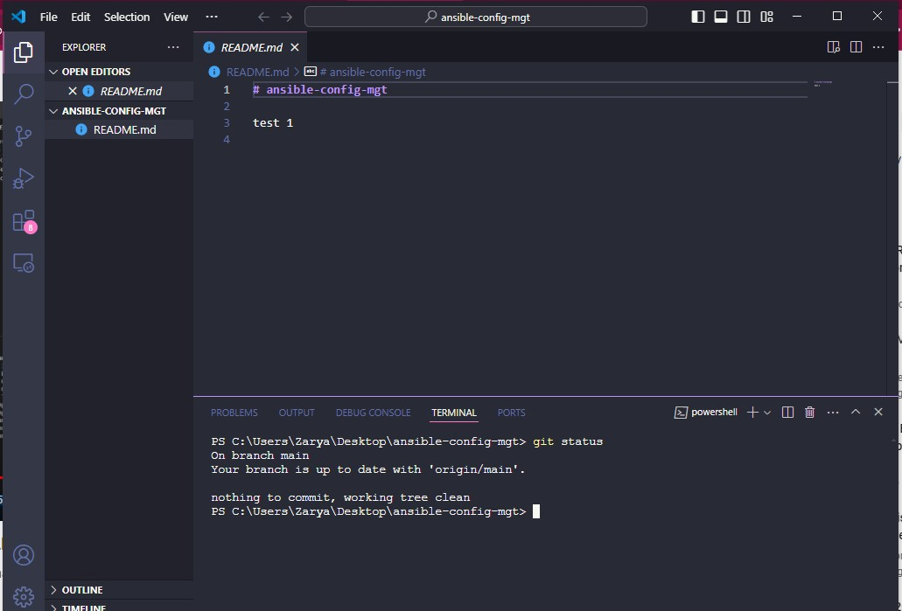
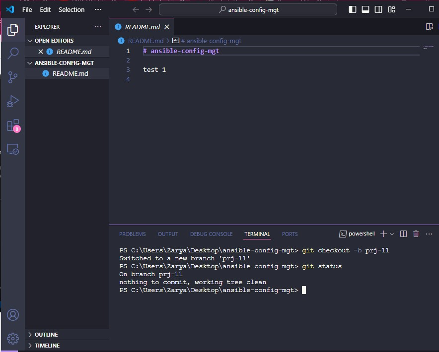
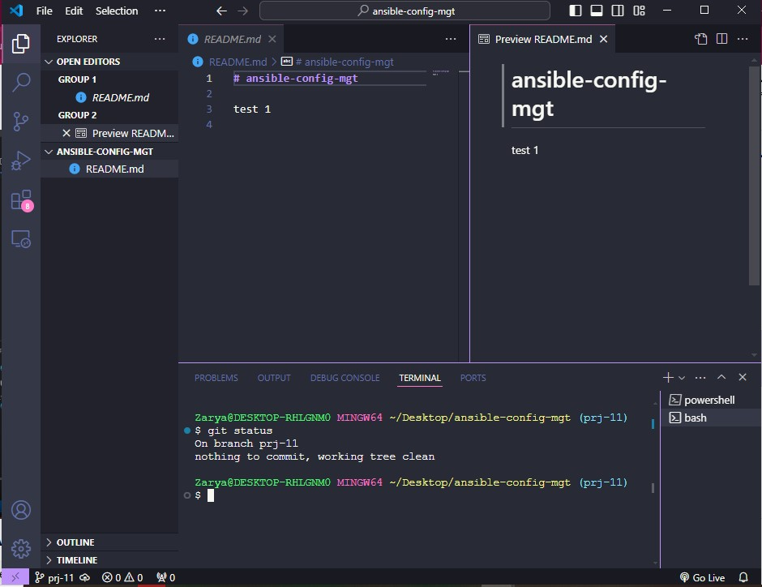
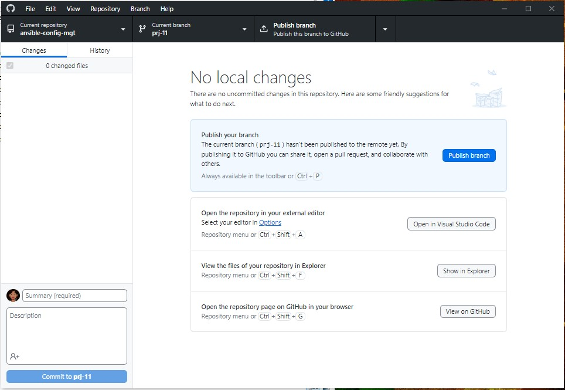
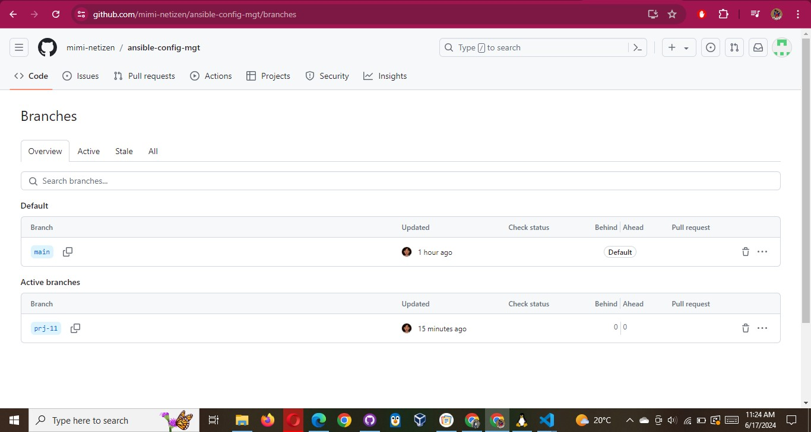
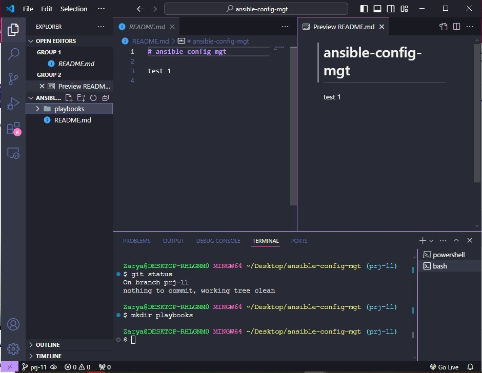
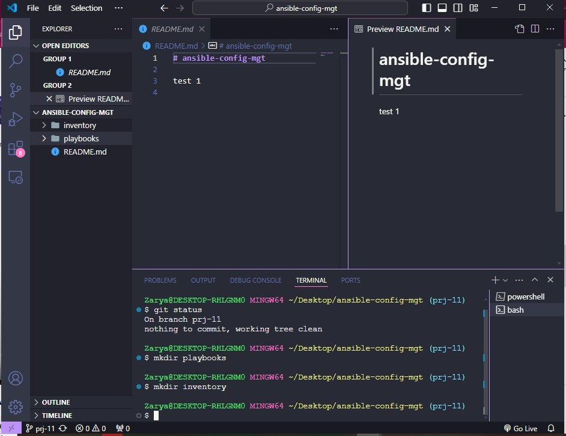
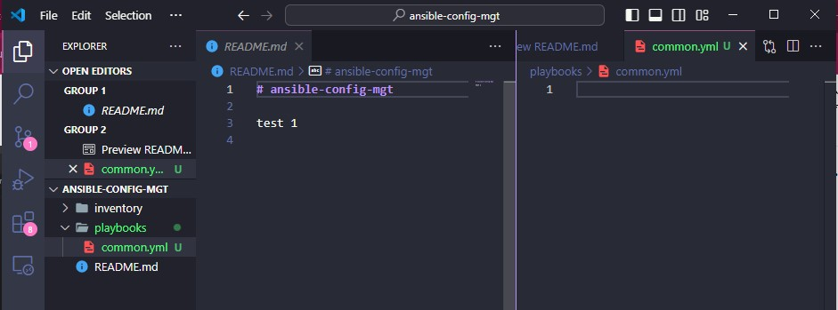
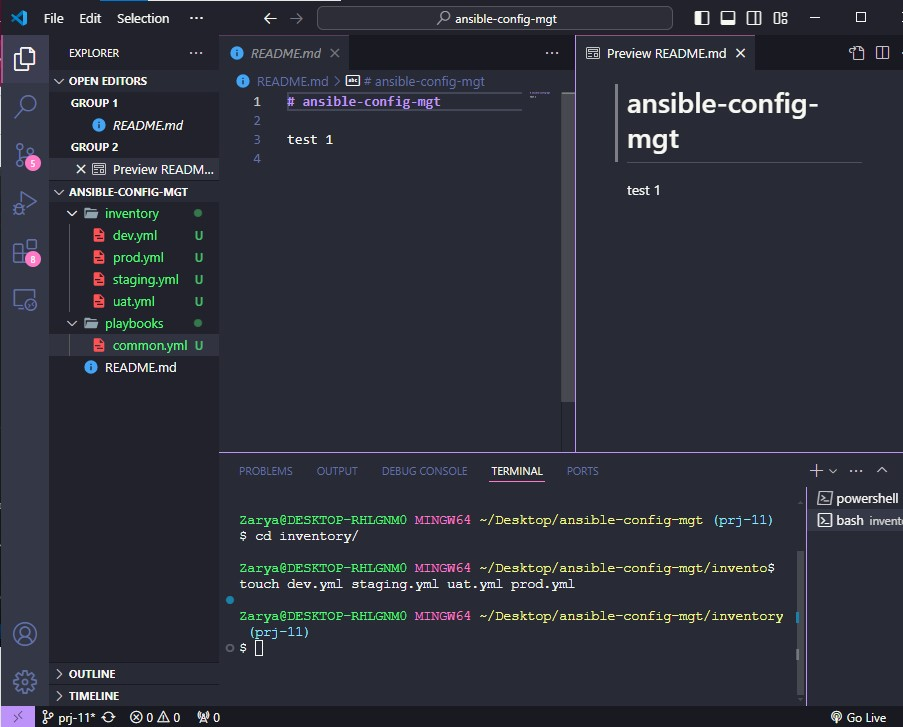

# BEGIN ANSIBLE DEVELOPMENT

1. In your ansible-config-mgt GitHub repository, create a new branch that will be used for development of a new feature.

Tip: Give your branches descriptive and comprehensive names, for example, if you use Jira or Trello as a project management tool –
include ticket number (e.g. PRJ-145) in the name of your branch and add a topic and a brief description what this branch is about – a
bugfix, hotfix, feature, release (e.g. feature/prj-145-lvm)

2. Checkout the newly created feature branch to your local machine and start building your code and directory structure

3. Create a directory and name it playbooks – it will be used to store all your playbook files.

4. Create a directory and name it inventory – it will be used to keep your hosts organised.

5. Within the playbooks folder, create your first playbook, and name it common.yml

6. Within the inventory folder, create an inventory file (.yml) for each environment (Development, Staging Testing and Production) dev, staging, uat, and prod respectively.

