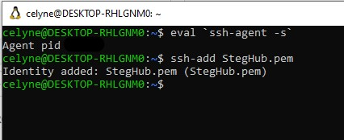
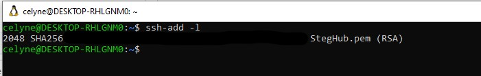
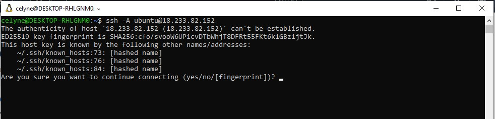
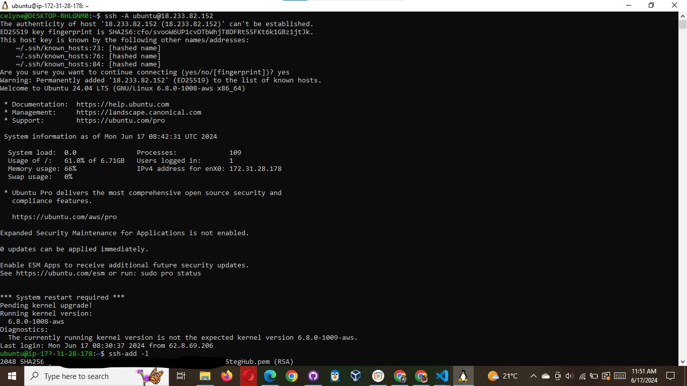
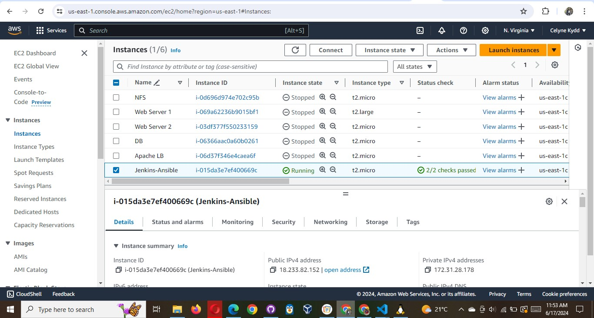
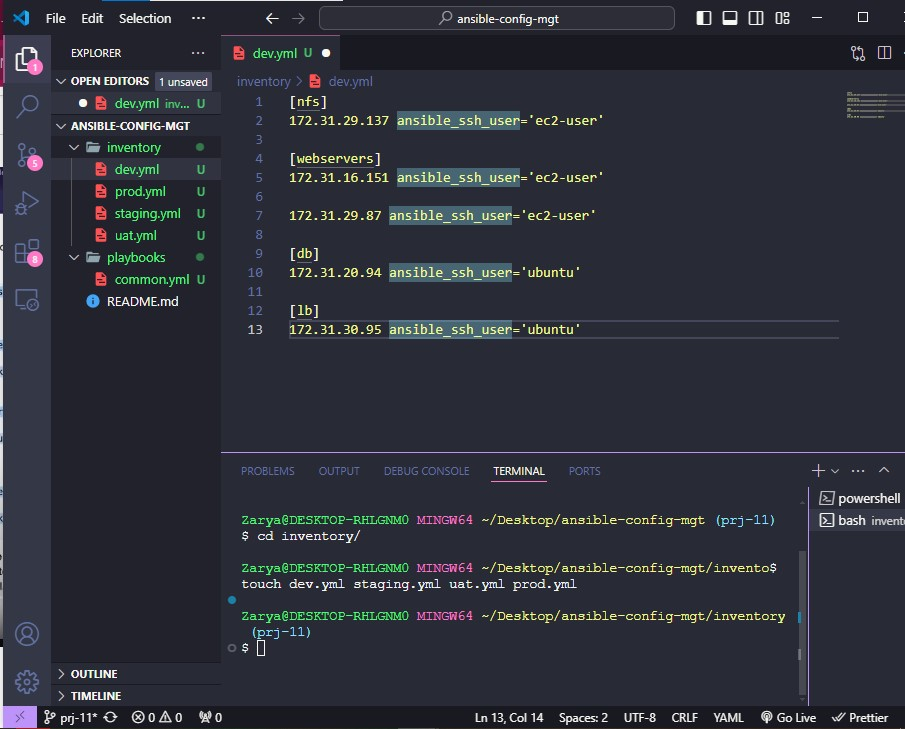

# Set up an Ansible Inventory

An Ansible inventory file defines the hosts and groups of hosts upon which commands, modules, and tasks in a playbook operate. Since
our intention is to execute Linux commands on remote hosts, and ensure that it is the intended configuration on a particular server
that occurs. It is important to have a way to organize our hosts in such an Inventory.

Save below inventory structure in the inventory/dev file to start configuring your development servers. Ensure to replace the IP
addresses according to your own setup.

Note: Ansible uses TCP port 22 by default, which means it needs to ssh into target servers from Jenkins-Ansible host – for this you
can implement the concept of ssh-agent. Now you need to import your key into ssh-agent:

To learn how to setup SSH agent and connect VS Code to your Jenkins-Ansible instance, please see this video:

- For Windows users – ssh-agent on windows
- For Linux users – ssh-agent on linux

Windows Installation:
Part 1: https://youtu.be/R-qcpehB5HY
part 2: https://youtu.be/jsNIlK5s6pI

OpenSSH Installation:

- https://docs.microsoft.com/en-us/wind...

- https://docs.microsoft.com/en-us/wind...

Read about ssh-agent:

- https://www.ssh.com/academy/ssh/agent
- https://smallstep.com/blog/ssh-agent-....

For Linux users:
https://youtu.be/RRRQLgAfcJw

```
eval `ssh-agent -s`
ssh-add <path-to-private-key>
```



Confirm the key has been added with the command below, you should see the name of your key

```
ssh-add -l
```



Now, ssh into your Jenkins-Ansible server using ssh-agent

```
ssh -A ubuntu@public-ip
```




Also notice, that your Load Balancer user is ubuntu and user for RHEL-based servers is ec2-user.

Update your inventory/dev.yml file with this snippet of code:

```powershell
[nfs]
<NFS-Server-Private-IP-Address> ansible_ssh_user='ec2-user'

[webservers]
<Web-Server1-Private-IP-Address> ansible_ssh_user='ec2-user'
<Web-Server2-Private-IP-Address> ansible_ssh_user='ec2-user'

[db]
<Database-Private-IP-Address> ansible_ssh_user='ec2-user'

[lb]
<Load-Balancer-Private-IP-Address> ansible_ssh_user='ubuntu'
```




