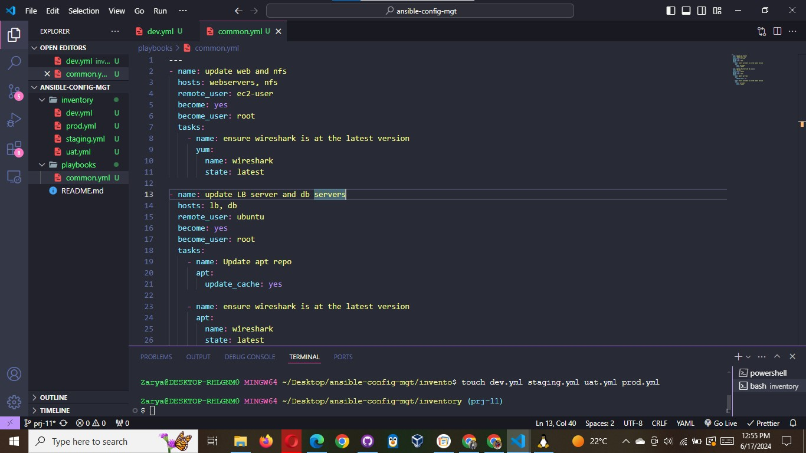

# CREATE A COMMON PLAYBOOK

It is time to start giving Ansible the instructions on what you needs to be performed on all servers listed in inventory/dev.

In common.yml playbook you will write configuration for repeatable, re-usable, and multi-machine tasks that is common to systems
within the infrastructure.

Update your playbooks/common.yml file with following code:

```powershell
---
- name: update web, nfs and db servers
  hosts: webservers, nfs, db
  remote_user: ec2-user
  become: yes
  become_user: root
  tasks:
    - name: ensure wireshark is at the latest version
      yum:
        name: wireshark
        state: latest

- name: update LB server
  hosts: lb
  remote_user: ubuntu
  become: yes
  become_user: root
  tasks:
    - name: Update apt repo
      apt:
        update_cache: yes

    - name: ensure wireshark is at the latest version
      apt:
        name: wireshark
        state: latest
```



Examine the code above and try to make sense out of it. This playbook is divided into two parts, each of them is intended to perform the same task: install wireshark utility (or make sure it is updated to the latest version) on your RHEL 8 and Ubuntu
servers. It uses root user to perform this task and respective package manager: yum for RHEL 8 and apt for Ubuntu.

Feel free to update this playbook with following tasks:

- Create a directory and a file inside it
- Change timezone on all servers
- Run some shell script

For a better understanding of Ansible playbooks – watch this video from RedHat ( https://youtu.be/ZAdJ7CdN7DY ) and read this article
( https://www.redhat.com/en/topics/automation/what-is-an-ansible-playbook ).
