# Update GIT with the latest code

Now all of your directories and files live on your machine and you need to push changes made locally to GitHub.

In the real world, you will be working within a team of other DevOps engineers and developers. It is important to learn how to
collaborate with help of GIT. In many organisations there is a development rule that do not allow to deploy any code before it
has been reviewed by an extra pair of eyes – it is also called "Four eyes principle".

Now you have a separate branch, you will need to know how to raise a Pull Request (PR), get your branch peer reviewed and merged to
the master branch.

Commit your code into GitHub:

1. use git commands to add, commit and push your branch to GitHub.

```
git status

git add <selected files>

git commit -m "commit message"
```

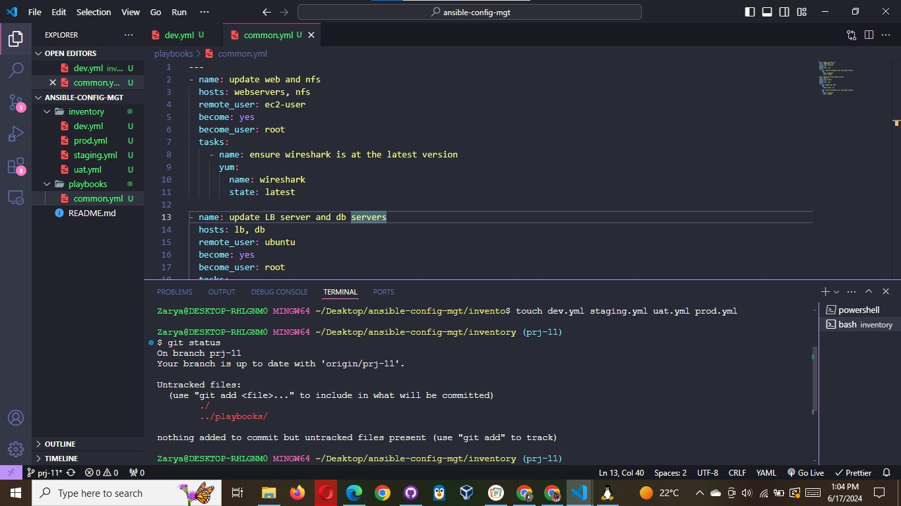

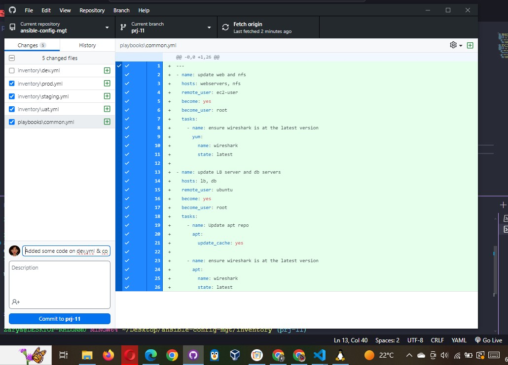

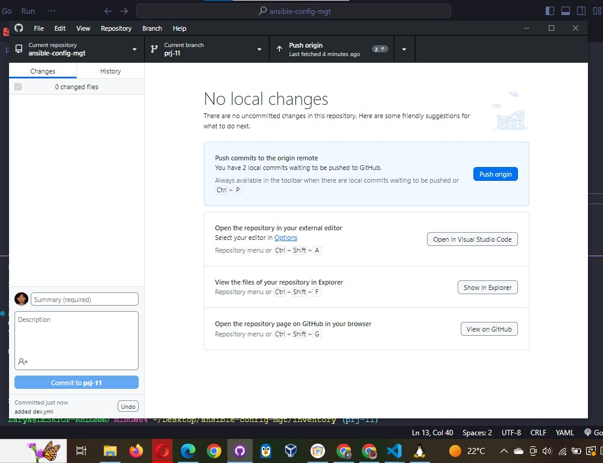

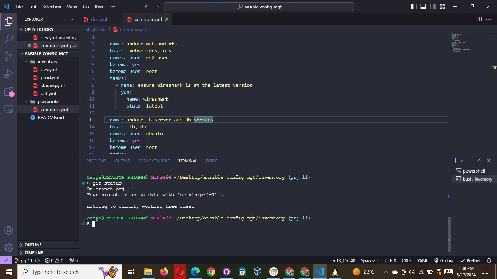

2. Create a Pull request (PR)

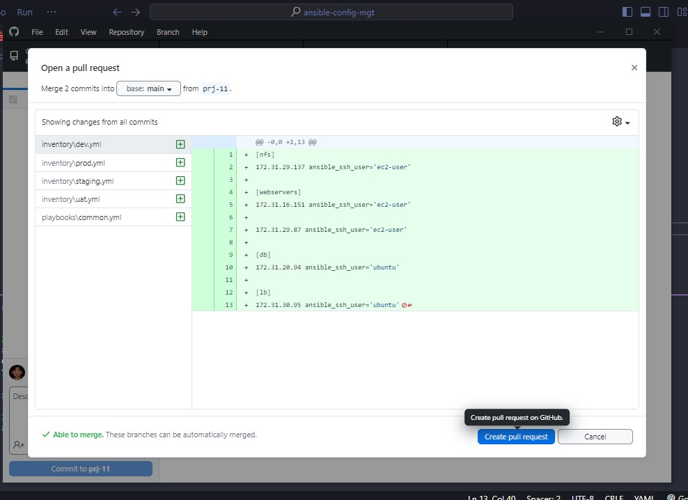

3. Wear a hat of another developer for a second, and act as a reviewer.

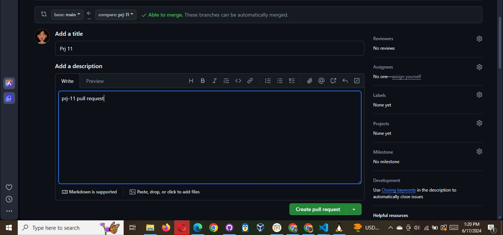

4. If the reviewer is happy with your new feature development, merge the code to the master branch.

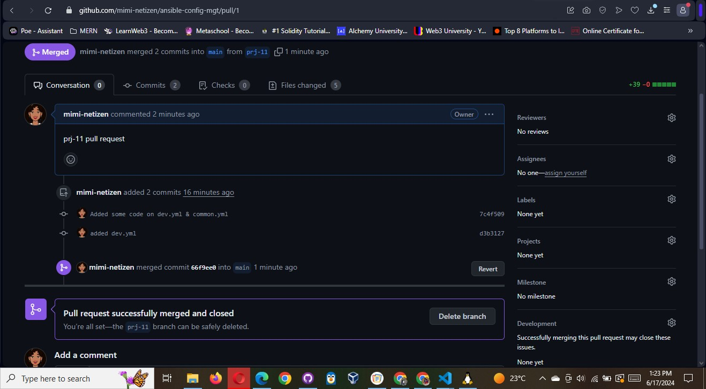

5. Head back on your terminal, checkout from the feature branch into the master, and pull down the latest changes.

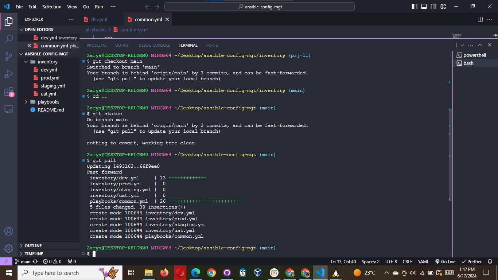

Once your code changes appear in master branch – Jenkins will do its job and save all the files (build artifacts) to
/var/lib/jenkins/jobs/ansible/builds/<build_number>/archive/ directory on Jenkins-Ansible server.

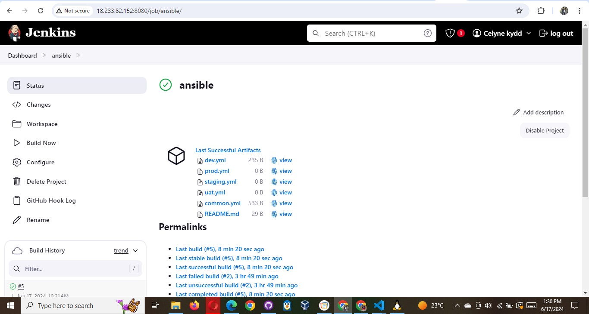

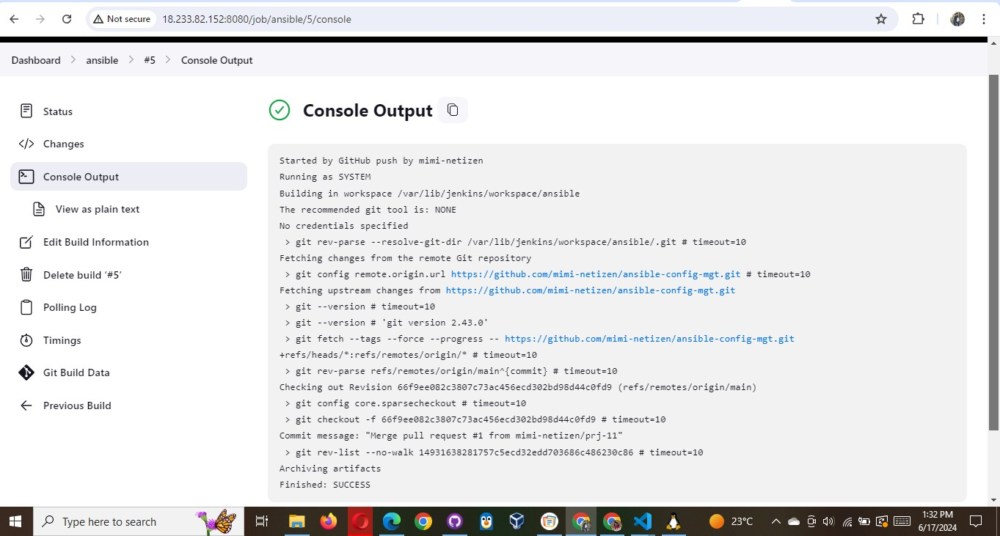

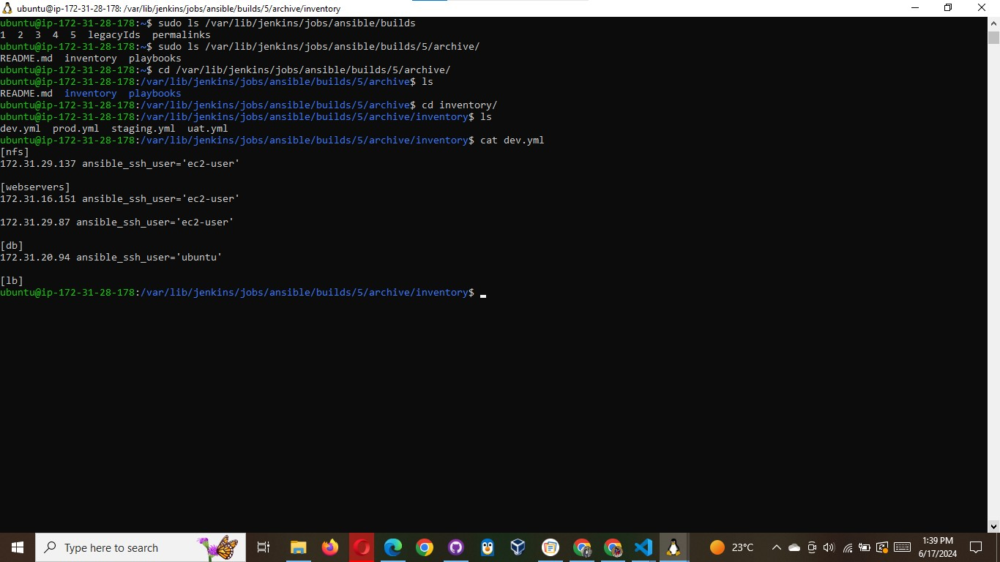
