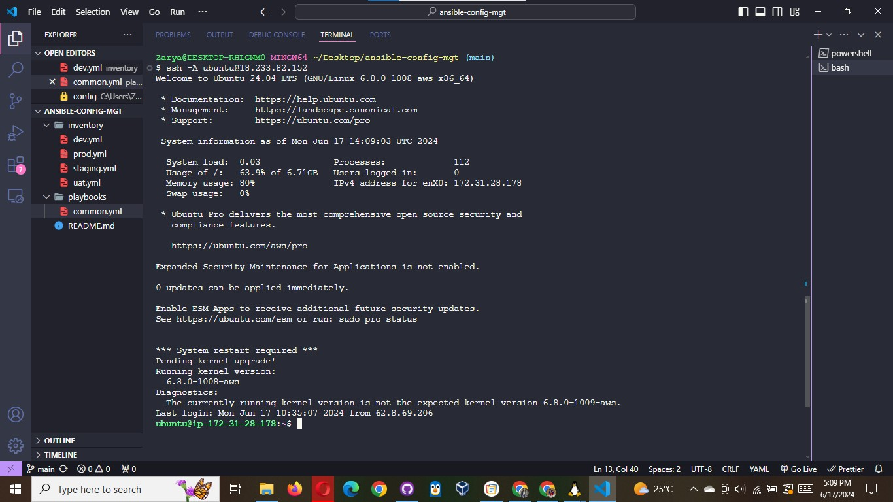
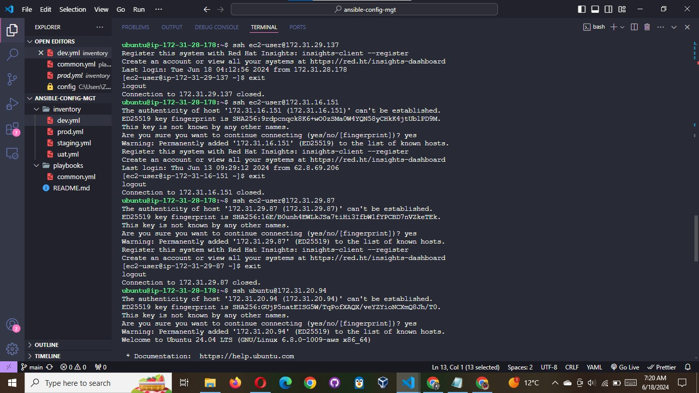
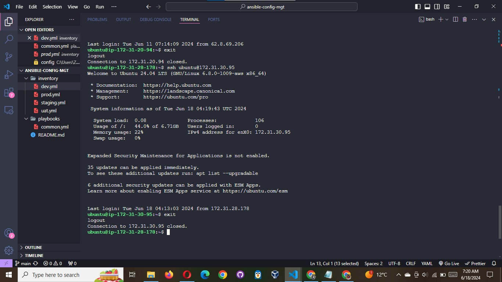
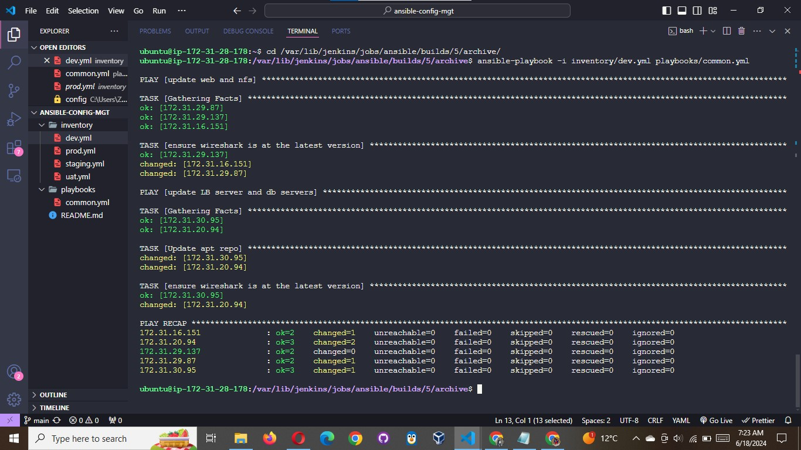
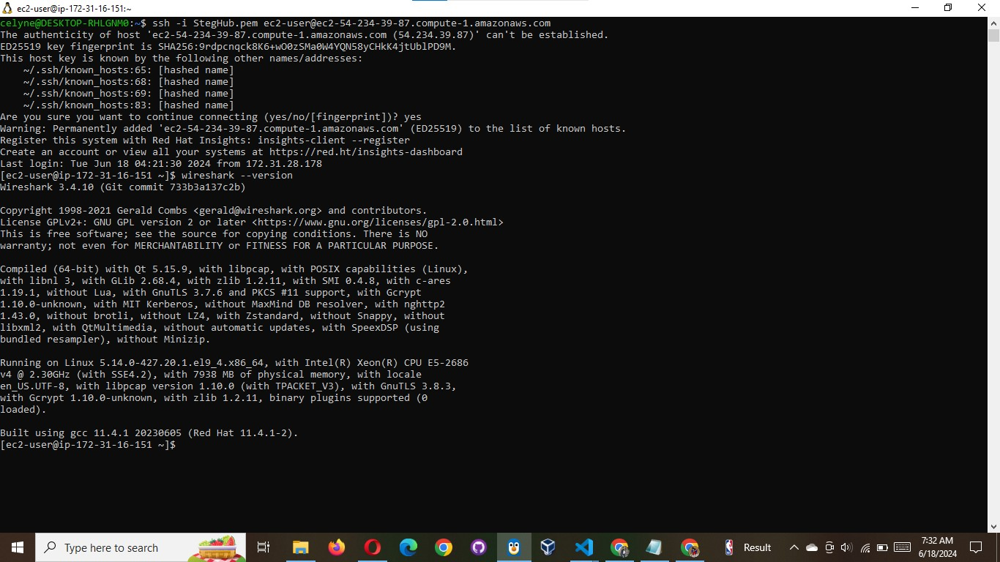
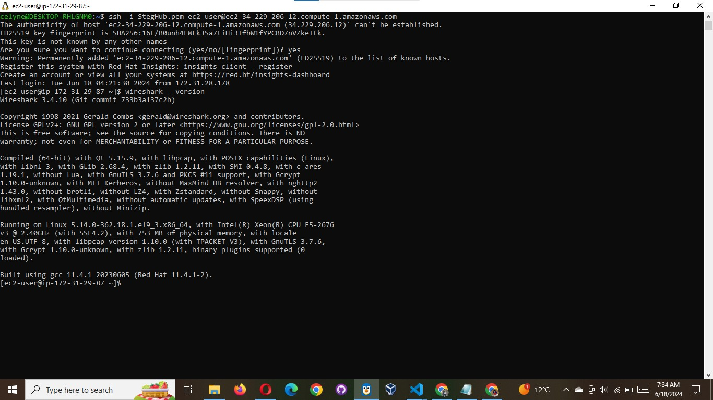
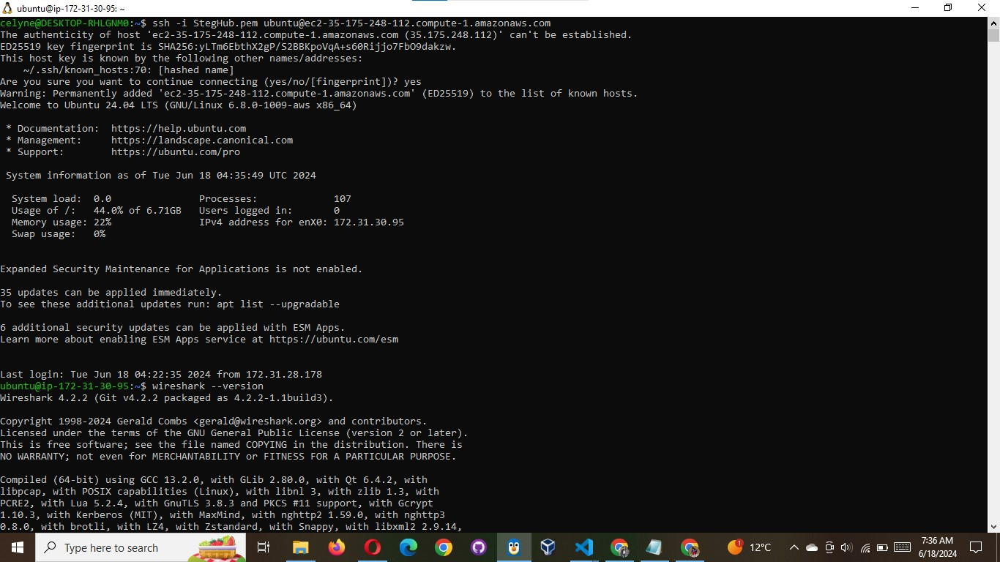
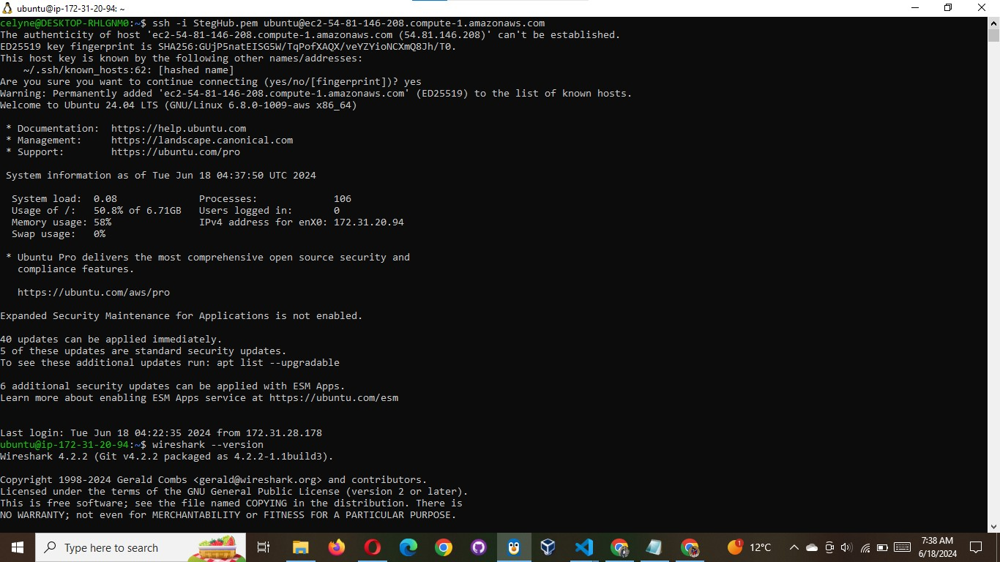

# RUN FIRST ANSIBLE TEST

Now, it is time to execute ansible-playbook command and verify if your playbook actually works:

```
cd ansible-config-mgt
```

```
ansible-playbook -i inventory/dev.yml playbooks/common.yml
```







You can go to each of the servers and check if wireshark has been installed by running `which wireshark` or `wireshark --version`

#### NFS


#### Webserver 1



#### Webserver 2



#### lb



#### db



Your updated with Ansible architecture now looks like this:


## Optional step - Repeat once again

Update your ansible playbook with some new Ansible tasks and go through the full
checkout -> change codes -> commit -> PR -> merge -> build -> ansible-playbook cycle again to see how easily you can manage a
servers fleet of any size with just one command!

Congratulations
You have just automated your routine tasks by implementing your first Ansible project! There is more exciting projects ahead, so lets
keep it moving!


