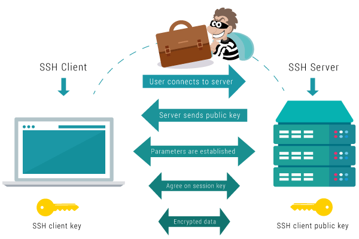

# SSH

SSH (Secure Shell) is a cryptographic network protocol for operating network services securely over unsecured networks. SSH provides a secure channel over an unsecured network by using the client-server architecture with strong authentication and encryption. It is commonly used for remote login, command-line access, and file transfers between a local and remote system.

## Key Features of SSH

- Encrypts all traffic to effectively eliminate eavesdropping, connection hijacking, and other network-level attacks.

- Supports strong authentication methods like passwords, public keys, and multi-factor authentication.

- Supports secure tunnels that allow encapsulating arbitrary TCP connections inside an encrypted SSH session.

- Provides secure file transfer capabilities using SFTP, SCP, and SFTP protocols.

- Allows remote execution of commands on other systems with SSH client applications.

- Widely supported on all major operating systems and platforms.

## How SSH Works

SSH uses public-key cryptography to authenticate the remote computer and allow secure data transmission over the insecure network. It establishes an encrypted tunnel between the client and server over TCP port 22. The client verifies the server's public key and encrypts data using a symmetric session key known only to the endpoints.

## Common Uses of SSH

- Remote access and administration of Linux/Unix servers and routers.

- Automated remote execution of tasks using SSH in DevOps workflows.

- Port forwarding and tunneling other insecure services through SSH.

- Secure file transfer between systems using SFTP/SCP instead of FTP/HTTP.

- Encrypted communication between network devices and applications.

## Benefits of Using SSH

- Strong encryption prevents eavesdropping and data tampering.

- Authentication prevents unauthorized access to systems.

- Integrity protection ensures data is not modified in transit.

- Secure remote access for server administration from any location.

- Standard, cross-platform protocol supported widely.

## Conclusion

SSH is a battle-tested and secure protocol for remote access, administration, automation, and file transfers over untrusted networks. Its encryption, authentication, and secure tunneling capabilities make it an indispensable tool for managing servers, infrastructure, and applications in today's world.
