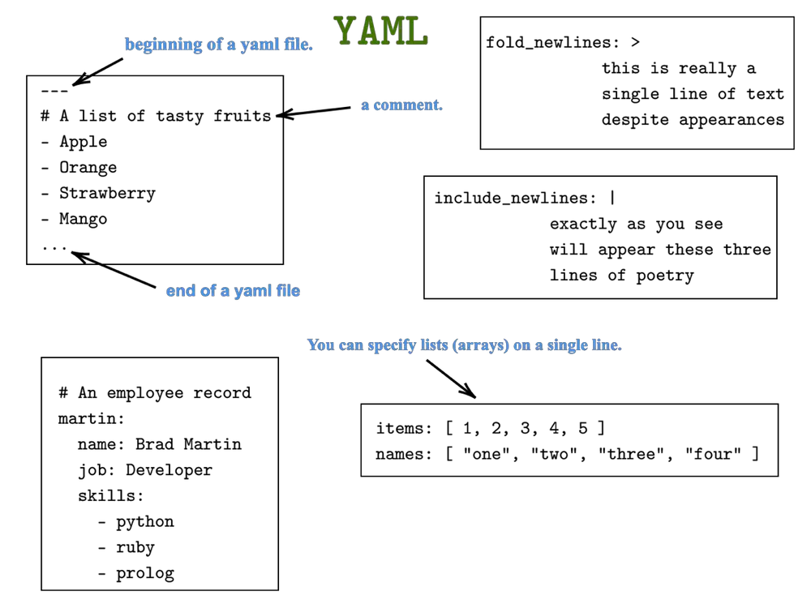

# YAML

YAML (YAML Ain't Markup Language) is a human-readable data serialization standard for programming languages. It is commonly used for configuration files, but could be used in many applications where data is being stored or transmitted. YAML is a superset of JSON and allows for native data types like maps, sets, and sequences without the need for custom types.

## Key Features of YAML

- Human-readable format that is easy for people to write and edit.

- Uses indentation to indicate nesting which makes it more readable than XML.

- Supports comments for annotating files.

- Data types supported include null, booleans, integers, floats, strings, arrays, and maps.

- Unicode support for all data types.

- Extensive library support across many programming languages.

## YAML Syntax

The basic YAML syntax consists of:

- Key-value pairs separated by colon for maps.

- Dashes for unordered lists and numbers for ordered lists.

- Block style for multiline strings and lists indicated by pipe.

- No closing tags - relies on indentation which must be consistent.

- Files have .yml or .yaml extension.

## Common Uses

- Configuration files for applications, frameworks and tools.

- Infrastructure as code definitions for tools like Ansible, Terraform etc.

- Specifications and documentation for APIs and protocols.

- Data serialization and storage formats.

- Structured logging and monitoring configurations.

- Package definitions and metadata files.

## Benefits

- Human readable and editable compared to JSON and XML.

- Support for comments.

- Native support for common data structures.

- Wide library support across languages.

- Standardized syntax.

- Lightweight and fast parsing.

## Conclusion

YAML is a very popular data serialization format that is used extensively in DevOps workflows and tooling due to its human readability, support for native data types and wide library support. Its simple syntax makes it ideal for configuration files and infrastructure definitions.
