# Jenkins job enhancement

Before we begin, let us make some changes to our Jenkins job - now every new change in the codes creates a separate directory which is not very convenient when we want to run some commands from one place. Besides, it consumes space on Jenkins serves with each subsequent change. Let us enhance it by introducing a new Jenkins project/job - we will require `Copy Artifact` plugin.

1. Go to your `Jenkins-Ansible` server and create a new directory called `ansible-config-artifact` - we will store there all artifacts after each build.

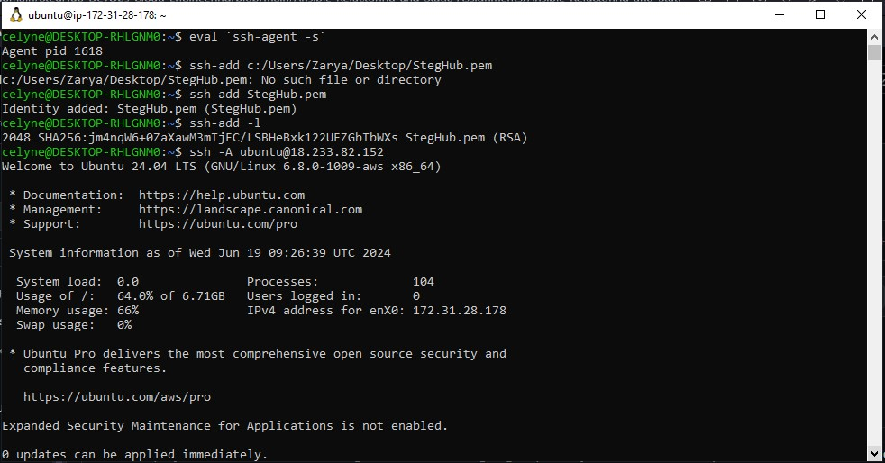

```bash
sudo mkdir /home/ubuntu/ansible-config-artifact
```

2. Change permissions to this directory, so Jenkins could save files there

```bash
chmod -R 0777 /home/ubuntu/ansible-config-artifact
```

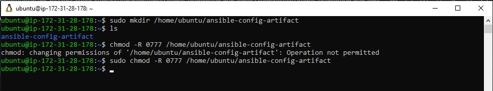

3. Go to Jenkins web console -> Manage Jenkins -> Manage Plugins -> on Available tab search for `Copy Artifact` and install this plugin without restarting Jenkins

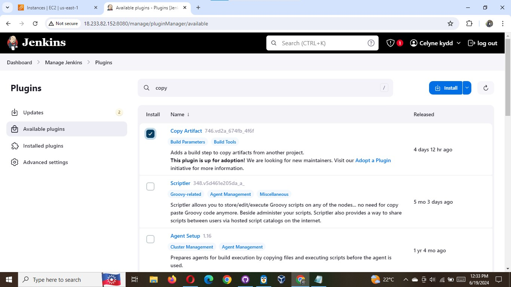

4. Create a new Freestyle project and name it `save_artifacts`.

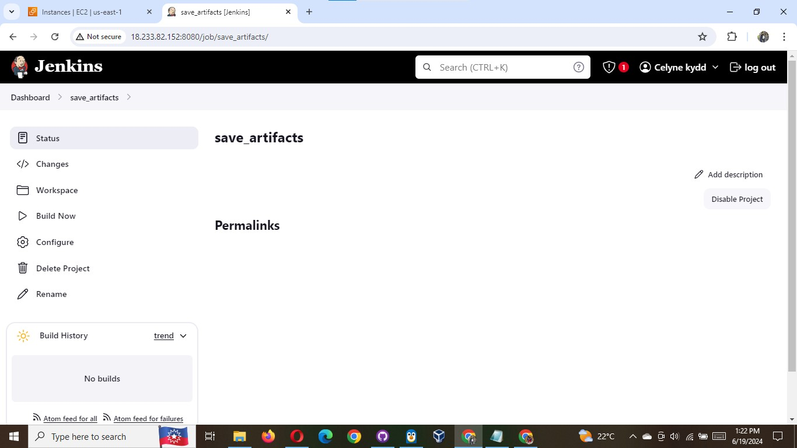

5. This project will be triggered by completion of your existing ansible project. Configure it accordingly

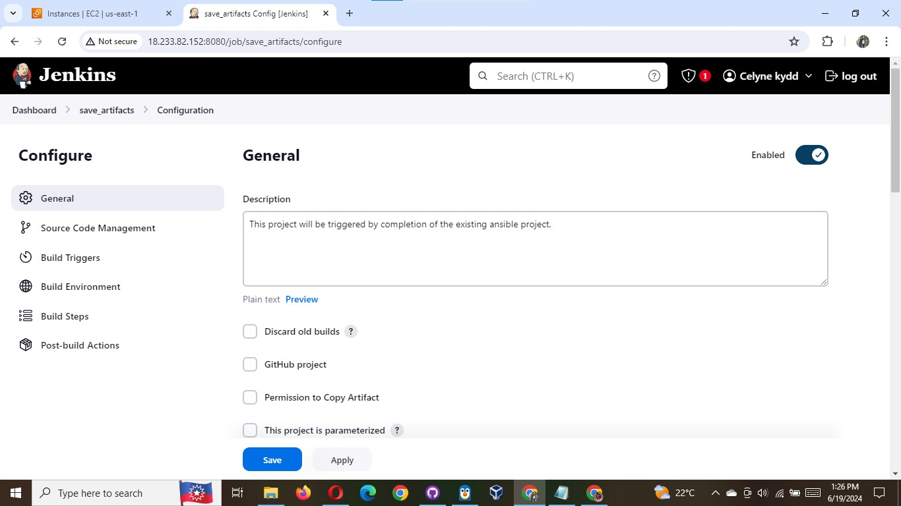

**Note:** You can configure number of builds to keep in order to save space on the server, for example, you might want to keep only last 2 or 5 build results. You can also make this change to your ansible job.

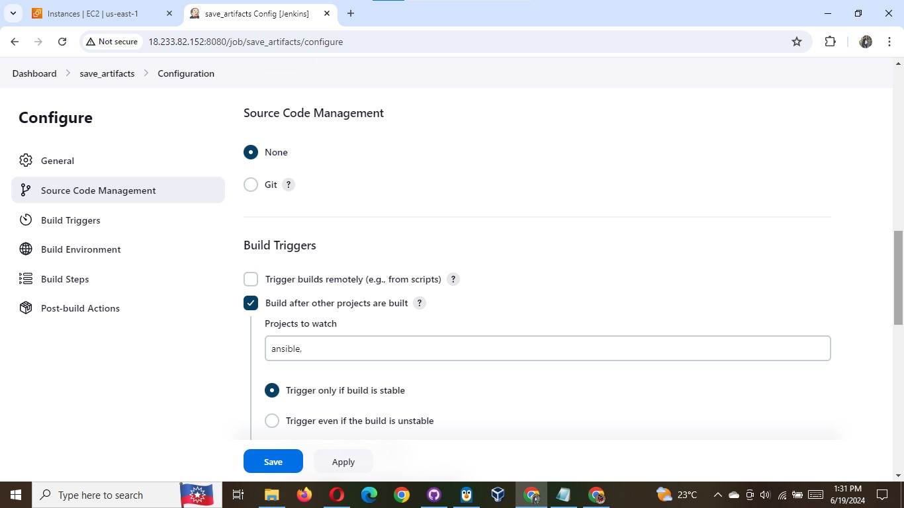

6. The main idea of `save_artifacts` project is to save artifacts into `/home/ubuntu/ansible-config-artifact` directory. To achieve this, create a `Build` step and choose `Copy artifacts from other project`, specify `ansible` as a source project and `/home/ubuntu/ansible-config-artifact` as a target directory.

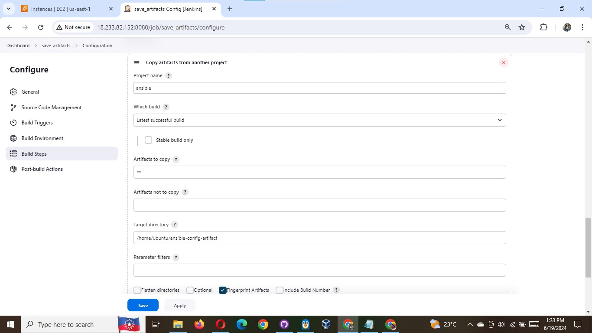

7. Test your set up by making some change in README.MD file inside your `ansible-config-mgt` repository (right inside main branch).

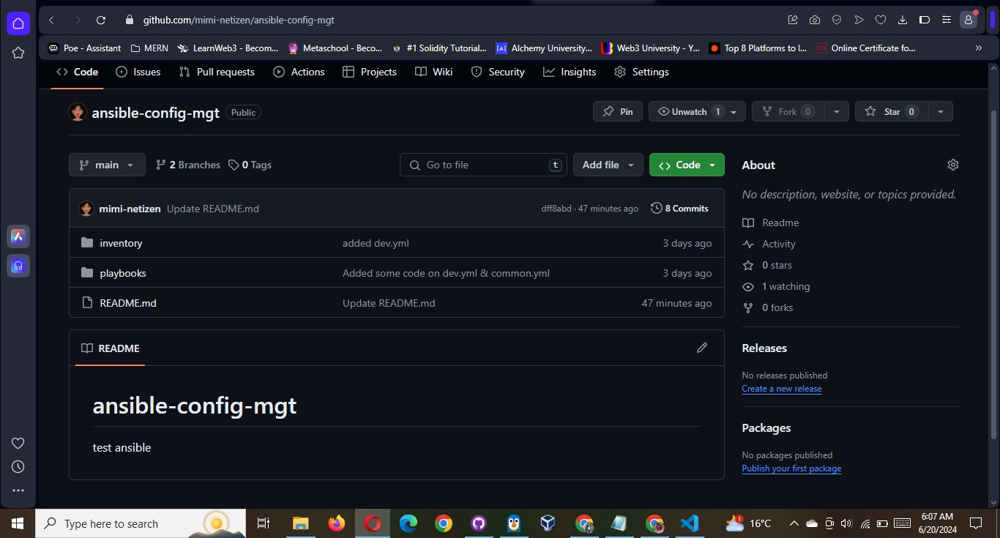

If both Jenkins jobs have completed one after another - you shall see your files inside `/home/ubuntu/ansible-config-artifact` directory and it will be updated with every commit to your master branch.
Now your Jenkins pipeline is more neat and clean.

I got the error below:

```bash
Started by user Celyne kydd
Running as SYSTEM
Building in workspace /var/lib/jenkins/workspace/save_artifacts
FATAL: /home/ubuntu/ansible-config-artifact
java.nio.file.AccessDeniedException: /home/ubuntu/ansible-config-artifact
	at java.base/sun.nio.fs.UnixException.translateToIOException(UnixException.java:90)
	at java.base/sun.nio.fs.UnixException.rethrowAsIOException(UnixException.java:106)
	at java.base/sun.nio.fs.UnixException.rethrowAsIOException(UnixException.java:111)
	at java.base/sun.nio.fs.UnixFileSystemProvider.createDirectory(UnixFileSystemProvider.java:438)
	at java.base/java.nio.file.Files.createDirectory(Files.java:699)
	at java.base/java.nio.file.Files.createAndCheckIsDirectory(Files.java:807)
	at java.base/java.nio.file.Files.createDirectories(Files.java:793)
	at hudson.FilePath.mkdirs(FilePath.java:3751)
	at hudson.FilePath$Mkdirs.invoke(FilePath.java:1416)
	at hudson.FilePath$Mkdirs.invoke(FilePath.java:1411)
	at hudson.FilePath.act(FilePath.java:1232)
	at hudson.FilePath.act(FilePath.java:1215)
	at hudson.FilePath.mkdirs(FilePath.java:1406)
	at hudson.plugins.copyartifact.CopyArtifact.copy(CopyArtifact.java:711)
	at hudson.plugins.copyartifact.CopyArtifact.perform(CopyArtifact.java:675)
	at hudson.plugins.copyartifact.CopyArtifact.perform(CopyArtifact.java:559)
	at jenkins.tasks.SimpleBuildStep.perform(SimpleBuildStep.java:123)
	at hudson.tasks.BuildStepCompatibilityLayer.perform(BuildStepCompatibilityLayer.java:80)
	at hudson.tasks.BuildStepMonitor$1.perform(BuildStepMonitor.java:20)
	at hudson.model.AbstractBuild$AbstractBuildExecution.perform(AbstractBuild.java:818)
	at hudson.model.Build$BuildExecution.build(Build.java:199)
	at hudson.model.Build$BuildExecution.doRun(Build.java:164)
	at hudson.model.AbstractBuild$AbstractBuildExecution.run(AbstractBuild.java:526)
	at hudson.model.Run.execute(Run.java:1894)
	at hudson.model.FreeStyleBuild.run(FreeStyleBuild.java:44)
	at hudson.model.ResourceController.execute(ResourceController.java:101)
	at hudson.model.Executor.run(Executor.java:442)
Archiving artifacts
Finished: FAILURE
```

The error above is from the jenkins console output.
This is because jenkins does not have the privillege to write to the `ansible-config-artifact` directory despite setting permission `chmod -R 777 ansible-config-artifact`
This was resolved by adding jenkins user to ubuntu group (has `rwx` permission)

```bash
sudo chown -R ubuntu:jenkins ansible-config-artifact

sudo usermod -a -G jenkins ubuntu  # Add jenkins user to ubuntu group

sudo groups ubuntu  # Confirm jenkins user have been added to ubuntu group
```

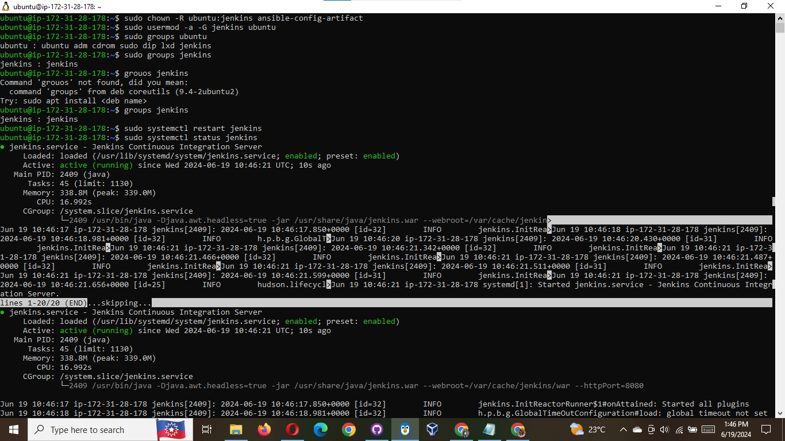

Now test the setup again. observe that the build was successful this time

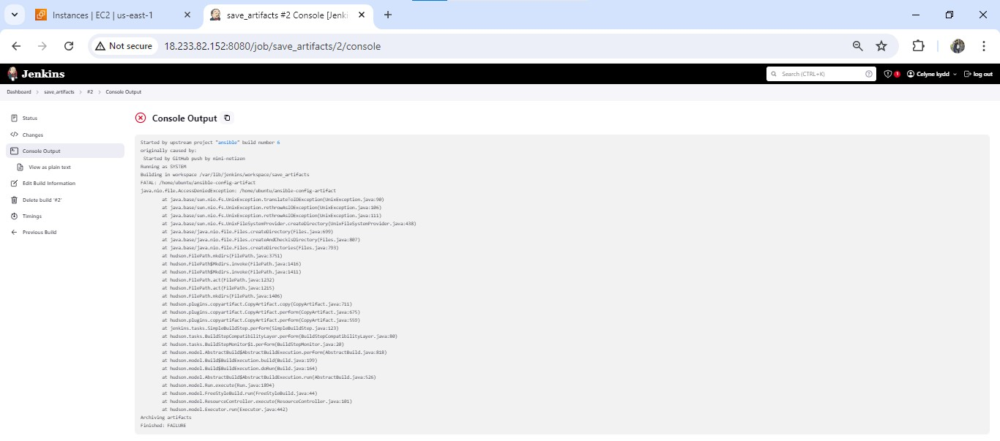

I still found a permission denied error.
To ensure that the Jenkins user has the necessary permissions to access and write to the `/home/ubuntu/ansible-config-artifact` directory, I followed these steps:

1. **Identify the Jenkins user**:

   - The Jenkins user is typically named "jenkins", but you can confirm this by checking the Jenkins configuration or running the following command:
     ```bash
     ps -ef | grep jenkins
     ```
   - The output should show the user running the Jenkins process.

2. **Grant the Jenkins user access to the directory**:

   - Log in to the Jenkins server as a user with sudo privileges.
   - Run the following commands to grant the Jenkins user access to the directory:

     ```bash
     sudo chown -R jenkins:jenkins /home/ubuntu/ansible-config-artifact
     sudo chmod -R 775 /home/ubuntu/ansible-config-artifact
     ```

   - The `chown` command changes the owner and group of the directory to the Jenkins user and group.
   - The `chmod` command sets the permissions to allow the Jenkins user to read, write, and execute files in the directory, and allows the group to read and execute files.

3. **Verify the permissions**:

   - Run the following command to check the permissions on the directory:

     ```bash
     ls -l /home/ubuntu
     ```

   - The output should show that the `/home/ubuntu/ansible-config-artifact` directory is owned by the Jenkins user and group, and the permissions are set to `drwxrwxr-x` (or similar).

4. **Restart Jenkins**:

   - After making the permission changes, restart the Jenkins service to ensure the changes take effect:

     ```bash
     sudo systemctl restart jenkins
     ```

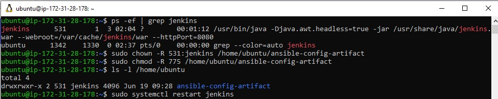

I still found more permission error message `java.nio.file.AccessDeniedException: /home/ubuntu/ansible-config-artifact`.

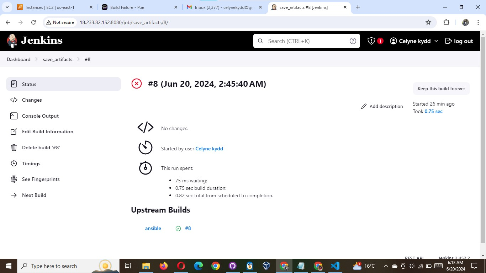

I tried these troubleshooting steps:

1. **Verify the directory permissions**: Run the following command to check the permissions on the `/home/ubuntu` directory:

```bash
ls -ld /home/ubuntu
```

The output should show that the directory is owned by the `ubuntu` user and the `ubuntu` group, with permissions `drwxr-xr-x`.

2. **Grant the Jenkins user access to the parent directory**: If the permissions on the `/home/ubuntu` directory are correct, try granting the Jenkins user access to the parent directory by running:

```bash
sudo chmod 755 /home/ubuntu
sudo chown -R ubuntu:jenkins /home/ubuntu
```

This will allow the Jenkins user to create directories and files within the `/home/ubuntu` directory.

3. **Restart Jenkins**:

```bash
sudo systemctl restart jenkins
```

4. **Check the Jenkins user's home directory**:

```bash
sudo -u jenkins bash -c 'echo $HOME'
```

The output should show the Jenkins user's home directory, which should be `/var/lib/jenkins` by default.

If the Jenkins user's home directory is not set correctly, you may need to update the Jenkins configuration to point to the correct home directory.

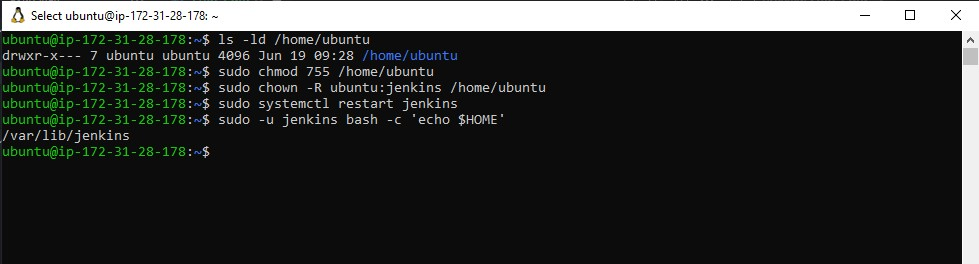

Run build again and check if it works

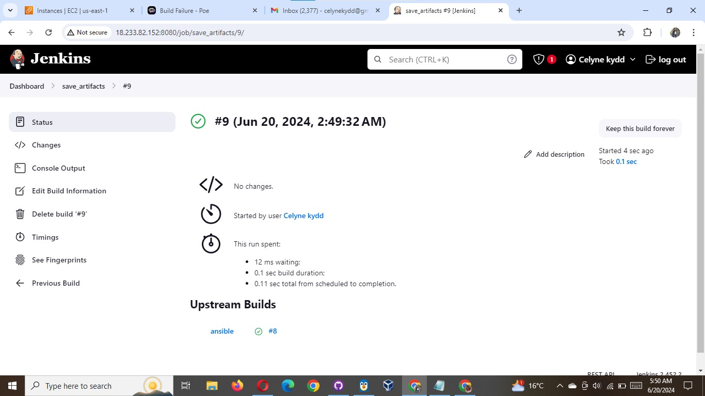

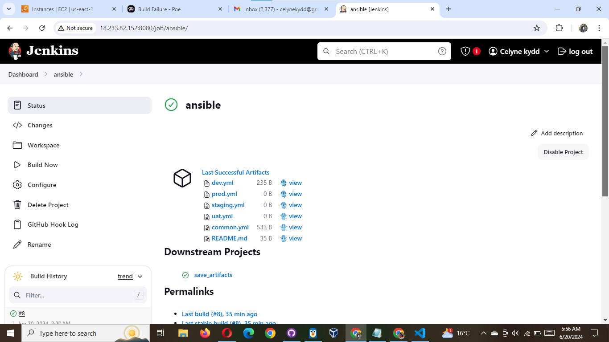
