# Refactor Ansible code by importing other playbooks into `site.yml`

Before starting to refactor the codes, ensure that you have pulled down the latest code from master (main) branch, and create a new branch, name it refactor.

```bash
git pull origin <branch>
git checkout -b refactor
```

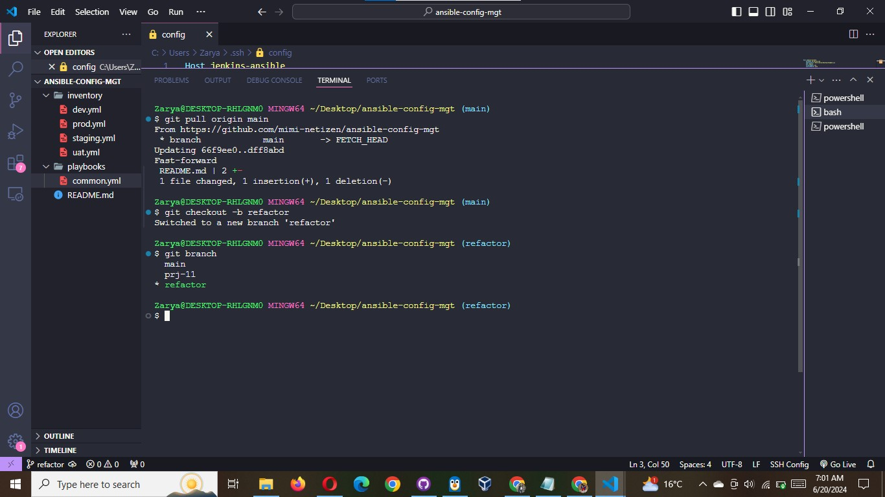

`DevOps` philosophy implies constant iterative improvement for better efficiency - refactoring is one of the techniques that can be used, but you always have an answer to question "why?". Why do we need to change something if it works well?

In previous project, you wrote all tasks in a single playbook common.yml, now it is pretty simple set of instructions for only 2 types of `OS`, but imagine you have many more tasks and you need to apply this playbook to other servers with different requirements.
In this case, you will have to read through the whole playbook to check if all tasks written there are applicable and is there anything that you need to add for certain `server/OS` families. Very fast it will become a tedious exercise and your playbook will become messy with many commented parts. Your DevOps colleagues will not appreciate such organization of your codes and it will be difficult for them to use your playbook.

Let see code re-use in action by importing other playbooks.

1. Within `playbooks` folder, create a new file and name it `site.yml` - This file will now be considered as an entry point into the entire infrastructure configuration. Other playbooks will be included here as a reference. In other words, `site.yml` will become a parent to all other playbooks that will be developed. Including common.yml that you created previously.

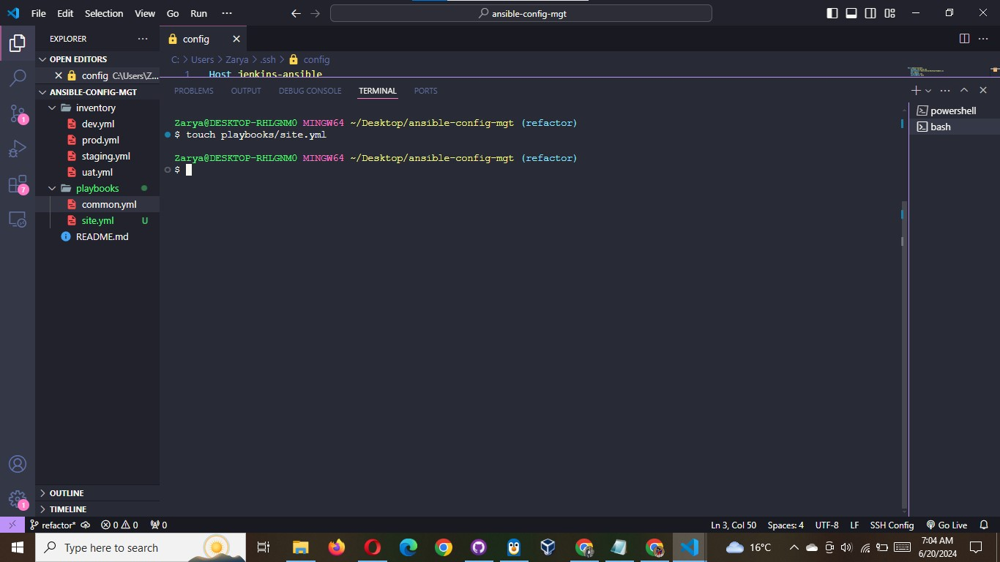

2. Create a new folder in root of the repository and name it `static-assignments`. The **static-assignments** folder is where all other children playbooks will be stored. This is merely for easy organization of your work. It is not an Ansible specific concept, therefore you can choose how you want to organize your work. You will see why the folder name has a prefix of **static** very soon. For now, just follow along.

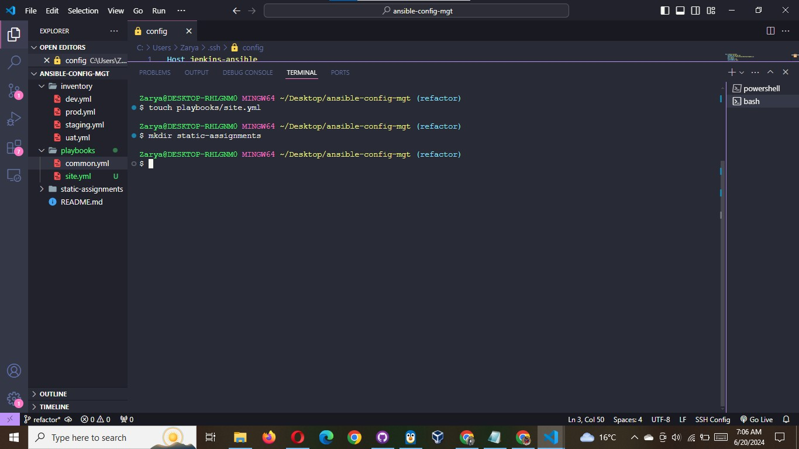

3. Move `common.yml` file into the newly created `static-assignments` folder.

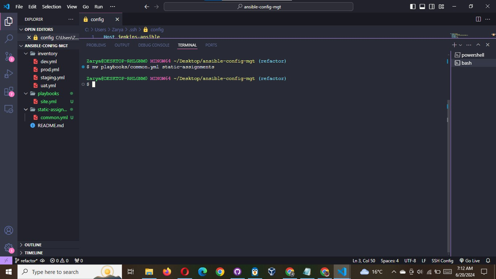

4. Inside `site.yml` file, import `common.yml` playbook.

```yaml
---
- hosts: all
- import_playbook: ../static-assignments/common.yml
```

The code above uses built in `import_playbook` Ansible module.

Your folder structure should look like this;

```css
├── static-assignments
│   └── common.yml
├── inventory
    └── dev
    └── stage
    └── uat
    └── prod
└── playbooks
    └── site.yml
```

**5. Run `ansible-playbook` command against the `dev` environment**

Since you need to apply some tasks to your `dev` servers and `wireshark` is already installed - you can go ahead and create another playbook under `static-assignments` and name it `common-del.yml`.

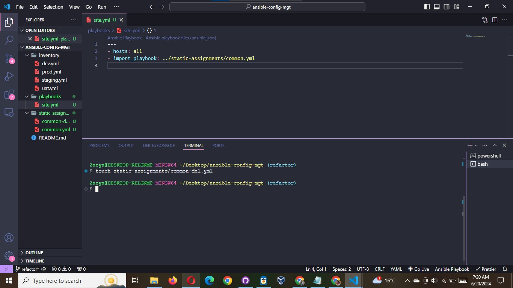

In this playbook, configure deletion of `wireshark` utility.

```yaml
---
- name: update web, nfs and db servers
  hosts: webservers, nfs, db
  remote_user: ec2-user
  become: yes
  become_user: root
  tasks:
    - name: delete wireshark
      yum:
        name: wireshark
        state: removed

- name: update LB server
  hosts: lb
  remote_user: ubuntu
  become: yes
  become_user: root
  tasks:
    - name: delete wireshark
      apt:
        name: wireshark
        state: absent
        autoremove: yes
        purge: yes
        autoclean: yes
```

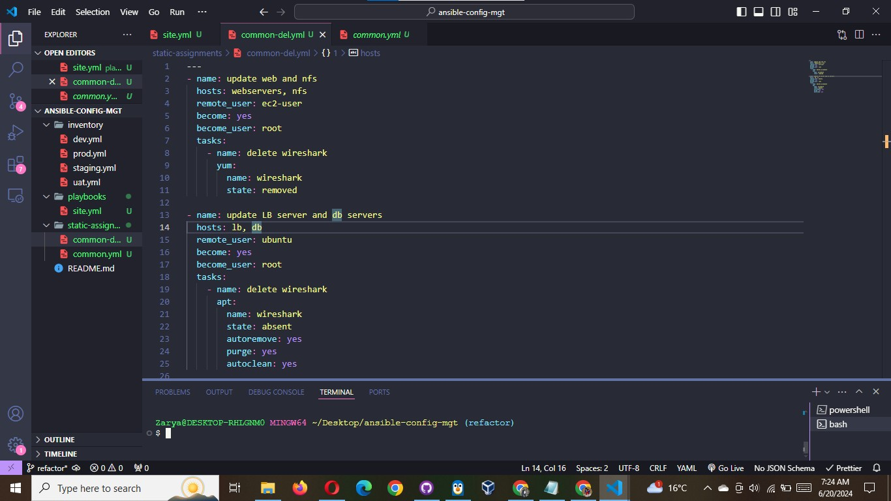

**Update `site.yml` with `- import_playbook: ../static-assignments/common-del.yml` instead of `common.yml`**

```yaml
---
- hosts: all
- import_playbook: ../static-assignments/common-del.yml
```

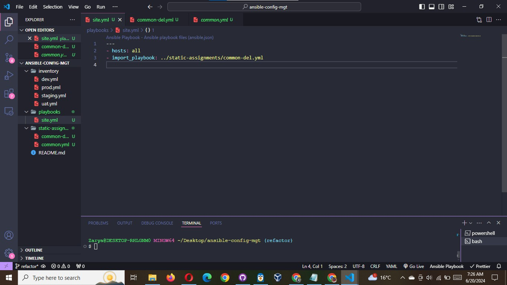

Push to your github repo and create a pull request, carefully check your codes and merge into your main branch

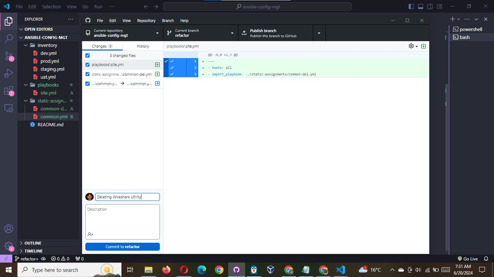
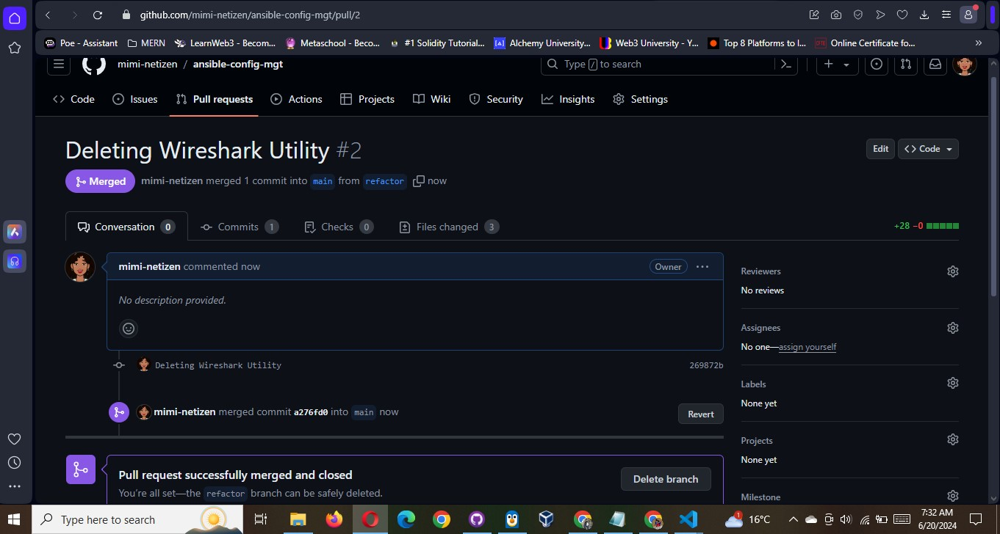

**Run it against dev servers**

```bash
ansible-playbook -i inventory/dev.yml playbooks/site.yml
```

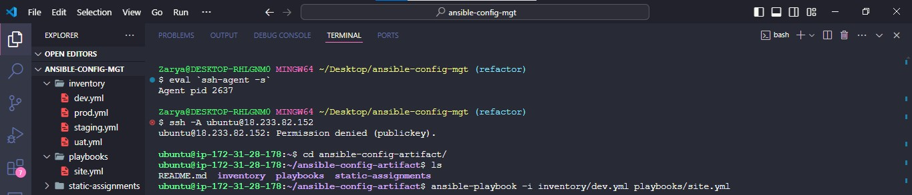

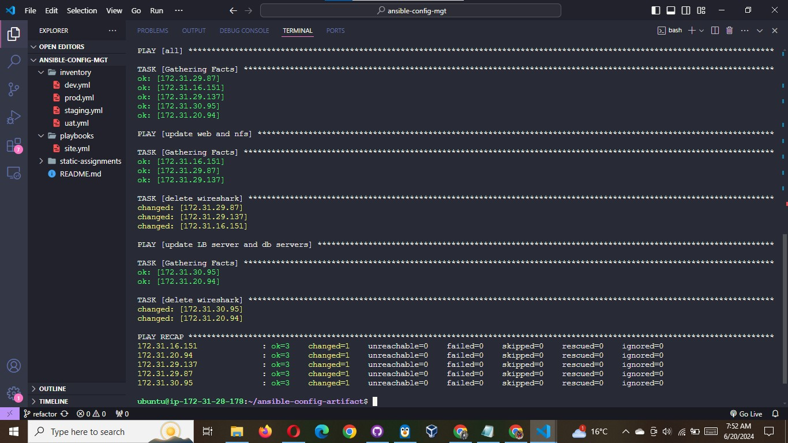

**Esure that wireshark is deleted on all the servers**

**Run** `wireshark --version` to check

Check the NFS Server

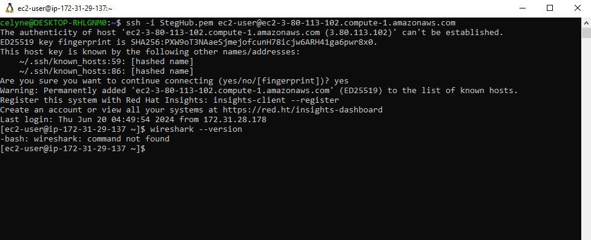

Check Web Server 1

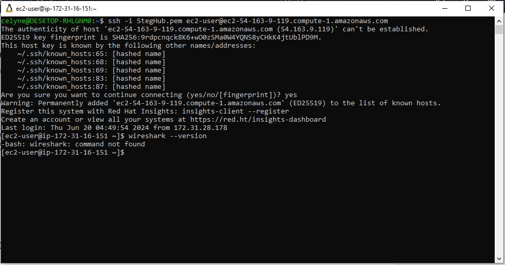

Check Web Server 2

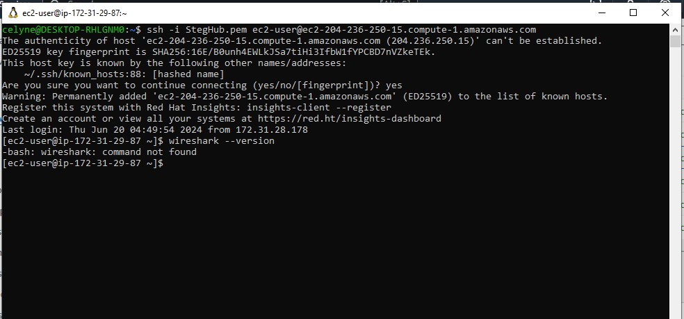

Check DB Server

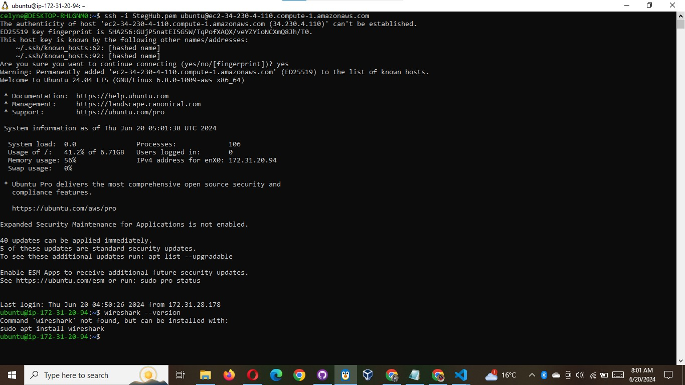

Check LB Server

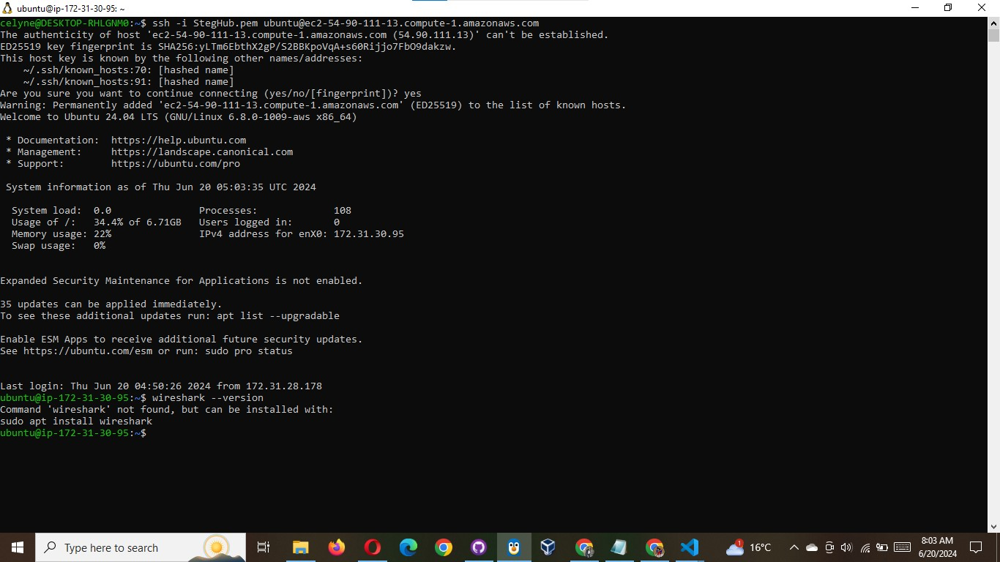

Now you have learned how to use import_playbooks module and you have a ready solution to install/delete packages on multiple servers with just one command.
