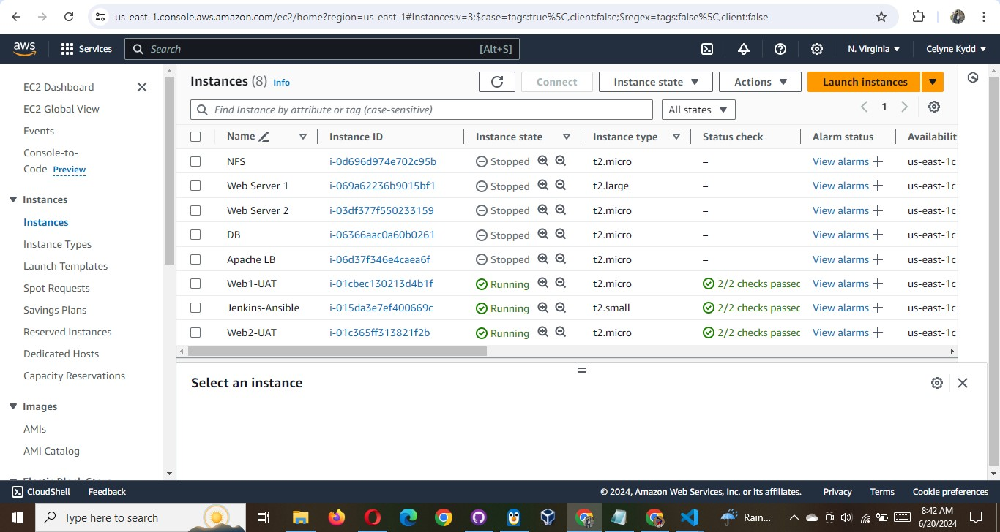
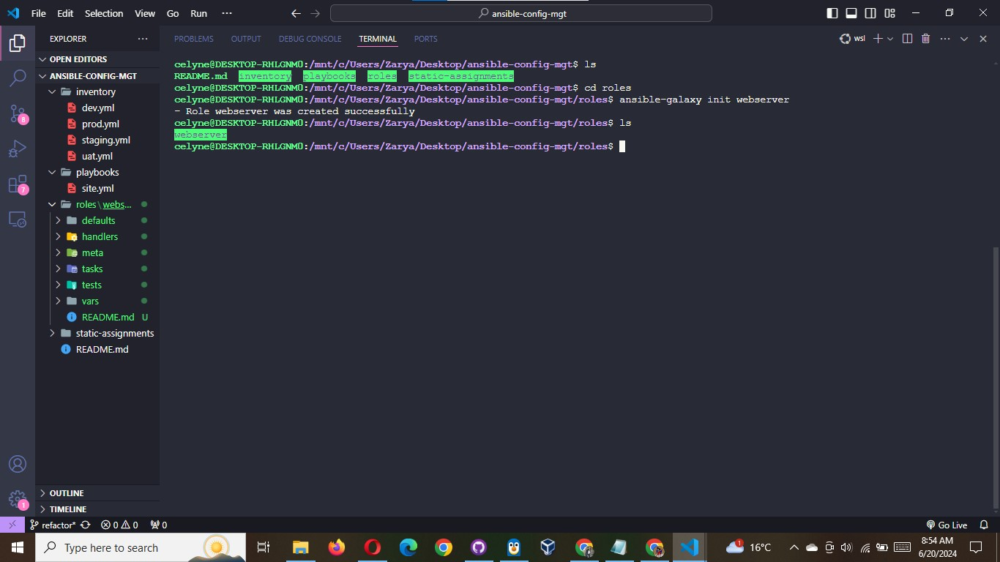
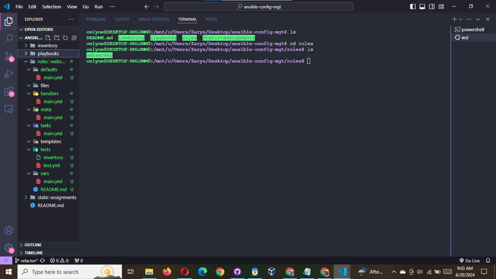
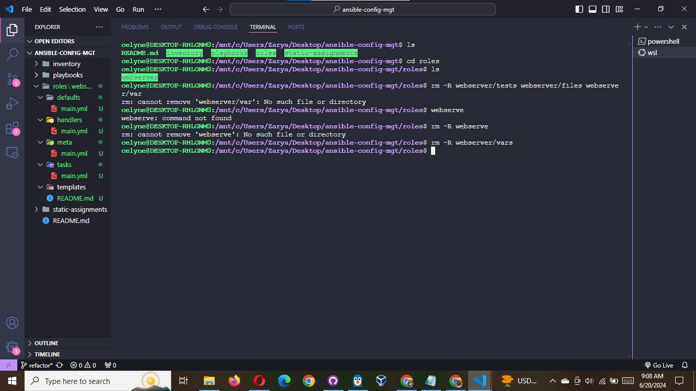
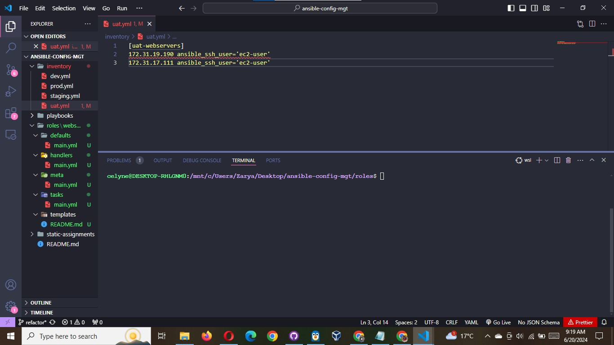
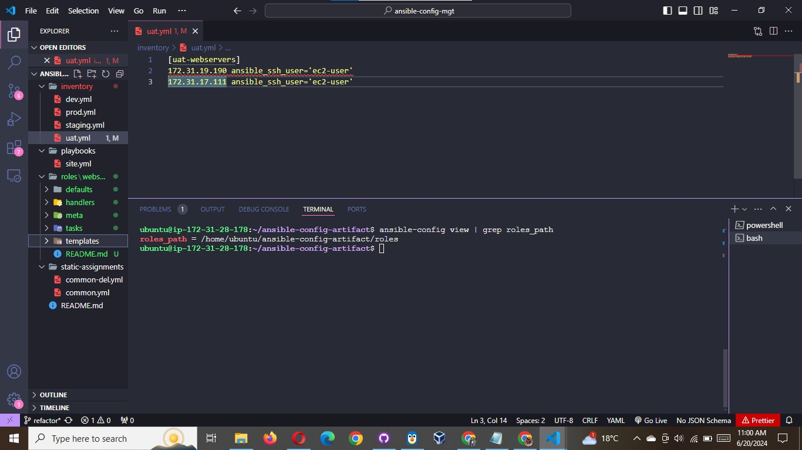
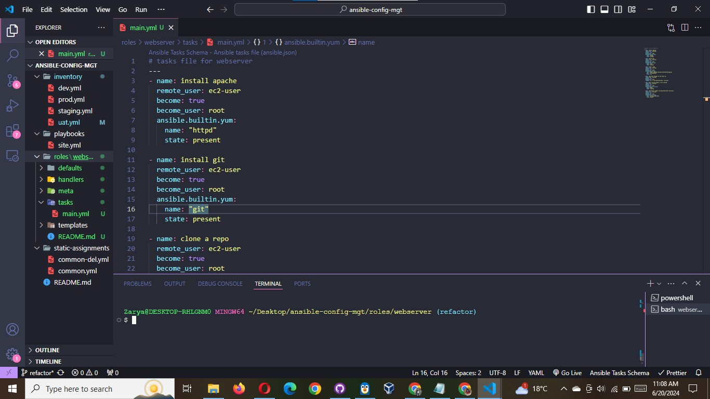

# Step 3 - Configure UAT Webservers with a role `Webserver`

We have our nice and clean dev environment, so let us put it aside and configure 2 new Web Servers as uat. We could write tasks to configure Web Servers in the same playbook, but it would be too messy, instead, we will use a dedicated role to make our configuration reusable.

1. Launch 2 fresh EC2 instances using RHEL 9 image, we will use them as our uat servers, so give them names accordingly - `Web1-UAT` and `Web2-UAT`.



2. To create a role, you must create a directory called `roles/`, relative to the playbook file or in `/etc/ansible/` directory.

There are two ways how you can create this folder structure:

Use an Ansible utility called ansible-galaxy inside `ansible-config-mgt/roles` directory (you need to create `roles` directory upfront)

```bash
mkdir roles
cd roles
ansible-galaxy init webserver
```



or create the file structure manually

```bash
            mkdir roles
            cd roles
            mkdir webserver
            cd webserver
            touch README.md
            mkdir defaults, handlers, meta, tasks, templates
```

**Note**: You can choose either way, but since you store all your codes in GitHub, it is recommended to create folders and files there rather than locally on `Jenkins-Ansible` server.

The entire folder structure should look like below, but if you create it manually - you can skip creating `tests`, `files`, and `vars` or remove them if you used `ansible-galaxy`



```css
└── webserver
    ├── README.md
    ├── defaults
    │   └── main.yml
    ├── files
    ├── handlers
    │   └── main.yml
    ├── meta
    │   └── main.yml
    ├── tasks
    │   └── main.yml
    ├── templates
    ├── tests
    │   ├── inventory
    │   └── test.yml
    └── vars
        └── main.yml
```

After removing unnecessary directories and files, the roles structure should look like this



```css
└── webserver
    ├── README.md
    ├── defaults
    │   └── main.yml
    ├── handlers
    │   └── main.yml
    ├── meta
    │   └── main.yml
    ├── tasks
    │   └── main.yml
    └── templates
```

3. Update your inventory `ansible-config-mgt/inventory/uat.yml` file with IP addresses of your 2 `UAT Web servers`

**NOTE:** Ensure you are using ssh-agent to ssh into the `Jenkins-Ansible` instance

```yaml
[uat-webservers]
<Web1-UAT-Server-Private-IP-Address> ansible_ssh_user='ec2-user'
<Web2-UAT-Server-Private-IP-Address> ansible_ssh_user='ec2-user'
```



To learn how to setup SSH agent and connect VS Code to your Jenkins-Ansible instance, please see this video:

- For Windows users - [ssh-agent on windows](https://www.youtube.com/watch?v=TYyTXxVWOYA)
- For Linux users - [ssh-agent on linux](https://www.youtube.com/watch?v=EoLrCX1VVog)

4. In /etc/ansible/ansible.cfg file uncomment roles_path string and provide a full path to your roles directory roles_path = /home/ubuntu/ansible-config-mgt/roles, so Ansible could know where to find configured roles.



5. It is time to start adding some logic to the webserver role. Go into `tasks` directory, and within the `main.yml` file, start writing configuration tasks to do the following:

- Install and configure Apache (httpd service)
- Clone Tooling website from GitHub https://github.com/<your-name>/tooling.git.
- Ensure the tooling website code is deployed to /var/www/html on each of 2 UAT Web servers.
- Make sure httpd service is started

Your main.yml consist of following tasks:

```yaml
# tasks file for webserver
---
- name: install apache
  remote_user: ec2-user
  become: true
  become_user: root
  ansible.builtin.yum:
    name: "httpd"
    state: present

- name: install git
  remote_user: ec2-user
  become: true
  become_user: root
  ansible.builtin.yum:
    name: "git"
    state: present

- name: clone a repo
  remote_user: ec2-user
  become: true
  become_user: root
  ansible.builtin.git:
    repo: https://github.com/mimi-netizen/tooling.git
    dest: /var/www/html
    force: yes

- name: copy html content to one level up
  remote_user: ec2-user
  become: true
  become_user: root
  command: cp -r /var/www/html/html/ /var/www/

- name: Start service httpd, if not started
  remote_user: ec2-user
  become: true
  become_user: root
  ansible.builtin.service:
    name: httpd
    state: started

- name: recursively remove /var/www/html/html/ directory
  remote_user: ec2-user
  become: true
  become_user: root
  ansible.builtin.file:
    path: /var/www/html/html
    state: absent
```


